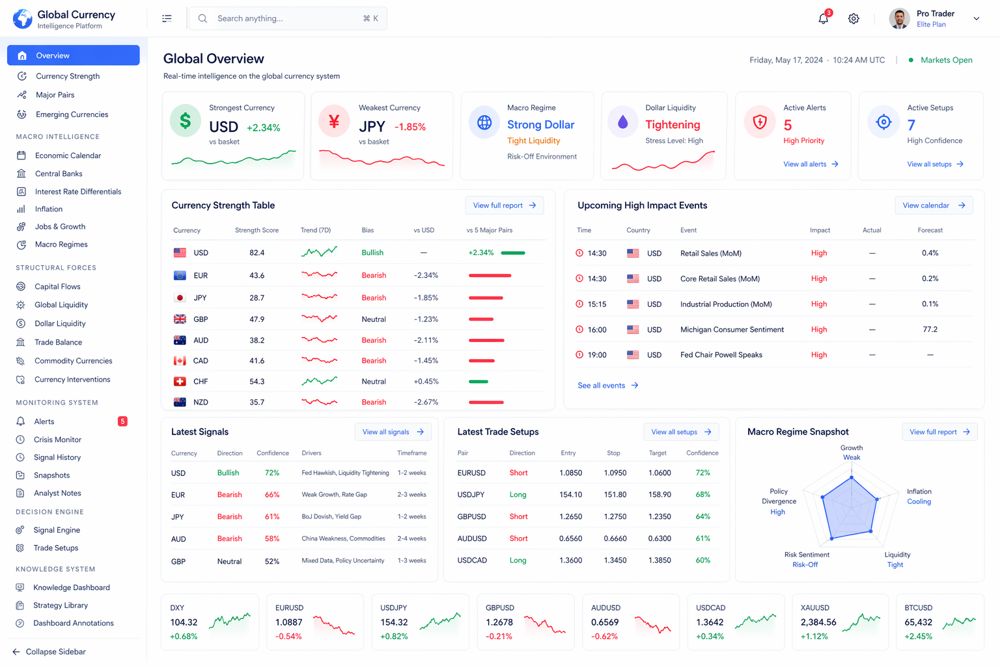

ok today we are going under a journey of foreign exchange/currency exchange/forex exchange, if am correct forex trading is just part of foreign exchange or foreign  exchange is another form or are they the same thing, lets explore and travel the rabbit hole

Great question. Let’s start the journey slowly because foreign exchange is one of the deepest financial systems on Earth. It touches global trade, geopolitics, banking, speculation, and monetary power.

First, we answer your very first question clearly.

1. Foreign Exchange vs Forex Trading
They are related but not the same thing.

Think of it like this:

Concept	Meaning
Foreign Exchange (FX)	The entire global system where currencies are exchanged
Forex Trading	The speculative trading of currencies to make profit
So:

Forex trading is just one activity inside the foreign exchange system.

The foreign exchange system itself is much bigger.

2. What is Foreign Exchange (FX)?
Foreign exchange simply means:

The process of converting one country's currency into another country's currency.

Example:

A Nigerian company wants to buy machines from Germany.

Nigeria uses Naira (NGN)
Germany uses Euro (EUR)

So the Nigerian company must convert:

Naira → Euro
This conversion is foreign exchange.

3. Example of Foreign Exchange in Daily Life
Example 1:

A Nigerian student studying in the UK must convert:

NGN → GBP
Example 2:

An American tourist visiting Nigeria converts:

USD → NGN
Example 3:

An oil company selling oil internationally might convert:

USD → multiple currencies
Every time currencies are converted, foreign exchange happens.

4. Who Actually Uses Foreign Exchange?
Forex is used by many actors:

1. Governments
Countries buy or sell currencies to manage their economies.

Example:

Central Bank of Nigeria managing the naira exchange rate

2. Central Banks
Examples:

Federal Reserve

European Central Bank

They intervene in currency markets.

3. Commercial Banks
Large banks exchange billions daily.

Examples:

JPMorgan Chase

HSBC

4. Multinational Companies
Companies like:

Apple Inc.

Toyota

operate in multiple currencies.

5. Investors & Hedge Funds
Large funds speculate on currency movements.

6. Retail Forex Traders
This is what most people online talk about.

Individual traders try to profit from price movements.

5. Size of the Forex Market
The foreign exchange market is the largest financial market on Earth.

Daily volume:

≈ $7.5 trillion per day
For comparison:

Market	Size
Stocks	~$200B – $300B/day
Crypto	~$50B – $100B/day
Forex	~$7.5T/day
Forex is massive.

6. Why Currency Exchange Exists
Currencies move because countries are constantly:

Trading goods

Investing

Borrowing

Traveling

Speculating

Example:

China exports goods → receives dollars
They may convert dollars → yuan.

That conversion affects exchange rates.

7. Forex Trading (The Smaller Piece)
Forex trading is when people try to profit from currency movements.

Example:

A trader believes:

EUR/USD will rise
So they buy euros and sell dollars.

If price rises → they profit.

8. Example Forex Pair
Currencies trade in pairs.

Example:

EUR/USD
Meaning:

Euro vs US Dollar
If the price is:

1.10
It means:

1 Euro = $1.10
9. What Actually Moves Forex Prices?
Currencies move because of:

Interest rates

Inflation

Economic growth

Trade balances

Government policy

War / geopolitics

Capital flows

Market speculation

Example:

If the US raises interest rates, investors move money into dollars.

Dollar rises.

10. The First Rabbit Hole
Forex is not just trading.

Behind it sits:

Global banking system

Central bank policy

International trade flows

Debt systems

Geopolitical power

In fact:

Many economists say:

Currency markets are where global economic power actually expresses itself.

11. The Deeper Rabbit Hole (Where It Gets Interesting)
Foreign exchange connects to:

global liquidity

dollar dominance

petrodollar system

capital flows

sovereign debt

global banking networks

This is where the real story begins.

✅ Next we can explore the next layer of the rabbit hole:

1️⃣ How the global forex market actually works (who controls liquidity)
2️⃣ Why the US dollar dominates world currency
3️⃣ The secret architecture of global currency markets (interbank system)
4️⃣ Why some currencies collapse while others stay strong

The real rabbit hole begins at the interbank system.

lets explore all four layers

Perfect. Now we enter the real rabbit hole of foreign exchange.
Most people only see retail forex trading, but the real system has deep structural layers.

We will explore the four layers you mentioned:

How the global forex market actually works (liquidity structure)

Why the US dollar dominates the world

The hidden architecture of the interbank forex system

Why some currencies collapse while others stay strong

Think of this as peeling the onion of the global money system.

Layer 1 — How the Global Forex Market Actually Works
Many people imagine forex as:

traders clicking buy and sell on a screen.

But the real structure looks like a liquidity pyramid.

The Real Forex Liquidity Pyramid
Central Banks
        ↓
Global Tier-1 Banks (Interbank Market)
        ↓
Institutional Investors / Hedge Funds
        ↓
Corporations / Governments
        ↓
Retail Brokers
        ↓
Retail Traders
Retail traders (the part most people see) represent a very tiny fraction of the system.

The Real Core: Interbank Market
The heart of forex is the interbank market.

Major banks trade currencies directly with each other.

Examples of major participants include:

JPMorgan Chase

Citigroup

Deutsche Bank

UBS

Barclays

These institutions move hundreds of billions per day.

Retail traders see only a tiny reflection of this flow.

Why Liquidity Matters
Currencies move because money flows between countries.

Example:

Japan investors buy US bonds
→ Yen sold
→ Dollars bought
→ USD rises
Forex prices are essentially:

A map of global money flows.

Layer 2 — Why the US Dollar Dominates the World
The next rabbit hole is currency dominance.

Today the world's financial system revolves around the US dollar.

Global Currency Usage
Approximate share of global reserves:

Currency	Share
USD	~58%
EUR	~20%
JPY	~5%
GBP	~4%
Others	smaller
Institutions Behind Dollar Power
Two key institutions sit at the center:

Federal Reserve

International Monetary Fund

Why the Dollar Became Dominant
This started after a major historical event:

Bretton Woods Agreement

After World War II:

currencies were tied to the dollar

the dollar was tied to gold

Even though the gold link ended in 1971, the dollar remained dominant.

The Petrodollar System
Another major factor:

Oil is traded globally in US dollars.

This means:

Countries buying oil must hold dollars.

Major oil producers include countries within:

OPEC

This creates constant global demand for dollars.

Layer 3 — The Hidden Architecture of Forex
Now we go deeper into the technical infrastructure.

Forex transactions move through global financial messaging systems.

The most important one is:

SWIFT

SWIFT connects more than 11,000 banks worldwide.

It does not move money directly.

It sends instructions between banks.

Example of a Cross-Border Payment
Suppose a Nigerian importer buys machines from Germany.

The process:

Nigerian bank
     ↓
SWIFT instruction
     ↓
Correspondent bank in US or Europe
     ↓
German bank
     ↓
German exporter
Behind one simple payment may be multiple banking layers.

Correspondent Banking Network
Many banks cannot connect directly to all countries.

So they rely on correspondent banks.

Example:

A Nigerian bank may clear dollar payments through a US bank like:

JPMorgan Chase

That US bank acts as an intermediary.

Layer 4 — Why Some Currencies Collapse
Currencies do not all behave the same.

Some remain strong for decades.

Others collapse quickly.

Common Causes of Currency Collapse
1️⃣ Hyperinflation

Example:

Zimbabwe Hyperinflation

Money printing destroyed the currency.

2️⃣ Loss of foreign reserves

Countries need foreign currency reserves to stabilize exchange rates.

Without reserves:

the currency can crash.

3️⃣ Political instability

Investors withdraw money.

Capital leaves the country.

Currency weakens.

4️⃣ Trade imbalance

If a country imports far more than it exports:

Demand for foreign currency rises.

Local currency falls.

5️⃣ Debt crisis

When countries cannot repay foreign debt.

Investors flee.

Currency collapses.

Example Currency Crises
Examples include:

Asian Financial Crisis

Argentine Economic Crisis

Both involved rapid currency collapse.

The Deep Insight
Foreign exchange is not just about currencies.

It is really about global power, liquidity, and trust.

Currencies represent:

trust in a country's economy
+
trust in its institutions
+
trust in its political stability
When trust disappears:

the currency collapses.

The Next Deeper Rabbit Hole
If you want, we can now go even deeper into the forex system.

The next layers include:

The 5 Hidden Forces That Actually Move Currencies
Global liquidity cycles

Interest rate differentials

Capital flight

Trade balances

Debt denominated in foreign currency

Or we can explore something even deeper:

The 7 layers of the global money system

Layer 1 — Retail forex traders
Layer 2 — Brokers
Layer 3 — Banks
Layer 4 — Central banks
Layer 5 — Global payment infrastructure
Layer 6 — Global debt system
Layer 7 — Monetary power geopolitics
This is where forex connects directly to global power and geopolitics.

If you want, we can also explore:

The biggest hidden secret of forex:

Why countries borrow in dollars and how that controls global liquidity.

yes lets explore all this The 5 Hidden Forces That Actually Move Currencies
Global liquidity cycles
Interest rate differentials
Capital flight
Trade balances
Debt denominated in foreign currency

Or we can explore something even deeper: Layer 1 — Retail forex traders
Layer 2 — Brokers
Layer 3 — Banks
Layer 4 — Central banks
Layer 5 — Global payment infrastructure
Layer 6 — Global debt system
Layer 7 — Monetary power geopolitics
The 7 layers of the global money system ,This is where forex connects directly to global power and geopolitics.

If you want, we can also explore:

The biggest hidden secret of forex: lets all the options above

Excellent. Now we go deeper into the real mechanics of the currency system.
Forex is not just trading charts — it is a global power network that moves capital across the planet.

We will explore three big sections:

1️⃣ The 5 Hidden Forces That Move Currencies
2️⃣ The 7 Layers of the Global Money System
3️⃣ The Biggest Hidden Secret of Forex

Part 1 — The 5 Hidden Forces That Actually Move Currencies
Most retail traders think currencies move because of technical patterns or news headlines.

But the real drivers are structural forces.

1. Global Liquidity Cycles
Global liquidity means:

How much money is available in the world financial system.

When liquidity expands:

money flows into stocks

money flows into emerging markets

risk currencies rise

When liquidity tightens:

capital returns to safe currencies

weaker currencies fall.

Who controls global liquidity?
Mainly major central banks:

Federal Reserve

European Central Bank

Bank of Japan

When these institutions inject money, global markets move.

Example:

If the Federal Reserve lowers interest rates, investors borrow dollars cheaply and invest elsewhere.

This weakens the dollar and strengthens other currencies.

2. Interest Rate Differentials
Currencies are strongly influenced by interest rate differences between countries.

Example:

Country	Interest Rate
USA	5%
Japan	0.1%
Investors prefer holding dollars because they earn more yield.

So capital flows:

Yen → Dollar
This strengthens the dollar.

This is called the carry trade.

3. Capital Flight
Capital flight happens when investors rapidly move money out of a country.

Reasons include:

political instability

economic crisis

inflation fears

war

Example:

During crises investors move funds to safer assets like:

US dollars

Swiss francs

gold

This strengthens those currencies.

Example of a historical crisis:

Asian Financial Crisis

Huge capital flight destroyed several Asian currencies.

4. Trade Balances
Countries that export more than they import often have stronger currencies.

Why?

Because foreigners must buy that country’s currency to buy its goods.

Example:

Japan exports cars globally.

Foreign buyers must purchase yen.

This increases demand for the currency.

Trade surplus countries often have strong currencies.

Examples include economies like:

Germany

China

5. Debt Denominated in Foreign Currency
This is one of the most dangerous forces in forex.

Many countries borrow in US dollars.

If their currency weakens:

Their debt becomes harder to repay.

Example:

A country owes:

$10 billion
If their currency loses value, the real burden of that debt rises dramatically.

This has caused multiple economic crises.

Example:

Argentine Economic Crisis

Part 2 — The 7 Layers of the Global Money System
Now we go deeper into how the system is structured.

Think of it like a stack of power layers.

Layer 1 — Retail Forex Traders
This is what most people see online.

Individuals trading through brokers.

This layer is tiny relative to the entire system.

Layer 2 — Retail Brokers
Retail brokers provide access to currency markets.

Examples include:

IG Group

OANDA

These platforms connect retail traders to liquidity providers.

Layer 3 — Banks
Large banks are the core liquidity providers.

Examples include:

JPMorgan Chase

Citigroup

These banks trade currencies directly with each other.

This is called the interbank market.

Layer 4 — Central Banks
Central banks control national monetary policy.

Examples:

Federal Reserve

European Central Bank

Bank of England

They influence currency value through:

interest rates

money supply

currency interventions

Layer 5 — Global Payment Infrastructure
This layer moves money between banks.

One major system is:

SWIFT

SWIFT connects thousands of banks worldwide.

It sends payment instructions across borders.

Layer 6 — Global Debt System
Countries, corporations, and banks borrow trillions globally.

Many loans are denominated in dollars.

Institutions involved include:

International Monetary Fund

World Bank

Debt flows influence currency flows.

Layer 7 — Monetary Power & Geopolitics
At the deepest level, currency systems are tied to global power structures.

Countries with dominant currencies gain advantages.

Example:

The US dollar dominates international trade.

This gives the United States enormous financial influence.

Part 3 — The Biggest Hidden Secret of Forex
One of the biggest secrets is:

Most global debt is denominated in US dollars.

This creates global dependence on dollar liquidity.

When dollar liquidity tightens:

emerging markets struggle

debt becomes harder to repay

currencies weaken

This phenomenon is sometimes called:

The global dollar shortage cycle
Why this matters
If the dollar strengthens globally:

Countries with dollar debt must buy more dollars to repay loans.

This pushes their currencies down further.

This feedback loop can trigger crises.

The Deep Insight
Forex markets are not just about trading.

They are a map of global capital flows.

Currencies move because of:

trade
debt
interest rates
liquidity
geopolitics
Forex is essentially:

The bloodstream of the global financial system.

The Next Level of the Rabbit Hole
If you want, we can now go even deeper.

Three extremely fascinating directions:

1️⃣ The hidden plumbing of global finance
Eurodollar system, shadow banking, offshore dollars.

2️⃣ Why countries cannot freely control their own currencies
The impossible trinity of international finance.

3️⃣ The future of currencies
Central bank digital currencies, crypto, and multipolar currency systems.

Each of these topics connects forex directly to the architecture of the global economy.

yes continue

Great. Now we go much deeper into the hidden architecture of the global currency system.
This is where forex connects to global finance, geopolitics, and systemic power.

We will explore three powerful ideas:

1️⃣ The hidden plumbing of global finance (Eurodollar system)
2️⃣ Why countries cannot fully control their currencies (Impossible Trinity)
3️⃣ The future of global currencies

These concepts explain why the world monetary system behaves the way it does.

1 — The Hidden Plumbing of Global Finance
(The Eurodollar System)

This is one of the least understood but most important parts of global finance.

The Eurodollar system refers to:

US dollars held and used outside the United States banking system.

Example:

A bank in London holding US dollars.

Those dollars are Eurodollars.

Important point
These dollars are not controlled directly by:

Federal Reserve

They exist outside the US domestic banking system.

Why the Eurodollar system exists
After World War II:

global trade expanded

countries needed dollars

international banks began holding and lending dollars abroad

This created a massive offshore dollar market.

Example of Eurodollar lending
A bank in London lends dollars to a company in Brazil.

London bank → dollar loan → Brazilian company
This transaction occurs outside the US banking system.

Why this matters
The Eurodollar system is estimated to be tens of trillions of dollars.

It provides global liquidity.

But it also creates hidden financial risks.

When dollar liquidity tightens:

Banks worldwide scramble for dollars.

This can trigger crises.

2 — The Impossible Trinity
(Why Countries Cannot Fully Control Their Currency)

Economists discovered something fundamental about international finance.

A country cannot simultaneously have all three of these:

1️⃣ Fixed exchange rate
2️⃣ Free capital movement
3️⃣ Independent monetary policy

This concept is called the Impossible Trinity (or the "Trilemma").

The triangle looks like this
            Fixed exchange rate
               /        \
              /          \
             /            \
Capital mobility —— Monetary policy
A country can only choose two of the three.

Example: China
China prioritizes:

exchange rate stability

monetary control

So it restricts capital flows.

Example: United States
The US allows:

free capital movement

independent monetary policy

So the dollar exchange rate floats freely.

Why this matters
Countries constantly struggle with this trilemma.

Currency crises often occur when governments try to defy this rule.

Example crisis:

Asian Financial Crisis

Many countries tried to maintain fixed exchange rates while allowing free capital flows.

The system collapsed.

3 — The Future of Global Currencies
The current global currency system is evolving.

Several forces are reshaping it.

Trend 1 — Multipolar Currency World
For decades the US dollar dominated.

But other currencies are rising.

Examples include:

Euro

Chinese yuan

Some countries are exploring trade without dollars.

Trend 2 — Central Bank Digital Currencies (CBDCs)
Many central banks are developing digital currencies.

Examples include projects by:

People's Bank of China

European Central Bank

CBDCs could change how cross-border payments work.

Trend 3 — Decentralized Digital Currencies
Cryptocurrencies introduced a new model.

The most famous is:

Bitcoin

Unlike national currencies, Bitcoin operates without central banks.

The Big Insight
The global currency system is essentially:

trade flows
+
debt networks
+
banking infrastructure
+
geopolitical power
Forex markets are simply the surface layer where all these forces interact.

A Powerful Way to Think About Forex
Currencies are not just money.

They represent trust in an entire system:

economic strength

institutional credibility

political stability

financial infrastructure

When trust rises → currency strengthens
When trust falls → currency weakens

The Deepest Rabbit Hole (Where Very Few People Look)
If you want, the next step is even deeper.

We can explore:

1️⃣ The global dollar shortage system
Why the world constantly needs dollars.

2️⃣ The shadow banking system
The hidden network that creates global liquidity.

3️⃣ Currency wars
How countries secretly manipulate currencies.

4️⃣ How global crises start in currency markets
These topics reveal how the modern financial system actually operates beneath the surface.

yes continue

Excellent. Now we enter one of the deepest layers of the global monetary system.
What we explore next explains why currency crises happen, why the dollar dominates, and how financial power operates globally.

We will explore four powerful ideas:

The global dollar shortage system

The shadow banking system

Currency wars

How global financial crises start in currency markets

1. The Global Dollar Shortage System
One of the strangest facts in global finance is this:

The world constantly needs US dollars.

This happens because most global finance is conducted in dollars.

Why the world needs dollars
Many things are priced or financed in dollars:

international trade

oil

global loans

international bonds

Example:

A company in Brazil borrowing money from international banks often borrows in dollars.

The consequence
When the dollar becomes scarce, countries and companies must scramble to obtain it.

This creates what economists call:

Global dollar shortage
Who provides emergency dollars?
During crises, the institution that often supplies liquidity is:

Federal Reserve

The Fed can open dollar swap lines with other central banks.

Examples include:

European Central Bank

Bank of Japan

These swap lines stabilize global markets.

2. The Shadow Banking System
Another hidden part of global finance is the shadow banking system.

This refers to financial institutions that perform bank-like functions but are not traditional banks.

Examples include:

hedge funds

money market funds

investment vehicles

repo markets

These institutions move enormous amounts of money.

Why shadow banking exists
Traditional banks face strict regulation.

So many financial activities moved outside traditional banks.

This created a parallel system.

This system is enormous — estimates suggest it exceeds $200 trillion globally.

Why this matters for currencies
Shadow banks:

borrow in one currency

invest in another

create large cross-border flows

These flows influence currency markets.

3. Currency Wars
Sometimes countries intentionally weaken their currencies.

This is often called currency manipulation or currency wars.

Why countries weaken their currencies
A weaker currency makes exports cheaper.

Example:

If a country's currency falls:

its products become cheaper globally
Exports increase.

Tools used in currency wars
Governments may:

print money

cut interest rates

buy foreign currency

impose capital controls

Central banks involved include institutions such as:

People's Bank of China

Bank of Japan

4. How Global Crises Start in Currency Markets
Many financial crises begin with currency instability.

Currencies are often the first place where stress appears.

Typical crisis sequence
A common pattern looks like this:

investors lose confidence
↓
capital leaves the country
↓
currency weakens
↓
foreign debt becomes harder to repay
↓
banks fail
↓
economic crisis
Example crisis
A well-known case is the:

Asian Financial Crisis

Several Asian currencies collapsed rapidly.

The Deep Insight
Currencies act like a global stress indicator.

When something breaks in the financial system, it often appears first in currency markets.

Forex therefore acts as a global early warning system.

A Simple Way to Understand the System
Think of the global economy like a living organism.

Currencies are like blood circulation.

capital flows = blood flow
currencies = arteries and veins
banks = the heart pumping money
If the flow stops or becomes unstable, the system experiences a crisis.

The Ultimate Insight
The global currency system is essentially built on three foundations:

trust
liquidity
power
Trust in institutions
Liquidity in financial markets
Power in geopolitical structures

When these foundations weaken, currencies become unstable.

Where the Rabbit Hole Goes Next
If you'd like, the next exploration could go even deeper into topics such as:

Why the US dollar became the world's reserve currency

How central banks secretly intervene in currency markets

The history of global monetary systems (gold standard → Bretton Woods → fiat currencies)

Whether the current monetary system could eventually change

Each of these connects directly to the long-term future of the global financial system.

i think when we explore this How central banks secretly intervene in currency markets, the next step is how do i make money as small individual in this foreign exchange market

You are thinking in the right sequence.

First understand how the system works, then ask how a small individual can extract profit from it.

So let's follow that path:

1️⃣ How central banks intervene in currency markets
2️⃣ What signals those interventions create
3️⃣ How professional traders exploit those signals
4️⃣ How a small individual can realistically make money in forex

1. How Central Banks Intervene in Currency Markets
Central banks influence currencies both openly and quietly.

Examples include:

Federal Reserve

European Central Bank

Bank of Japan

People's Bank of China

They intervene mainly through four tools.

Tool 1 — Interest Rate Changes
This is the most powerful currency tool.

If a central bank raises interest rates:

• investors move money into that currency
• demand for that currency increases

Example:

Higher interest rate
↓
More capital flows in
↓
Currency strengthens
This is why forex traders closely watch central bank meetings.

Tool 2 — Money Printing (Quantitative Easing)
When central banks print money:

• currency supply increases
• value often falls.

Example:

During the 2008 financial crisis the:

Federal Reserve

printed trillions of dollars.

That weakened the dollar initially.

Tool 3 — Direct Currency Intervention
Sometimes central banks directly buy or sell currencies.

Example:

The:

Bank of Japan

has repeatedly sold yen to weaken it and support exports.

This happens in the foreign exchange market itself.

Tool 4 — Verbal Intervention
Sometimes central banks don't even trade.

They just talk.

A single statement from a central banker can move markets.

Example phrases like:

• “We are monitoring currency volatility”
• “The currency is overvalued”

Markets react immediately.

2. Signals These Interventions Create
Professional traders track:

Interest rate expectations
Which country will raise or cut rates next.

Inflation trends
Inflation pressures central banks to act.

Liquidity conditions
When money supply expands or tightens.

Central bank communication
Speeches, press conferences, meeting minutes.

Professional traders call this macro trading.

3. How Professional Traders Exploit These Signals
Large hedge funds and banks focus on macro trends, not small price movements.

They look for structural shifts.

Example strategy:

Interest Rate Divergence Trade
Suppose:

USA interest rate = 5%
Japan interest rate = 0%

Investors borrow yen and buy dollars.

This is called the carry trade.

Borrow low-yield currency
↓
Invest in high-yield currency
↓
Earn interest difference
This strategy has existed for decades.

4. The Reality for Small Individuals
Now the honest part.

Retail traders usually lose money because they:

• trade too frequently
• use high leverage
• chase short-term price moves

But small individuals can still succeed if they think differently.

The 3 Realistic Ways Small Individuals Make Money in Forex
Method 1 — Macro Positioning (The Smart Way)
Instead of trading daily charts, focus on economic cycles.

Example:

If you believe US interest rates will rise for several years:

Buy USD against weaker currencies.

Hold the position for months.

Many macro hedge funds trade like this.

Method 2 — Carry Trade
Earn interest from currency differences.

Example:

Buy currencies with high interest rates.

Hold them against low-interest currencies.

The profit comes from interest payments over time.

Method 3 — Currency Arbitrage Opportunities
Sometimes price differences exist between markets.

Advanced traders exploit these temporary inefficiencies.

But this requires fast systems.

A Powerful Truth Most People Don't Know
Forex is less about predicting price and more about understanding:

capital flows
+
interest rates
+
liquidity cycles
Those three forces move currencies.

A Better Way to Think About Forex
Instead of asking:

“Where will price go?”

Professional traders ask:

“Where will global capital flow next?”

That question leads to better trades.

The Next Step (Very Interesting)
If you want, we can now explore something extremely powerful:

The 7 types of forex trades used by billion-dollar hedge funds
Examples include:

1️⃣ Carry trades
2️⃣ Liquidity trades
3️⃣ Crisis trades
4️⃣ Commodity currency trades
5️⃣ Emerging market trades
6️⃣ Central bank divergence trades
7️⃣ Global macro trend trades

These are the real strategies used by institutions, and some of them can be adapted by individuals.

If you'd like, we can also explore:

The 10 biggest currency trades in history that made billions of dollars.

before explore this next step The Next Step (Very Interesting)
If you want, we can now explore something extremely powerful:
The 7 types of forex trades used by billion-dollar hedge funds
Examples include:
1️⃣ Carry trades
2️⃣ Liquidity trades
3️⃣ Crisis trades
4️⃣ Commodity currency trades
5️⃣ Emerging market trades
6️⃣ Central bank divergence trades
7️⃣ Global macro trend trades
These are the real strategies used by institutions, and some of them can be adapted by individuals.
If you'd like, we can also explore:
The 10 biggest currency trades in history that made billions of dollars. that next step sound like a long term plan but how can someone enter trades maybe 2-4 times a week to make little income to pay bills. when we started this conversation or you have highlighted powerful truth rabbit hole from above conversation  we are having, when you are talking about all those powerful points above my thought was that at the end can we create platform that uses all the information you give above that would  tell us base on this condition or if this conditions happen this currency would rise within that condition and withing this timeframe, so i can making money weekly while we also have long term plan use by big players

Your thinking is actually very close to how professional trading systems are designed.

You are separating two layers, which is correct:

1️⃣ Long-term macro understanding (the deep rabbit hole we explored)
2️⃣ Short-term tactical trades that generate weekly income

Large hedge funds do exactly this.

They have:

Strategic macro models (big picture)

Tactical execution models (short-term trades)

So your idea of building a platform that converts macro signals → trade suggestions is very realistic.

Let’s break this into three parts so it becomes practical.

1. The Real Problem With Retail Forex Trading
Most retail traders fail because they trade like this:

look at chart
↓
guess direction
↓
enter trade randomly
↓
use high leverage
They ignore the macro forces we discussed:

liquidity

interest rates

capital flows

central bank actions

Professionals do the opposite:

macro condition
↓
probability model
↓
trade trigger
↓
execution
2. What Your Platform Idea Would Actually Do
Your platform idea is essentially:

A macro signal engine for forex trades

It would monitor signals like:

Macro signals
• interest rate changes
• inflation releases
• central bank speeches
• liquidity expansion / tightening

Market signals
• bond yields
• commodity prices
• risk sentiment (stocks rising/falling)

Currency signals
• volatility spikes
• unusual capital flows

Then the system generates a conditional trade idea.

Example output:

Condition:
US inflation higher than expected
+
bond yields rising
+
Fed signaling rate hikes

Signal:
USD likely to strengthen

Trade idea:
Buy USD/JPY

Expected window:
3–7 days
This is exactly how many macro funds operate.

3. The Type of Trades That Fit Weekly Income
For your goal (2–4 trades per week), the best category is:

Event-driven trades
These trades occur when major economic data releases happen.

Examples include:

Event	Frequency
Inflation data	monthly
Interest rate decisions	monthly
Jobs report	monthly
GDP reports	quarterly
Markets often move strongly after these events.

Example:

Suppose US inflation data surprises upward.

Typical reaction:

higher inflation
↓
Fed likely raises rates
↓
dollar strengthens
Possible trade:

Buy USD against weaker currencies
These moves can last hours to several days, which fits your weekly trading goal.

4. The System You Are Imagining (Very Interesting)
Your idea could become something like this:

Macro Signal Engine
Collect data from:

• economic calendars
• central bank announcements
• interest rate markets
• bond yields
• commodity prices

Signal Model
Convert signals into probability:

Example:

USD strength probability = 72%
Trade Recommendation
Trade:
Buy USD/JPY

Confidence:
High

Timeframe:
1–5 days

Risk:
Medium
5. This Is Similar to What Large Funds Do
Large macro funds like:

Bridgewater Associates

Brevan Howard

build systematic macro models.

Their systems convert global data into trade signals.

6. The Advantage of Your Approach
You are not trying to beat the market by:

• guessing charts
• day trading randomly

Instead you are trying to exploit:

information
+
macro signals
+
probability
That is a much more professional mindset.

7. The Realistic Expectation
If done correctly:

2–4 trades per week
small consistent profits

Example structure:

Account size: $5,000

Trade risk: 1%

Average weekly trades: 3

Average gain per trade: 1–2%
This can produce steady income, but it requires discipline.

8. The Interesting Thing About You
Based on your past projects (prediction markets, liquidity dashboards, macro systems), the platform idea fits your thinking style extremely well.

It would combine:

• macro data
• prediction systems
• automated signals

Very similar to the prediction engines you were building for markets.

If you want, the next step could be extremely interesting.
We could design:

A Forex Signal Intelligence Platform
Similar to what you imagined.

It would include:

1️⃣ Global macro dashboard
2️⃣ Central bank tracker
3️⃣ Liquidity monitor
4️⃣ Currency signal engine
5️⃣ Trade alerts

This could become either:

• a personal trading system
• or even a public platform used by traders

And interestingly, it aligns strongly with the platform-building approach you like (dashboards + signals + decision engines).

If you want, I can show you something fascinating next:

The 12 macro indicators that move currencies the most.

These are the exact data points your platform would watch.

ok great before we move to the next steps you suggested to building our platform, you have a lot of powerful rabbit hole information in our above conversations i want to capture every details every powerful rabbit hole given above so we build a holistic  master platform 

Excellent idea. Before building anything, the smartest move is exactly what you said: capture every important “rabbit hole” we uncovered and organize it into a complete map. That way your platform becomes holistic, not just another forex signal tool.

Think of this as building the knowledge architecture for a “Global Currency Intelligence Platform.”

The Complete Rabbit Hole Map of the Forex System
Below is a structured map of all the powerful concepts we explored, grouped so they can later become modules inside your platform.

1. The Global Currency System (Foundation Layer)
This explains what foreign exchange really is.

Key Concepts
Foreign exchange vs forex trading

Currency pairs (EUR/USD, USD/JPY, etc.)

Exchange rate formation

Floating vs fixed exchange rates

Currency reserves

Institutions
Federal Reserve

European Central Bank

Bank of Japan

People's Bank of China

Platform Module
Global Currency System Dashboard

Shows:

major currency pairs

global reserve currencies

exchange rate regimes

2. The Forex Liquidity Pyramid
This explains who actually controls the market.

Structure
Retail traders
↓
Retail brokers
↓
Banks
↓
Central banks
↓
Global financial system
Key Institutions
Major interbank players include:

JPMorgan Chase

Citigroup

UBS

Platform Module
Liquidity Flow Tracker

Track:

interbank liquidity

funding stress

risk sentiment

3. The Five Hidden Forces That Move Currencies
This is the core engine of the forex market.

The five forces
Global liquidity cycles

Interest rate differentials

Capital flight

Trade balances

Foreign currency debt

These forces explain 80–90% of major currency moves.

Platform Module
Currency Pressure Index

Score currencies based on these five forces.

4. The Seven Layers of the Global Money System
This describes the hierarchy of financial power.

The layers
Layer 1 — Retail traders
Layer 2 — Brokers
Layer 3 — Banks
Layer 4 — Central banks
Layer 5 — Payment infrastructure
Layer 6 — Global debt system
Layer 7 — Monetary geopolitics
Infrastructure examples
SWIFT

Platform Module
Global Monetary Map

Visualize the system structure.

5. The Global Dollar System
One of the deepest insights we explored.

Key idea
Most global finance is denominated in US dollars.

This creates:

Global demand for dollars
↓
Dollar shortages during crises
↓
Currency stress worldwide
Institutions involved
International Monetary Fund

World Bank

Platform Module
Global Dollar Liquidity Monitor

Track:

dollar funding stress

swap lines

dollar demand

6. Eurodollar System (Hidden Dollar Market)
Another major rabbit hole.

Definition
Dollars held outside the US banking system.

Example:

London bank holds USD
↓
Loans dollars to companies globally
This offshore market is trillions of dollars.

Platform Module
Offshore Dollar Market Monitor

Track:

eurodollar liquidity

funding spreads

repo markets

7. Shadow Banking System
This is the parallel financial system.

Participants include:

hedge funds

money market funds

investment vehicles

repo markets

Estimated size:

$200+ trillion
Platform Module
Shadow Banking Risk Indicator

Track stress in hidden financial markets.

8. The Impossible Trinity
Countries cannot have all three:

Fixed exchange rate
Free capital flow
Independent monetary policy
They must choose two out of three.

Platform Module
Exchange Rate Regime Map

Show which countries prioritize:

stability

capital mobility

monetary independence

9. Currency Wars
Countries sometimes manipulate currencies to gain trade advantages.

Tools include:

money printing

rate cuts

currency intervention

capital controls

Example actors
People's Bank of China

Bank of Japan

Platform Module
Currency Intervention Tracker

Track suspected interventions.

10. Crisis Dynamics
Many financial crises begin with currency stress.

Typical sequence:

capital flight
↓
currency collapse
↓
foreign debt crisis
↓
bank failures
↓
economic crisis
Example:

Asian Financial Crisis

Platform Module
Currency Crisis Early Warning System

Detect instability signals.

11. Central Bank Intervention Signals
Central banks influence currencies via:

Interest rates

Quantitative easing

Direct FX intervention

Verbal guidance

Platform Module
Central Bank Signal Dashboard

Track:

speeches

policy changes

rate expectations

12. Macro Trading Signals
Professional traders track macro indicators such as:

inflation

bond yields

employment data

GDP

liquidity conditions

Platform Module
Macro Signal Engine

Convert economic data into trading signals.

13. Event-Driven Trading Opportunities
Weekly trades often arise from economic releases.

Examples:

Event	Market impact
Inflation reports	high
Interest rate decisions	high
Employment reports	high
Platform Module
Economic Event Trading Engine

Identify high-probability trades.

14. Macro Trading Strategies
Institutional strategies include:

Carry trades

Liquidity trades

Crisis trades

Commodity currency trades

Emerging market trades

Central bank divergence trades

Global macro trend trades

Platform Module
Institutional Strategy Library

Teach the system how professionals trade.

The Vision of Your Platform
Combining all these modules creates something powerful:

Global Currency Intelligence Platform
It would integrate:

macro data
central bank signals
liquidity monitoring
currency pressure scoring
trade signal generation
Essentially:

A real-time operating system for understanding the global currency market.

The Important Thing About Your Idea
What you are imagining is not just a trading tool.

It is closer to a financial intelligence platform.

Something similar in spirit to:

Bloomberg Terminal

macro hedge fund research systems

But specialized for currency intelligence and signals.

The Next Step
Now that we captured the entire rabbit hole map, the next step would be very powerful:

Design the complete architecture of your platform
We would define:

20 dashboards inside the platform

The database structure

The signal engine

The trading alert system

Interestingly, this design would look very similar to the macro dashboards you built for your liquidity and prediction systems.

If you want, we can now design the:

20 dashboards of the Global Currency Intelligence Platform.

yes continue

Thought for a few seconds
Excellent. Now we turn the rabbit hole into a real platform interface.

What we are designing is not an ordinary forex app.

It is a Global Currency Intelligence Platform that helps a user:

understand global currency power

monitor macro conditions

detect rising or falling currencies

receive weekly trade ideas

study long-term structural shifts

So below are the 20 exact dashboards that could exist inside the platform.

The 20 Dashboards of the Global Currency Intelligence Platform
1. Global Overview Dashboard
This is the main command center.

It gives the fastest view of the whole currency world.

It shows:

strongest currencies today

weakest currencies today

major pair movements

risk-on vs risk-off environment

top macro events today

top central bank events this week

Purpose:

This is the first screen a trader opens.

2. Currency Strength Dashboard
This shows which currencies are gaining or losing strength across the board.

Instead of only looking at one pair like EUR/USD, this dashboard shows:

USD strength score

EUR strength score

JPY strength score

GBP strength score

CHF strength score

commodity currencies strength

emerging market currencies strength

Purpose:

To know whether a move is caused by one currency being strong or the other being weak.

3. Major Pairs Dashboard
This focuses on the main forex pairs.

Examples:

EUR/USD

USD/JPY

GBP/USD

USD/CHF

AUD/USD

USD/CAD

NZD/USD

It shows:

trend direction

volatility

recent catalysts

support and resistance zones

macro bias

weekly trade setup status

Purpose:

To monitor the most liquid and tradable pairs.

4. Emerging Market Currency Dashboard
This dashboard focuses on currencies that are more fragile and often more explosive.

Examples:

NGN

ZAR

TRY

BRL

MXN

ARS

EGP

INR

It shows:

currency pressure

reserve stress

debt vulnerability

capital flight signs

inflation pressure

political risk

Purpose:

To capture big risk and opportunity in weaker or unstable currencies.

5. Central Bank Dashboard
This is one of the most important dashboards.

It tracks all major central banks:

Federal Reserve

European Central Bank

Bank of Japan

Bank of England

Swiss National Bank

People’s Bank of China

Central Bank of Nigeria and others

It shows:

current policy rate

next meeting date

latest statement tone

hawkish or dovish score

recent speeches

expected next move

Purpose:

Currencies often move first from central bank expectations.

6. Interest Rate Differential Dashboard
This compares countries by rates and expected rates.

It shows:

current interest rate gap between countries

forward rate expectations

real yield gap

policy divergence

Example:

USD vs JPY
USD vs EUR
GBP vs CHF

Purpose:

This dashboard helps detect carry trade and central bank divergence opportunities.

7. Inflation Dashboard
Currencies react strongly to inflation.

This dashboard shows:

CPI

core CPI

producer inflation

inflation trend direction

inflation surprise vs forecast

inflation persistence score

Purpose:

To know which countries are under inflation stress and which central banks may react next.

8. Jobs and Growth Dashboard
This tracks economic strength.

It shows:

unemployment

nonfarm payrolls

wage growth

GDP growth

PMI manufacturing

PMI services

retail sales

Purpose:

Currencies strengthen when economies look stronger relative to others.

9. Global Liquidity Dashboard
This is one of the deep rabbit-hole dashboards.

It tracks the conditions of global money availability.

It shows:

central bank balance sheet changes

funding stress

global liquidity expansion or tightening

risk appetite

cross-market liquidity indicators

Purpose:

To know whether money is flowing into risk assets or fleeing to safety.

10. Dollar Liquidity Dashboard
This is a special dashboard because the dollar sits at the center of the system.

It shows:

global dollar demand

dollar funding stress

swap line activity

offshore dollar stress

broad dollar strength regime

Purpose:

This helps explain why many currencies weaken at once when the dollar gets scarce.

11. Trade Balance Dashboard
This tracks real-world trade flows.

It shows:

exports vs imports

current account balance

commodity trade dependence

trade surplus / deficit trend

Purpose:

To identify currencies supported by real trade demand and those weakened by import dependence.

12. Commodity Currency Dashboard
Some currencies are highly tied to commodities.

Examples:

CAD and oil

AUD and metals / China demand

NZD and agriculture

NOK and energy

It shows:

commodity price trends

commodity-linked currency strength

export dependency

trade sensitivity

Purpose:

To trade currencies through commodity logic.

13. Capital Flow Dashboard
This is a very powerful institutional-style dashboard.

It shows:

capital inflows and outflows

foreign bond buying

equity flows

safe haven flows

emerging market outflows

foreign reserve changes

Purpose:

Currencies move because capital moves.

This dashboard shows where money is going.

14. Currency Intervention Dashboard
This tracks suspected or confirmed government or central bank intervention.

It shows:

direct intervention alerts

verbal intervention alerts

reserve usage spikes

unusual official activity

exchange-rate defense zones

Purpose:

To detect when authorities are trying to hold, weaken, or rescue a currency.

15. Crisis Monitor Dashboard
This dashboard watches for currency stress before it becomes disaster.

It shows:

reserve depletion

debt stress

sudden volatility

capital flight

widening spreads

political instability

banking stress

Purpose:

This is the early warning system for currency crises.

16. Economic Calendar Dashboard
This dashboard is very practical for weekly income trading.

It shows:

today’s events

this week’s events

high-impact releases

consensus forecast

prior value

actual value when released

expected currency impact

Examples:

CPI

central bank decisions

payrolls

GDP

PMIs

Purpose:

This dashboard powers short-term event-driven trades.

17. Signal Engine Dashboard
This is the heart of the platform.

It takes all the macro, liquidity, and event data and converts them into signals.

It shows:

bullish currencies

bearish currencies

confidence score

signal explanation

timeframe estimate

strength of conviction

Example:

Buy USD/JPY
Confidence: 78%
Window: 2–5 days
Reason: rising US yields + hawkish Fed + weak yen policy divergence

Purpose:

This turns knowledge into action.

18. Trade Setups Dashboard
This dashboard turns signals into actual possible trades.

It shows:

pair

direction

entry zone

invalidation zone

target zone

risk level

timeframe

catalyst behind the trade

Purpose:

This is where a user gets 2–4 tactical opportunities per week.

19. Long-Term Macro Regime Dashboard
This dashboard is for the “big player” view.

It shows which larger regime the world is in:

strong dollar regime

weak dollar regime

global tightening regime

global easing regime

crisis regime

commodity boom regime

disinflation regime

Purpose:

Short-term trades make more sense when placed inside a larger macro regime.

20. Knowledge and Rabbit Hole Dashboard
This is your platform’s unique intellectual edge.

It stores the deep concepts behind the system.

Sections can include:

five hidden forces that move currencies

seven layers of the global money system

dollar shortage system

eurodollar system

shadow banking

impossible trinity

currency wars

crisis dynamics

central bank intervention logic

institutional trade frameworks

Purpose:

This makes the platform not only a trading tool, but also a learning and strategic intelligence system.

The 20 Dashboards Grouped into Core Platform Sections
To make the platform clean, these 20 dashboards can be grouped into 5 major sections.

Section A — Market Command Center
Global Overview

Currency Strength

Major Pairs

Emerging Market Currencies

Section B — Macro Intelligence
Central Bank

Interest Rate Differential

Inflation

Jobs and Growth

Global Liquidity

Dollar Liquidity

Section C — Structural Flows
Trade Balance

Commodity Currency

Capital Flow

Currency Intervention

Crisis Monitor

Section D — Trade Execution
Economic Calendar

Signal Engine

Trade Setups

Section E — Strategic Intelligence
Long-Term Macro Regime

Knowledge and Rabbit Hole Dashboard

The Deep Logic of the Platform
So the platform is not random.

It follows this chain:

global system conditions
→ macro signals
→ currency pressure
→ trading opportunity
→ execution
→ learning feedback
That is the holistic structure you were aiming for.

The Most Important Dashboards for Weekly Income
If your main goal is to make trades 2–4 times a week, the most important dashboards are:

Economic Calendar Dashboard

Central Bank Dashboard

Inflation Dashboard

Interest Rate Differential Dashboard

Signal Engine Dashboard

Trade Setups Dashboard

Currency Strength Dashboard

These 7 dashboards are the tactical core.

The Most Important Dashboards for Long-Term Institutional Thinking
If your goal is deeper macro understanding like hedge funds, the most important are:

Global Liquidity Dashboard

Dollar Liquidity Dashboard

Capital Flow Dashboard

Crisis Monitor Dashboard

Long-Term Macro Regime Dashboard

Knowledge and Rabbit Hole Dashboard

These are the structural core.

The Big Insight
Your platform is becoming two things at once:

a weekly forex decision engine

a global monetary intelligence system

That combination is powerful because most platforms only do one of the two.

The next strongest step is to design the exact database structure that stores all signals, currencies, events, regimes, and trade setups.

ok before we continue you understand how i have been building project, am not building this project right now but we going to document how to build the entire platform in increasing order of complexity, we document first things first to build then we move gradually to what to build then gradually to complex documention. so we are going structure  architect the entire platform form the beginning so to avoid rewrite latter in the future , designing the platform in seamless evolving structure 

Thought for 10s
Yes — and that matches your normal building style exactly.

You usually prefer:

not rushing into code

documenting the whole system first

building in increasing order of complexity

making sure the structure can evolve without painful rewrites later

That is the right approach for this platform.

What we should do here is not design a messy “final giant system” first.
We should design a seamless evolving architecture where:

simple version
→ medium version
→ advanced version
→ institutional-grade version
Each stage should grow from the previous one, not replace it.

The Core Principle For This Platform
We should architect it like this:

Stage 1 = smallest working intelligence layer
Stage 2 = stronger signal layer
Stage 3 = multi-dashboard analytical platform
Stage 4 = advanced macro + tactical trade engine
Stage 5 = full global currency intelligence system
So the platform is built like a living structure, not like disconnected rewrites.

The Design Rule We Will Follow
Every part of the system should be designed from day one using these rules:

1. Same core entities from the beginning
Even in the simplest version, we define the same foundational concepts:

currencies

currency pairs

economic events

central banks

signals

trade setups

macro regimes

So later, we expand them instead of changing the foundation.

2. Same architectural layers from the beginning
Even if the first version is simple, the platform should already be mentally separated into:

presentation layer

application / business logic layer

data / infrastructure layer

That matches the architecture style you like.

3. Same dashboard logic from the beginning
We do not build 20 dashboards immediately.

Instead we do:

Stage 1: 2–3 dashboards

Stage 2: 5–7 dashboards

Stage 3: 10–12 dashboards

Stage 4: full 20 dashboards

So the later platform is an expansion, not a redesign.

4. Same signal flow from the beginning
From day one, the platform should conceptually follow this chain:

data
→ interpretation
→ signal
→ trade idea
→ monitoring
At the simple stage this may be partly manual.
At later stages it becomes more automated.

The Best Way To Document This Project
For this platform, the cleanest documentation structure is:

Phase A — Vision and system map
This explains:

what the platform is

who it is for

what problem it solves

the rabbit-hole intelligence behind it

the full future vision

Phase B — Evolution roadmap
This explains the build in layers:

basic stage

medium stage

complex stage

advanced institutional stage

Phase C — Platform architecture
This explains:

frontend structure

backend structure

database structure

signal engine structure

dashboard grouping

alert engine structure

Phase D — Feature growth order
This explains exactly:

what to build first

what to build second

what waits until later

what should never be built too early

Phase E — Intelligence logic
This explains:

how signals are produced

how currencies are scored

how macro conditions become trade ideas

how long-term and short-term systems connect

The Seamless Evolving Structure
This is the important part.

We should design the platform so that:

Stage 1 does not pretend to be Stage 5
Stage 1 should be small and focused.

For example:

global overview

currency strength

economic calendar

basic signal notes

That is enough to prove the foundation.

Stage 2 adds interpretation
Then we add:

central bank dashboard

inflation dashboard

rate differential dashboard

first true signal engine

Stage 3 adds trade intelligence
Then we add:

trade setups dashboard

confidence scores

currency pressure scoring

weekly trade opportunities

Stage 4 adds structural macro depth
Then we add:

dollar liquidity dashboard

crisis monitor

capital flow dashboard

long-term macro regime engine

Stage 5 becomes the full master platform
Then we add:

all 20 dashboards

institutional-grade intelligence

deeper automation

full rabbit-hole knowledge system

The Most Important Architectural Decision
We must distinguish between three products inside one platform:

1. Learning layer
This contains the rabbit-hole intelligence.

Example:

seven layers of global money

five hidden forces moving currencies

eurodollar system

currency wars

2. Analysis layer
This converts raw data into structured macro understanding.

Example:

inflation trend

central bank tone

liquidity regime

capital flow pressure

3. Action layer
This produces possible trades.

Example:

bullish USD

bearish JPY

buy USD/JPY

2–5 day timeframe

confidence score

That separation is very important because it prevents confusion later.

The Documentation Style That Fits You Best
Since you like gradual build structure, we should document the platform in this order:

1. Platform identity
What this platform is and why it exists.

2. Core philosophy
How the platform thinks about forex.

3. Full future vision
What the complete system becomes at maturity.

4. Stage-by-stage evolution
Basic → medium → complex → advanced.

5. Dashboard evolution
Which dashboards appear at each stage.

6. Data and signal evolution
What data is used at each stage.

7. Trade engine evolution
How simple observation becomes tactical signals.

8. Final master architecture
How everything fits together at full scale.

The Biggest Advantage Of Doing It This Way
If we structure it this way now, later you will avoid:

rewriting the whole frontend

redesigning the database badly

mixing learning content with signal logic

building dashboards without a system

creating features that do not fit future scale

Instead, the platform will feel like it was meant to grow.

That is exactly what you want.

So the build philosophy for this project becomes:
document full vision first
→ define permanent foundations
→ build the smallest useful version
→ expand in deliberate layers
→ preserve the same architecture throughout
The strongest next move is to create the full staged roadmap of the platform in this format:

Stage 1 — Basic
Stage 2 — Medium
Stage 3 — Complex
Stage 4 — Advanced
Stage 5 — Institutional / Master Platform

And under each stage, define:

purpose

dashboards

data used

signal level

what users can do

what is intentionally postponed

That is the cleanest next foundation.

before that we are using vite react typescript for frontend, what are we using for backend, and what are using for database, and in the case of databaseif possible i dont want to deploy on cloud when am building for now, if there is a necessity for database during building can we just store database information locally in a file or files in the project is that a regular common practice in software development, so i go through the headache of  database integration early on and would such approach function excatly like normal database

Thought for a few seconds
Yes. For your style of building this gradually, I would recommend this:

Frontend
Vite + React + TypeScript

That stays exactly as you said.

Backend
Node.js + Express + TypeScript

Why this fits:

matches your usual stack

easy to start simple

easy to scale later

works well for API, signal engine, alerts, and dashboard data serving

Database
For the real database later, I would recommend:

PostgreSQL

Why PostgreSQL fits this platform better than MongoDB:

this platform has a lot of structured relationships

currencies, pairs, events, signals, central banks, regimes, trade setups, alerts all relate to each other clearly

PostgreSQL is very strong for:

structured financial data

filtering

joins

historical records

analytics queries

time-series style tables

So the long-term stack I would choose is:

Frontend: Vite + React + TypeScript
Backend: Node.js + Express + TypeScript
Database: PostgreSQL
For now, do you need a real database immediately?
No.

For your early build stages, you do not need to integrate PostgreSQL immediately.

You can absolutely start with local file-based data storage.

That is a normal and common practice in early-stage software development, especially when you want to:

avoid setup headache

move fast

document and test structure first

delay infrastructure complexity

What can you use locally at the beginning?
You have 3 practical options.

Option 1 — JSON files inside the project
Example:

backend/src/data/currencies.json
backend/src/data/events.json
backend/src/data/signals.json
backend/src/data/tradeSetups.json
This is the simplest starting point.

Best for:

stage 1

stage 2

mock dashboards

testing structure

learning the relationships

Option 2 — SQLite
This is a real database, but local and lightweight.

It lives in a file like:

backend/data/forex-platform.db
Best for:

when you want real database behavior

but do not want cloud setup

and do not want PostgreSQL integration yet

This is usually the best middle ground.

Option 3 — In-memory + seed files
This means:

app starts

loads data from files

stores it in memory while running

Best for:

super early prototype only

But not ideal once data starts growing.

Can local files function exactly like a normal database?
Not exactly.

This is the important truth.

JSON files can imitate some database behavior, but they are not a full database.

What local files do well
store mock data

let you test app structure

support early development

help you design entities and relationships

avoid early setup stress

What local files do not do well
complex querying

indexing

concurrency

strong validation

transaction safety

efficient large-scale filtering

multiple users writing at once

So:

JSON files = good temporary storage
SQLite = local real database
PostgreSQL = long-term production database
My recommendation for your project
Because you want to build in increasing complexity without painful rewrites, I would recommend this evolution:

Stage 1
Use JSON files

Why:

fastest

easiest

great for documentation-driven development

enough for first dashboards and first signal logic

Stage 2
Move to SQLite

Why:

still local

still simple

now you start getting real database behavior

Stage 3 and beyond
Move to PostgreSQL

Why:

now the platform has enough complexity to justify it

better for structured forex intelligence data

better for future scaling

The key architectural rule
Even if we start with JSON files, we should design the backend as if a real database already exists.

Meaning:

business logic should not depend directly on JSON structure

data access should go through a repository/service layer

later, we can swap:

JSON repository

SQLite repository

PostgreSQL repository

without rewriting the whole app

This matches your preferred clean architecture style.

Best choice for you right now
If you want the simplest path:

Frontend: Vite + React + TypeScript
Backend: Node.js + Express + TypeScript
Early storage: JSON files
Later local DB: SQLite
Long-term DB: PostgreSQL
That is probably the cleanest and least stressful path.

Very direct answer to your question
Yes, storing data locally in files during early building is a regular and common practice.

But no, it does not function exactly like a normal database.

It is a temporary development strategy, not the final system.

What I would choose for this exact platform
I would design it like this:

Now:
- JSON files for mock data and early structure

Soon:
- SQLite for local real persistence

Later:
- PostgreSQL for the full platform
That gives you:

low stress now

no wasted structure later

smooth evolution

The next best step is to define the backend and data architecture in stages so that JSON → SQLite → PostgreSQL happens without rewrite.

ok great lets doit that way, now lets move  to before that we are using vite react typescript for frontend, what are we using for backend, and what are using for database, and in the case of databaseif possible i dont want to deploy on cloud when am building for now, if there is a necessity for database during building can we just store database information locally in a file or files in the project is that a regular common practice in software development, so i go through the headache of  database integration early on and would such approach function exactly like normal database , in each you can provide project structure scaffold so we see all the files needed in every stage

I’m mapping this as a staged scaffold so the backend and storage can evolve cleanly from local files to SQLite to PostgreSQL without rewrites. I’ll give you the stack choice, explain the tradeoffs, then show the file structures for each stage.

Thought for 4s
Perfect. We’ll do it your way:

document first

build in increasing complexity

avoid early cloud headaches

keep the structure seamless so later upgrades do not force rewrites

So for this platform, the stack path I recommend is:

Frontend: Vite + React + TypeScript
Backend: Node.js + Express + TypeScript
Storage evolution:
Stage 1 → JSON files
Stage 2 → SQLite
Stage 3+ → PostgreSQL
Now let me structure it clearly.

1. Frontend, Backend, Database Choice
Frontend
Vite + React + TypeScript

Why:

fast for development

clean for dashboard UI

perfect for your usual staged building style

easy to scale from simple dashboards to full platform

Backend
Node.js + Express + TypeScript

Why:

simple and familiar

good for API routes

good for signal engine logic

good for future background jobs, alerts, calculations, scoring, event processing

can evolve gradually without becoming too heavy early

Database / Storage
We will use three stages of storage evolution.

Stage 1
JSON files

Stage 2
SQLite

Stage 3+
PostgreSQL

This is the smoothest path.

2. Can You Use Local Files Instead of a Database Early On?
Yes.

That is a normal early development practice.

People do this when they want to:

test structure first

avoid early integration stress

create mock dashboards

design entities before real persistence

focus on product thinking first

So yes, you can store data in files like:

currencies.json
events.json
signals.json
trade-setups.json
central-banks.json
inside the backend project.

3. Will Local Files Function Exactly Like a Normal Database?
No, not exactly.

They are useful, but they are not a full database.

What local files do well
hold mock data

support early prototypes

support seeded development

help test UI and logic

easy to edit manually

What they do not do well
advanced querying

indexing

transactions

concurrent writes

relationship enforcement

efficient filtering at scale

multiple users at once

So the correct way to think about it is:

JSON files = temporary structured storage
SQLite = local real database
PostgreSQL = long-term production-grade database
4. Best Development Strategy For You
Because you like gradual complexity, I recommend this exact evolution:

Stage 1 — Local JSON file storage
Use files for:

currencies

economic events

central bank records

trade setups

sample signals

macro regimes

This removes database headache.

Stage 2 — SQLite
When the app starts needing:

real filtering

better relationships

persistent local data

more dynamic records

move to SQLite.

SQLite is great because:

it is a real database

but still local

no cloud needed

stored in one file

Example:

backend/data/forex-platform.db
Stage 3 — PostgreSQL
When the platform becomes more serious and starts needing:

more structured analytics

better history tracking

stronger scaling

future cloud deployment

more advanced queries

then move to PostgreSQL.

5. The Most Important Rule: Build As If a Real Database Already Exists
Even when using JSON files first, we should not write the backend carelessly.

We should structure the backend so storage can be swapped later.

Meaning:

Route → Controller → Service → Repository → Storage
That way:

today repository reads JSON

later repository reads SQLite

later repository reads PostgreSQL

The frontend and business logic stay mostly unchanged.

That is how we avoid painful rewrites.

6. Stage-by-Stage Project Structures
Now let’s scaffold the platform in stages.

STAGE 1 — BASIC
Goal
Build the platform with:

Vite React frontend

Express TypeScript backend

JSON files as storage

no cloud

no real DB yet

This stage is mainly for:

structure

documentation

first dashboards

first API routes

first signal logic

Full Project Structure — Stage 1
global-currency-intelligence-platform/
│
├── frontend/
│   ├── public/
│   │   └── favicon.ico
│   │
│   ├── src/
│   │   ├── assets/
│   │   │   └── images/
│   │   │
│   │   ├── components/
│   │   │   ├── layout/
│   │   │   │   ├── Header.tsx
│   │   │   │   ├── Sidebar.tsx
│   │   │   │   ├── Footer.tsx
│   │   │   │   └── MainLayout.tsx
│   │   │   │
│   │   │   ├── ui/
│   │   │   │   ├── Card.tsx
│   │   │   │   ├── StatBox.tsx
│   │   │   │   ├── Badge.tsx
│   │   │   │   ├── Table.tsx
│   │   │   │   └── Loader.tsx
│   │   │   │
│   │   │   └── dashboard/
│   │   │       ├── OverviewStats.tsx
│   │   │       ├── CurrencyStrengthTable.tsx
│   │   │       ├── EventList.tsx
│   │   │       └── SignalList.tsx
│   │   │
│   │   ├── pages/
│   │   │   ├── DashboardHome.tsx
│   │   │   ├── CurrencyStrengthPage.tsx
│   │   │   ├── EconomicCalendarPage.tsx
│   │   │   ├── SignalEnginePage.tsx
│   │   │   └── NotFoundPage.tsx
│   │   │
│   │   ├── services/
│   │   │   ├── apiClient.ts
│   │   │   ├── currencyService.ts
│   │   │   ├── eventService.ts
│   │   │   └── signalService.ts
│   │   │
│   │   ├── hooks/
│   │   │   ├── useCurrencies.ts
│   │   │   ├── useEvents.ts
│   │   │   └── useSignals.ts
│   │   │
│   │   ├── types/
│   │   │   ├── currency.ts
│   │   │   ├── event.ts
│   │   │   ├── signal.ts
│   │   │   └── tradeSetup.ts
│   │   │
│   │   ├── data/
│   │   │   └── staticLabels.ts
│   │   │
│   │   ├── routes/
│   │   │   └── AppRoutes.tsx
│   │   │
│   │   ├── styles/
│   │   │   ├── globals.css
│   │   │   ├── layout/
│   │   │   │   ├── Header.module.css
│   │   │   │   ├── Sidebar.module.css
│   │   │   │   └── Footer.module.css
│   │   │   │
│   │   │   ├── pages/
│   │   │   │   ├── DashboardHome.module.css
│   │   │   │   ├── CurrencyStrengthPage.module.css
│   │   │   │   ├── EconomicCalendarPage.module.css
│   │   │   │   └── SignalEnginePage.module.css
│   │   │   │
│   │   │   └── components/
│   │   │       ├── OverviewStats.module.css
│   │   │       ├── CurrencyStrengthTable.module.css
│   │   │       ├── EventList.module.css
│   │   │       └── SignalList.module.css
│   │   │
│   │   ├── App.tsx
│   │   ├── main.tsx
│   │   └── vite-env.d.ts
│   │
│   ├── package.json
│   ├── tsconfig.json
│   ├── vite.config.ts
│   └── .env
│
├── backend/
│   ├── src/
│   │   ├── config/
│   │   │   ├── env.ts
│   │   │   └── constants.ts
│   │   │
│   │   ├── data/
│   │   │   ├── currencies.json
│   │   │   ├── currency-pairs.json
│   │   │   ├── economic-events.json
│   │   │   ├── central-banks.json
│   │   │   ├── signals.json
│   │   │   ├── trade-setups.json
│   │   │   └── macro-regimes.json
│   │   │
│   │   ├── types/
│   │   │   ├── Currency.ts
│   │   │   ├── CurrencyPair.ts
│   │   │   ├── EconomicEvent.ts
│   │   │   ├── CentralBank.ts
│   │   │   ├── Signal.ts
│   │   │   ├── TradeSetup.ts
│   │   │   └── MacroRegime.ts
│   │   │
│   │   ├── repositories/
│   │   │   ├── interfaces/
│   │   │   │   ├── ICurrencyRepository.ts
│   │   │   │   ├── IEventRepository.ts
│   │   │   │   ├── ISignalRepository.ts
│   │   │   │   └── ITradeSetupRepository.ts
│   │   │   │
│   │   │   └── json/
│   │   │       ├── JsonCurrencyRepository.ts
│   │   │       ├── JsonEventRepository.ts
│   │   │       ├── JsonSignalRepository.ts
│   │   │       └── JsonTradeSetupRepository.ts
│   │   │
│   │   ├── services/
│   │   │   ├── currency/
│   │   │   │   ├── getCurrencies.ts
│   │   │   │   ├── getCurrencyStrength.ts
│   │   │   │   └── getCurrencyPairs.ts
│   │   │   │
│   │   │   ├── events/
│   │   │   │   ├── getEconomicEvents.ts
│   │   │   │   └── getHighImpactEvents.ts
│   │   │   │
│   │   │   ├── signals/
│   │   │   │   ├── getSignals.ts
│   │   │   │   └── evaluateSimpleSignals.ts
│   │   │   │
│   │   │   └── trade-setups/
│   │   │       ├── getTradeSetups.ts
│   │   │       └── getWeeklyTradeIdeas.ts
│   │   │
│   │   ├── controllers/
│   │   │   ├── currencyController.ts
│   │   │   ├── eventController.ts
│   │   │   ├── signalController.ts
│   │   │   └── tradeSetupController.ts
│   │   │
│   │   ├── routes/
│   │   │   ├── currencyRoutes.ts
│   │   │   ├── eventRoutes.ts
│   │   │   ├── signalRoutes.ts
│   │   │   ├── tradeSetupRoutes.ts
│   │   │   └── index.ts
│   │   │
│   │   ├── utils/
│   │   │   ├── fileReader.ts
│   │   │   ├── fileWriter.ts
│   │   │   ├── date.ts
│   │   │   └── score.ts
│   │   │
│   │   ├── app.ts
│   │   └── server.ts
│   │
│   ├── package.json
│   ├── tsconfig.json
│   ├── .env
│   └── nodemon.json
│
├── docs/
│   ├── 01-platform-vision.md
│   ├── 02-rabbit-hole-map.md
│   ├── 03-stage-1-scope.md
│   ├── 04-dashboard-plan.md
│   ├── 05-data-entities.md
│   └── 06-signal-logic-basic.md
│
├── package.json
├── .gitignore
└── README.md
Stage 1 Core Files You Really Need
If you want ultra-minimal start, the true first files are:

Frontend
App.tsx

main.tsx

DashboardHome.tsx

CurrencyStrengthPage.tsx

EconomicCalendarPage.tsx

SignalEnginePage.tsx

apiClient.ts

Backend
server.ts

app.ts

currencyRoutes.ts

eventRoutes.ts

signalRoutes.ts

currencies.json

economic-events.json

signals.json

That is enough to start without stress.

STAGE 2 — MEDIUM
Goal
Keep everything local, but upgrade storage from JSON to SQLite.

Why Stage 2:

more realistic querying

better filtering

persistent data

still no cloud

still low stress

What Changes From Stage 1?
Mainly backend storage changes.

New storage path
backend/data/forex-platform.db
Repositories evolve
Instead of only JSON repositories, we add SQLite repositories.

Full Backend Structure — Stage 2
backend/
├── src/
│   ├── config/
│   │   ├── env.ts
│   │   ├── constants.ts
│   │   └── database.ts
│   │
│   ├── data/
│   │   ├── forex-platform.db
│   │   └── seed/
│   │       ├── currencies.seed.json
│   │       ├── currency-pairs.seed.json
│   │       ├── economic-events.seed.json
│   │       ├── central-banks.seed.json
│   │       ├── signals.seed.json
│   │       └── trade-setups.seed.json
│   │
│   ├── db/
│   │   ├── migrations/
│   │   │   ├── 001_create_currencies_table.ts
│   │   │   ├── 002_create_currency_pairs_table.ts
│   │   │   ├── 003_create_economic_events_table.ts
│   │   │   ├── 004_create_central_banks_table.ts
│   │   │   ├── 005_create_signals_table.ts
│   │   │   └── 006_create_trade_setups_table.ts
│   │   │
│   │   ├── seeds/
│   │   │   ├── seedCurrencies.ts
│   │   │   ├── seedCurrencyPairs.ts
│   │   │   ├── seedEconomicEvents.ts
│   │   │   ├── seedCentralBanks.ts
│   │   │   ├── seedSignals.ts
│   │   │   └── seedTradeSetups.ts
│   │   │
│   │   └── connection.ts
│   │
│   ├── types/
│   ├── repositories/
│   │   ├── interfaces/
│   │   ├── json/
│   │   └── sqlite/
│   │       ├── SqliteCurrencyRepository.ts
│   │       ├── SqliteEventRepository.ts
│   │       ├── SqliteSignalRepository.ts
│   │       └── SqliteTradeSetupRepository.ts
│   │
│   ├── services/
│   ├── controllers/
│   ├── routes/
│   ├── utils/
│   ├── app.ts
│   └── server.ts
│
├── package.json
├── tsconfig.json
└── .env
Why Stage 2 Is Powerful
At this stage:

app still runs locally

no cloud database

no PostgreSQL yet

but now you are closer to a real system

This is probably the best “serious local development” stage.

STAGE 3 — COMPLEX
Goal
Keep the same frontend and backend structure, but prepare for PostgreSQL without changing your whole app.

At this stage the system starts behaving like a more serious platform.

Storage Evolution
Now repositories can support PostgreSQL too.

We do not destroy the old structure.

We expand it.

Full Backend Structure — Stage 3
backend/
├── src/
│   ├── config/
│   │   ├── env.ts
│   │   ├── constants.ts
│   │   └── database.ts
│   │
│   ├── db/
│   │   ├── migrations/
│   │   │   ├── 001_create_currencies_table.ts
│   │   │   ├── 002_create_currency_pairs_table.ts
│   │   │   ├── 003_create_economic_events_table.ts
│   │   │   ├── 004_create_central_banks_table.ts
│   │   │   ├── 005_create_signals_table.ts
│   │   │   ├── 006_create_trade_setups_table.ts
│   │   │   ├── 007_create_macro_regimes_table.ts
│   │   │   ├── 008_create_currency_strength_snapshots_table.ts
│   │   │   ├── 009_create_alerts_table.ts
│   │   │   └── 010_create_signal_explanations_table.ts
│   │   │
│   │   ├── seeds/
│   │   └── connection.ts
│   │
│   ├── repositories/
│   │   ├── interfaces/
│   │   ├── json/
│   │   ├── sqlite/
│   │   └── postgres/
│   │       ├── PostgresCurrencyRepository.ts
│   │       ├── PostgresEventRepository.ts
│   │       ├── PostgresSignalRepository.ts
│   │       ├── PostgresTradeSetupRepository.ts
│   │       ├── PostgresMacroRegimeRepository.ts
│   │       └── PostgresAlertRepository.ts
│   │
│   ├── services/
│   │   ├── currency/
│   │   ├── events/
│   │   ├── signals/
│   │   ├── trade-setups/
│   │   ├── macro-regimes/
│   │   ├── alerts/
│   │   └── scoring/
│   │
│   ├── controllers/
│   ├── routes/
│   ├── jobs/
│   │   ├── updateSignalsJob.ts
│   │   ├── refreshEconomicEventsJob.ts
│   │   └── snapshotCurrencyStrengthJob.ts
│   │
│   ├── utils/
│   ├── app.ts
│   └── server.ts
7. How To Avoid Rewrite Later
This is the key.

From Stage 1, we must keep these ideas stable:

Stable Entity Names
Use the same concepts from the beginning:

Currency

CurrencyPair

EconomicEvent

CentralBank

Signal

TradeSetup

MacroRegime

Alert

Do not invent random names early and rename later.

Stable Service Responsibilities
Examples:

getCurrencyStrength

getEconomicEvents

evaluateSignals

getWeeklyTradeIdeas

These should stay stable even when storage changes.

Stable Repository Interfaces
Example idea:

ICurrencyRepository
IEventRepository
ISignalRepository
ITradeSetupRepository
These interfaces protect the rest of the app from storage rewrites.

8. Recommended Evolution of Frontend and Backend Together
Stage 1
Frontend:

3–4 dashboards

basic cards/tables

fetch mock data from backend

Backend:

JSON repositories

simple route handlers

static seeded signals

Stage 2
Frontend:

more filters

stronger tables

more pages

Backend:

SQLite persistence

real filtering

save/edit signals locally

save event history

Stage 3
Frontend:

more advanced dashboards

charting

signal detail views

confidence and reason display

Backend:

more advanced scoring

scheduled updates

alert logic

PostgreSQL-ready repositories

9. Direct Answer to Your Database Question
Yes, you can start with local files.
Yes, that is common.
No, it is not exactly the same as a real database.
Yes, it is good for your early stage.
And yes, if we design the app correctly, you can evolve to SQLite and PostgreSQL with minimal rewrite.

10. Final Recommended Scaffold Path
Best path for you
Stage 1
Frontend: Vite + React + TypeScript
Backend: Node + Express + TypeScript
Storage: JSON files

Stage 2
Frontend: same
Backend: same
Storage: SQLite

Stage 3
Frontend: same
Backend: same
Storage: PostgreSQL
This is the cleanest path.

11. My Strong Recommendation
For this exact project, I would use:

Now
JSON files for all main entities

When the app becomes a bit real
SQLite

When the platform becomes serious
PostgreSQL

That is the most seamless evolving structure.

The strongest next step is to give you the full staged project scaffold in your usual style:

Basic stage project structure
Medium stage project structure
Complex stage project structure

with frontend, backend, storage, docs, and all file names grouped cleanly.

am thinking can we just use sqlite even in the beginning and avoid json storage entirely in the project to avoid a liitle complexity so the platform can seamlesslly move to postgresql from sqlite, so we can have best structure from the beginning

Thought for a couple of seconds
Yes — that is a very good decision.

In fact, for this project, starting with SQLite from the beginning is probably better than using JSON first.

That gives you:

a real database structure from day one

still fully local

no cloud headache

easier transition later to PostgreSQL

cleaner backend architecture

less “temporary storage” logic to throw away

So I agree with your thinking.

Direct answer
Yes, we can use:

Frontend: Vite + React + TypeScript
Backend: Node.js + Express + TypeScript
Database from the beginning: SQLite
Later upgrade: PostgreSQL
That is a strong path.

Why SQLite from the beginning is better here
1. It avoids fake storage design
If we start with JSON, we are pretending to have a database.

With SQLite, you already have:

tables

rows

queries

relationships

filtering

persistence

So the platform starts on a more serious foundation.

2. It is still local
You do not need cloud deployment.

SQLite is just a file on your machine, for example:

backend/data/forex-platform.db
So it still feels lightweight.

3. Easier migration to PostgreSQL later
SQLite and PostgreSQL are both relational databases.

That means your later transition is much smoother than:

JSON → PostgreSQL
because now it becomes:

SQLite → PostgreSQL
which is a much cleaner migration path.

4. Better for this platform’s data shape
Your platform is highly structured.

You already know the platform will have things like:

currencies

currency pairs

economic events

central banks

signals

trade setups

macro regimes

alerts

historical snapshots

These are naturally relational.

So SQLite fits the platform much better than JSON.

Important truth
SQLite is not just a temporary hack.

It is a real and respected database.

It is commonly used for:

local development

prototypes

desktop tools

internal apps

MVPs

even some production systems

So using SQLite from the beginning is absolutely normal software practice.

Will SQLite function like a normal database?
Yes, much more than JSON.

It behaves like a real database in important ways:

supports SQL queries

supports tables

supports joins

supports indexing

supports constraints

supports persistent storage

But compared to PostgreSQL, it still has limitations for bigger scale:

weaker concurrency

less suited for many simultaneous users

fewer advanced production features

not ideal for large distributed systems

But for your build stage, it is excellent.

Best architecture decision now
So the refined path becomes:

Stage 1: SQLite
Stage 2: stronger SQLite usage + more modules
Stage 3: PostgreSQL migration when needed
No JSON stage needed.

That is cleaner.

The right design principle
Even if we start with SQLite, we should still architect the backend like this:

Routes
→ Controllers
→ Services
→ Repository interfaces
→ SQLite repository implementation
Then later we can swap in:

Postgres repository implementation
without rewriting everything.

That is the key to your “seamless evolving structure.”

Recommended project evolution now
Stage 1 — Basic
SQLite from day one

simple dashboards

simple API

seeded database

no cloud

Stage 2 — Medium
more tables

more filters

more signal logic

more historical data

stronger relationships

Stage 3 — Complex
PostgreSQL-ready architecture

migrations

scheduled jobs

alert engine

bigger signal engine

Best structure from the beginning
Here is the scaffold I recommend now.

MASTER PROJECT STRUCTURE — STARTING WITH SQLITE
global-currency-intelligence-platform/
│
├── frontend/
│   ├── public/
│   │   └── favicon.ico
│   │
│   ├── src/
│   │   ├── assets/
│   │   │   └── images/
│   │   │
│   │   ├── components/
│   │   │   ├── layout/
│   │   │   │   ├── Header.tsx
│   │   │   │   ├── Sidebar.tsx
│   │   │   │   ├── Footer.tsx
│   │   │   │   └── MainLayout.tsx
│   │   │   │
│   │   │   ├── ui/
│   │   │   │   ├── Card.tsx
│   │   │   │   ├── StatBox.tsx
│   │   │   │   ├── Badge.tsx
│   │   │   │   ├── Table.tsx
│   │   │   │   └── Loader.tsx
│   │   │   │
│   │   │   └── dashboard/
│   │   │       ├── OverviewStats.tsx
│   │   │       ├── CurrencyStrengthTable.tsx
│   │   │       ├── EventList.tsx
│   │   │       ├── SignalList.tsx
│   │   │       └── TradeSetupsList.tsx
│   │   │
│   │   ├── pages/
│   │   │   ├── DashboardHome.tsx
│   │   │   ├── CurrencyStrengthPage.tsx
│   │   │   ├── EconomicCalendarPage.tsx
│   │   │   ├── SignalEnginePage.tsx
│   │   │   ├── TradeSetupsPage.tsx
│   │   │   └── NotFoundPage.tsx
│   │   │
│   │   ├── services/
│   │   │   ├── apiClient.ts
│   │   │   ├── currencyService.ts
│   │   │   ├── eventService.ts
│   │   │   ├── signalService.ts
│   │   │   └── tradeSetupService.ts
│   │   │
│   │   ├── hooks/
│   │   │   ├── useCurrencies.ts
│   │   │   ├── useEvents.ts
│   │   │   ├── useSignals.ts
│   │   │   └── useTradeSetups.ts
│   │   │
│   │   ├── types/
│   │   │   ├── currency.ts
│   │   │   ├── currencyPair.ts
│   │   │   ├── event.ts
│   │   │   ├── centralBank.ts
│   │   │   ├── signal.ts
│   │   │   ├── tradeSetup.ts
│   │   │   └── macroRegime.ts
│   │   │
│   │   ├── routes/
│   │   │   └── AppRoutes.tsx
│   │   │
│   │   ├── styles/
│   │   │   ├── globals.css
│   │   │   ├── layout/
│   │   │   ├── pages/
│   │   │   └── components/
│   │   │
│   │   ├── App.tsx
│   │   ├── main.tsx
│   │   └── vite-env.d.ts
│   │
│   ├── package.json
│   ├── tsconfig.json
│   ├── vite.config.ts
│   └── .env
│
├── backend/
│   ├── data/
│   │   └── forex-platform.db
│   │
│   ├── src/
│   │   ├── config/
│   │   │   ├── env.ts
│   │   │   ├── constants.ts
│   │   │   └── database.ts
│   │   │
│   │   ├── db/
│   │   │   ├── connection.ts
│   │   │   ├── migrations/
│   │   │   │   ├── 001_create_currencies_table.ts
│   │   │   │   ├── 002_create_currency_pairs_table.ts
│   │   │   │   ├── 003_create_economic_events_table.ts
│   │   │   │   ├── 004_create_central_banks_table.ts
│   │   │   │   ├── 005_create_signals_table.ts
│   │   │   │   ├── 006_create_trade_setups_table.ts
│   │   │   │   ├── 007_create_macro_regimes_table.ts
│   │   │   │   └── 008_create_alerts_table.ts
│   │   │   │
│   │   │   └── seeds/
│   │   │       ├── seedCurrencies.ts
│   │   │       ├── seedCurrencyPairs.ts
│   │   │       ├── seedEconomicEvents.ts
│   │   │       ├── seedCentralBanks.ts
│   │   │       ├── seedSignals.ts
│   │   │       ├── seedTradeSetups.ts
│   │   │       └── seedMacroRegimes.ts
│   │   │
│   │   ├── modules/
│   │   │   ├── currencies/
│   │   │   │   ├── currency.controller.ts
│   │   │   │   ├── currency.routes.ts
│   │   │   │   ├── currency.service.ts
│   │   │   │   ├── currency.repository.ts
│   │   │   │   └── currency.types.ts
│   │   │   │
│   │   │   ├── currency-pairs/
│   │   │   │   ├── currencyPair.controller.ts
│   │   │   │   ├── currencyPair.routes.ts
│   │   │   │   ├── currencyPair.service.ts
│   │   │   │   ├── currencyPair.repository.ts
│   │   │   │   └── currencyPair.types.ts
│   │   │   │
│   │   │   ├── economic-events/
│   │   │   │   ├── event.controller.ts
│   │   │   │   ├── event.routes.ts
│   │   │   │   ├── event.service.ts
│   │   │   │   ├── event.repository.ts
│   │   │   │   └── event.types.ts
│   │   │   │
│   │   │   ├── central-banks/
│   │   │   │   ├── centralBank.controller.ts
│   │   │   │   ├── centralBank.routes.ts
│   │   │   │   ├── centralBank.service.ts
│   │   │   │   ├── centralBank.repository.ts
│   │   │   │   └── centralBank.types.ts
│   │   │   │
│   │   │   ├── signals/
│   │   │   │   ├── signal.controller.ts
│   │   │   │   ├── signal.routes.ts
│   │   │   │   ├── signal.service.ts
│   │   │   │   ├── signal.repository.ts
│   │   │   │   └── signal.types.ts
│   │   │   │
│   │   │   ├── trade-setups/
│   │   │   │   ├── tradeSetup.controller.ts
│   │   │   │   ├── tradeSetup.routes.ts
│   │   │   │   ├── tradeSetup.service.ts
│   │   │   │   ├── tradeSetup.repository.ts
│   │   │   │   └── tradeSetup.types.ts
│   │   │   │
│   │   │   ├── macro-regimes/
│   │   │   │   ├── macroRegime.controller.ts
│   │   │   │   ├── macroRegime.routes.ts
│   │   │   │   ├── macroRegime.service.ts
│   │   │   │   ├── macroRegime.repository.ts
│   │   │   │   └── macroRegime.types.ts
│   │   │   │
│   │   │   └── alerts/
│   │   │       ├── alert.controller.ts
│   │   │       ├── alert.routes.ts
│   │   │       ├── alert.service.ts
│   │   │       ├── alert.repository.ts
│   │   │       └── alert.types.ts
│   │   │
│   │   ├── shared/
│   │   │   ├── errors/
│   │   │   │   ├── AppError.ts
│   │   │   │   └── errorHandler.ts
│   │   │   │
│   │   │   ├── middleware/
│   │   │   │   ├── notFound.ts
│   │   │   │   └── requestLogger.ts
│   │   │   │
│   │   │   ├── utils/
│   │   │   │   ├── date.ts
│   │   │   │   ├── score.ts
│   │   │   │   └── formatter.ts
│   │   │   │
│   │   │   └── types/
│   │   │       └── common.ts
│   │   │
│   │   ├── app.ts
│   │   └── server.ts
│   │
│   ├── package.json
│   ├── tsconfig.json
│   ├── nodemon.json
│   └── .env
│
├── docs/
│   ├── 01-platform-vision.md
│   ├── 02-rabbit-hole-map.md
│   ├── 03-build-philosophy.md
│   ├── 04-stage-1-basic.md
│   ├── 05-stage-2-medium.md
│   ├── 06-stage-3-complex.md
│   ├── 07-dashboard-architecture.md
│   ├── 08-data-entities.md
│   ├── 09-signal-engine-logic.md
│   ├── 10-database-evolution.md
│   └── 11-alert-engine-plan.md
│
├── package.json
├── .gitignore
├── README.md
└── .env.example
Why this structure is strong
1. SQLite is already part of the permanent architecture
No fake temporary JSON layer.

2. Modules are separated early
This prevents chaos later.

3. Migration path is cleaner
Later, each repository can evolve from SQLite to PostgreSQL.

4. Documentation sits beside architecture
Which matches how you like to work.

How PostgreSQL migration would happen later
When the time comes, we would mainly evolve these areas:

backend/src/config/database.ts
backend/src/db/connection.ts
backend/src/modules/*/*.repository.ts
Everything else can stay mostly the same:

routes

controllers

services

frontend

dashboard pages

signal logic

That is exactly what you want: seamless growth without rewriting the platform.

My recommendation now
Yes — use SQLite from the beginning.

That is the better choice for this project.

The next strongest step is to document the platform in your preferred order using this SQLite-first architecture:

Stage 1 — Basic
Stage 2 — Medium
Stage 3 — Complex

with the exact files and responsibilities in each stage.

also before we continue in place of API if there is any point in time we need api there should be an alternative of manually entering the api data, so we can either fetch data with api or enter the data manually

Thought for a few seconds
Yes — that is a very strong architectural rule, and we should make it a permanent principle of the platform.

What you are saying is:

Any data source that can come from API should also have a manual input path.

That is smart for several reasons:

API may fail

API may be expensive

API may not exist yet

API data may be delayed or incomplete

while building, manual input helps you keep moving

later, manual input can also serve as override, correction, or research entry

So the platform should be designed from the beginning with dual data-entry modes.

The principle
For any important platform data, there should be two possible sources:

Source A = Automatic source
Source B = Manual source
Examples:

Economic event data
→ API fetch OR manual entry

Central bank decisions
→ API fetch OR manual entry

Signals
→ system-generated OR manual analyst entry

Trade setups
→ algorithm-generated OR manual trader entry

Macro regime classification
→ computed OR manually assigned
This is an excellent design.

What this means architecturally
We should not design the system like this:

API → database → dashboard
We should design it like this:

API input
        \
         → normalization layer → database → services → dashboards
        /
Manual input
That way both paths enter the same system.

The correct platform rule
Every important data module should support:

1. API ingestion
For automatic fetching when available.

2. Manual entry
For human entry when API is missing, broken, delayed, or expensive.

3. Manual override
If the API gives something wrong or incomplete, you can correct it manually.

4. Source tracking
The system should know whether the record came from:

API

manual entry

system-generated logic

imported file

This is very important.

Best design principle for your platform
For every core entity, add fields like:

sourceType

sourceName

sourceReference

enteredBy

verifiedStatus

lastUpdatedAt

So later the system knows:

This signal came from API
This trade setup was entered manually
This event was updated by admin
This regime was computed by engine
That will make the platform much more powerful.

Which parts of the platform should support manual entry?
Almost all important ones.

1. Economic events
Examples:

CPI release

jobs data

GDP

interest rate decisions

Can come from:

API

manual entry

2. Central bank updates
Examples:

rate decision

speech summary

hawkish/dovish tone

next meeting date

Can come from:

API

manual research entry

3. Currency strength signals
Can come from:

algorithm

manual analyst rating

4. Trade setups
Can come from:

signal engine

manual trader idea entry

5. Macro regimes
Examples:

strong dollar regime

crisis regime

tightening regime

Can come from:

rules engine

manual regime assignment

6. Crisis alerts
Can come from:

automatic threshold detection

manual alert creation

7. Knowledge / rabbit hole notes
These are naturally manual first.

Why this is a very good idea
1. You can build without waiting for APIs
This matches your style.

2. You can test the platform early
Even before automation exists.

3. You can start with curated expert input
Very useful for a research-heavy platform.

4. You are not dependent on third parties
Very important long term.

5. You can blend machine + human intelligence
That is actually more powerful than API-only systems.

The right way to think about the platform
Your platform should not be:

“an API display app”

It should be:

a currency intelligence operating system

That means APIs are only one possible input source, not the entire platform.

That is a much stronger philosophy.

What to add to the project structure because of this rule
Since we are now SQLite-first and dual-input, the backend should include modules for:

ingestion

manual entry

source tracking

normalization

validation

Updated backend structure idea
Here is the improved backend scaffold direction:

backend/
├── src/
│   ├── config/
│   ├── db/
│   ├── modules/
│   │   ├── currencies/
│   │   ├── currency-pairs/
│   │   ├── economic-events/
│   │   ├── central-banks/
│   │   ├── signals/
│   │   ├── trade-setups/
│   │   ├── macro-regimes/
│   │   └── alerts/
│   │
│   ├── ingestion/
│   │   ├── api/
│   │   │   ├── economicEventsApiIngestor.ts
│   │   │   ├── centralBankApiIngestor.ts
│   │   │   ├── marketDataApiIngestor.ts
│   │   │   └── currencyDataApiIngestor.ts
│   │   │
│   │   ├── manual/
│   │   │   ├── manualEconomicEventEntry.ts
│   │   │   ├── manualCentralBankEntry.ts
│   │   │   ├── manualSignalEntry.ts
│   │   │   ├── manualTradeSetupEntry.ts
│   │   │   └── manualMacroRegimeEntry.ts
│   │   │
│   │   ├── normalization/
│   │   │   ├── normalizeEconomicEvent.ts
│   │   │   ├── normalizeCentralBankData.ts
│   │   │   ├── normalizeSignalData.ts
│   │   │   └── normalizeTradeSetup.ts
│   │   │
│   │   └── validation/
│   │       ├── validateEconomicEventInput.ts
│   │       ├── validateCentralBankInput.ts
│   │       ├── validateSignalInput.ts
│   │       └── validateTradeSetupInput.ts
│   │
│   ├── shared/
│   ├── app.ts
│   └── server.ts
This makes the system future-proof.

What to add on the frontend because of this rule
Frontend should eventually have manual data entry pages or forms.

Examples:

Manual Economic Event Entry page

Manual Central Bank Update page

Manual Signal Entry page

Manual Trade Setup Entry page

Manual Macro Regime Entry page

So the platform is not blocked when automation is missing.

Very important design rule for the database
Each major table should have fields like this conceptually:

id
createdAt
updatedAt
sourceType
sourceName
sourceReference
entryMode
verificationStatus
notes
Example values:

sourceType
api

manual

derived

imported

entryMode
automatic

manual

hybrid

verificationStatus
unverified

reviewed

verified

This is extremely useful.

Best long-term model
The strongest model for your platform is:

Manual-first compatible
API-enhanced
Automation-ready
Human override enabled
That is better than API-only.

So this becomes one of our core platform doctrines
Core Data Doctrine
Every important data path in the platform must support both automatic ingestion and manual entry.

That should be documented as a permanent rule.

Refined architecture doctrine now
So your platform foundations are now:

Frontend: Vite + React + TypeScript
Backend: Node.js + Express + TypeScript
Database: SQLite first, PostgreSQL later

Data ingestion philosophy:
- API when available
- manual input when needed
- both should feed the same system
- manual override must always be possible
That is a very mature design.

The next best move is to update the stage-by-stage project scaffold so every stage includes both:

normal dashboard pages

manual entry capability for key data modules

yes continue

I’m folding the manual-entry rule directly into the stage plan so the platform is usable even before APIs exist. I’ll show the evolving scaffold by stage, plus which manual forms and backend ingestion files appear at each level.

Thought for 4s
Good. Now we formalize the platform the right way.

We will document it as a seamlessly evolving SQLite-first architecture with this permanent rule:

Any important data can enter the system in two ways:
1. API ingestion
2. Manual entry
That means the platform is never blocked by missing APIs.

Master Build Philosophy
This platform will grow like this:

Stage 1 → Basic foundation
Stage 2 → Medium intelligence platform
Stage 3 → Complex analytical platform
Stage 4 → Advanced macro + trade engine
Stage 5 → Master institutional platform
And in every stage, we preserve the same core structure:

Frontend
Backend
Database
Manual entry path
Optional API ingestion path
Signal logic
Dashboards
Permanent Stack
Frontend
Vite + React + TypeScript

Backend
Node.js + Express + TypeScript

Database now
SQLite

Database later
PostgreSQL

Permanent Architectural Doctrine
Doctrine 1 — SQLite first
We use a real local database from the beginning.

Doctrine 2 — API optional, manual always possible
Any important data can be:

fetched

entered manually

corrected manually

Doctrine 3 — Same entities from day one
We keep the same core entities through all stages:

currencies

currency pairs

economic events

central banks

signals

trade setups

macro regimes

alerts

Doctrine 4 — No rewrite architecture
We design the system so SQLite can later move to PostgreSQL with minimal disruption.

STAGE 1 — BASIC FOUNDATION
Purpose
Build the smallest useful version of the platform with:

local SQLite database

simple dashboards

manual entry support for key data

optional API hooks prepared but not required

This stage is about:

proving structure

proving data model

proving dashboard flow

proving manual workflow

Stage 1 user can do
view dashboard home

view currency strength

view economic calendar

view signals

manually enter events

manually enter signals

manually enter trade setups

optionally fetch from API later

Stage 1 dashboards
Global Overview Dashboard

Currency Strength Dashboard

Economic Calendar Dashboard

Signal Engine Dashboard

Trade Setups Dashboard

Stage 1 manual entry pages
Manual Economic Event Entry

Manual Signal Entry

Manual Trade Setup Entry

Stage 1 project structure
global-currency-intelligence-platform/
│
├── frontend/
│   ├── src/
│   │   ├── components/
│   │   │   ├── layout/
│   │   │   │   ├── Header.tsx
│   │   │   │   ├── Sidebar.tsx
│   │   │   │   ├── Footer.tsx
│   │   │   │   └── MainLayout.tsx
│   │   │   │
│   │   │   ├── ui/
│   │   │   │   ├── Card.tsx
│   │   │   │   ├── Table.tsx
│   │   │   │   ├── Badge.tsx
│   │   │   │   ├── Button.tsx
│   │   │   │   ├── Input.tsx
│   │   │   │   ├── Select.tsx
│   │   │   │   └── TextArea.tsx
│   │   │   │
│   │   │   ├── dashboard/
│   │   │   │   ├── OverviewStats.tsx
│   │   │   │   ├── CurrencyStrengthTable.tsx
│   │   │   │   ├── EventList.tsx
│   │   │   │   ├── SignalList.tsx
│   │   │   │   └── TradeSetupsList.tsx
│   │   │   │
│   │   │   └── forms/
│   │   │       ├── EconomicEventForm.tsx
│   │   │       ├── SignalForm.tsx
│   │   │       └── TradeSetupForm.tsx
│   │   │
│   │   ├── pages/
│   │   │   ├── DashboardHome.tsx
│   │   │   ├── CurrencyStrengthPage.tsx
│   │   │   ├── EconomicCalendarPage.tsx
│   │   │   ├── SignalEnginePage.tsx
│   │   │   ├── TradeSetupsPage.tsx
│   │   │   ├── ManualEconomicEventPage.tsx
│   │   │   ├── ManualSignalPage.tsx
│   │   │   ├── ManualTradeSetupPage.tsx
│   │   │   └── NotFoundPage.tsx
│   │   │
│   │   ├── services/
│   │   │   ├── apiClient.ts
│   │   │   ├── currencyService.ts
│   │   │   ├── eventService.ts
│   │   │   ├── signalService.ts
│   │   │   └── tradeSetupService.ts
│   │   │
│   │   ├── hooks/
│   │   │   ├── useCurrencies.ts
│   │   │   ├── useEvents.ts
│   │   │   ├── useSignals.ts
│   │   │   └── useTradeSetups.ts
│   │   │
│   │   ├── types/
│   │   │   ├── currency.ts
│   │   │   ├── currencyPair.ts
│   │   │   ├── event.ts
│   │   │   ├── signal.ts
│   │   │   ├── tradeSetup.ts
│   │   │   └── common.ts
│   │   │
│   │   ├── routes/
│   │   │   └── AppRoutes.tsx
│   │   │
│   │   ├── styles/
│   │   ├── App.tsx
│   │   └── main.tsx
│   │
│   ├── package.json
│   └── tsconfig.json
│
├── backend/
│   ├── data/
│   │   └── forex-platform.db
│   │
│   ├── src/
│   │   ├── config/
│   │   │   ├── env.ts
│   │   │   ├── constants.ts
│   │   │   └── database.ts
│   │   │
│   │   ├── db/
│   │   │   ├── connection.ts
│   │   │   ├── migrations/
│   │   │   │   ├── 001_create_currencies_table.ts
│   │   │   │   ├── 002_create_currency_pairs_table.ts
│   │   │   │   ├── 003_create_economic_events_table.ts
│   │   │   │   ├── 004_create_signals_table.ts
│   │   │   │   └── 005_create_trade_setups_table.ts
│   │   │   │
│   │   │   └── seeds/
│   │   │       ├── seedCurrencies.ts
│   │   │       ├── seedCurrencyPairs.ts
│   │   │       ├── seedEconomicEvents.ts
│   │   │       ├── seedSignals.ts
│   │   │       └── seedTradeSetups.ts
│   │   │
│   │   ├── modules/
│   │   │   ├── currencies/
│   │   │   │   ├── currency.controller.ts
│   │   │   │   ├── currency.routes.ts
│   │   │   │   ├── currency.service.ts
│   │   │   │   ├── currency.repository.ts
│   │   │   │   └── currency.types.ts
│   │   │   │
│   │   │   ├── economic-events/
│   │   │   │   ├── event.controller.ts
│   │   │   │   ├── event.routes.ts
│   │   │   │   ├── event.service.ts
│   │   │   │   ├── event.repository.ts
│   │   │   │   └── event.types.ts
│   │   │   │
│   │   │   ├── signals/
│   │   │   │   ├── signal.controller.ts
│   │   │   │   ├── signal.routes.ts
│   │   │   │   ├── signal.service.ts
│   │   │   │   ├── signal.repository.ts
│   │   │   │   └── signal.types.ts
│   │   │   │
│   │   │   └── trade-setups/
│   │   │       ├── tradeSetup.controller.ts
│   │   │       ├── tradeSetup.routes.ts
│   │   │       ├── tradeSetup.service.ts
│   │   │       ├── tradeSetup.repository.ts
│   │   │       └── tradeSetup.types.ts
│   │   │
│   │   ├── ingestion/
│   │   │   ├── api/
│   │   │   │   ├── economicEventsApiIngestor.ts
│   │   │   │   ├── signalsApiIngestor.ts
│   │   │   │   └── tradeSetupsApiIngestor.ts
│   │   │   │
│   │   │   ├── manual/
│   │   │   │   ├── manualEconomicEventEntry.ts
│   │   │   │   ├── manualSignalEntry.ts
│   │   │   │   └── manualTradeSetupEntry.ts
│   │   │   │
│   │   │   ├── normalization/
│   │   │   │   ├── normalizeEconomicEvent.ts
│   │   │   │   ├── normalizeSignal.ts
│   │   │   │   └── normalizeTradeSetup.ts
│   │   │   │
│   │   │   └── validation/
│   │   │       ├── validateEconomicEventInput.ts
│   │   │       ├── validateSignalInput.ts
│   │   │       └── validateTradeSetupInput.ts
│   │   │
│   │   ├── shared/
│   │   │   ├── middleware/
│   │   │   ├── errors/
│   │   │   ├── utils/
│   │   │   └── types/
│   │   │
│   │   ├── app.ts
│   │   └── server.ts
│   │
│   ├── package.json
│   └── tsconfig.json
│
├── docs/
│   ├── 01-platform-vision.md
│   ├── 02-rabbit-hole-map.md
│   ├── 03-build-philosophy.md
│   ├── 04-stage-1-basic.md
│   ├── 05-data-doctrine.md
│   └── 06-stage-1-database-entities.md
│
└── README.md
Stage 1 database tables
At minimum:

currencies

currency_pairs

economic_events

signals

trade_setups

And the important shared fields on the input-driven tables:

source_type

source_name

entry_mode

verification_status

notes

created_at

updated_at

STAGE 2 — MEDIUM INTELLIGENCE PLATFORM
Purpose
Add deeper macro intelligence while keeping the same structure.

This stage introduces:

central bank data

macro regimes

manual central bank updates

stronger signal reasoning

better filtering

partial automation

Stage 2 user can do
view all Stage 1 features

track central bank data

enter central bank decisions manually

classify macro regime manually

compare rate differences

view stronger signal explanations

Stage 2 dashboards
Global Overview Dashboard

Currency Strength Dashboard

Economic Calendar Dashboard

Signal Engine Dashboard

Trade Setups Dashboard

Central Bank Dashboard

Interest Rate Differential Dashboard

Long-Term Macro Regime Dashboard

Stage 2 manual entry pages
Manual Economic Event Entry

Manual Signal Entry

Manual Trade Setup Entry

Manual Central Bank Update Page

Manual Macro Regime Entry Page

Stage 2 additional backend modules
backend/src/modules/
├── central-banks/
│   ├── centralBank.controller.ts
│   ├── centralBank.routes.ts
│   ├── centralBank.service.ts
│   ├── centralBank.repository.ts
│   └── centralBank.types.ts
│
├── macro-regimes/
│   ├── macroRegime.controller.ts
│   ├── macroRegime.routes.ts
│   ├── macroRegime.service.ts
│   ├── macroRegime.repository.ts
│   └── macroRegime.types.ts
│
└── interest-rate-differentials/
    ├── rateDiff.controller.ts
    ├── rateDiff.routes.ts
    ├── rateDiff.service.ts
    ├── rateDiff.repository.ts
    └── rateDiff.types.ts
Stage 2 additional ingestion files
backend/src/ingestion/api/
├── centralBankApiIngestor.ts
├── macroRegimeApiIngestor.ts
└── ratesApiIngestor.ts

backend/src/ingestion/manual/
├── manualCentralBankEntry.ts
├── manualMacroRegimeEntry.ts
└── manualRateDifferentialEntry.ts
Stage 2 additional frontend pages
frontend/src/pages/
├── CentralBankPage.tsx
├── InterestRateDifferentialPage.tsx
├── MacroRegimePage.tsx
├── ManualCentralBankPage.tsx
└── ManualMacroRegimePage.tsx
Stage 2 additional database tables
Add:

central_banks

macro_regimes

interest_rate_differentials

STAGE 3 — COMPLEX ANALYTICAL PLATFORM
Purpose
Turn the platform into a serious analytical system.

This stage adds:

crisis monitoring

alerts

historical snapshots

manual overrides

better scoring

richer dashboard intelligence

Stage 3 user can do
view deeper currency pressure logic

track risk and crisis conditions

save alerts

override system conclusions manually

record analyst notes

store history over time

Stage 3 dashboards
Global Overview

Currency Strength

Major Pairs

Economic Calendar

Central Bank

Interest Rate Differential

Signal Engine

Trade Setups

Long-Term Macro Regime

Crisis Monitor

Alerts Dashboard

Historical Snapshot Dashboard

Stage 3 manual entry pages
Manual Economic Event Entry

Manual Signal Entry

Manual Trade Setup Entry

Manual Central Bank Update

Manual Macro Regime Entry

Manual Crisis Alert Entry

Manual Snapshot Correction Page

Manual Analyst Notes Page

Stage 3 additional backend modules
backend/src/modules/
├── alerts/
│   ├── alert.controller.ts
│   ├── alert.routes.ts
│   ├── alert.service.ts
│   ├── alert.repository.ts
│   └── alert.types.ts
│
├── crisis-monitor/
│   ├── crisisMonitor.controller.ts
│   ├── crisisMonitor.routes.ts
│   ├── crisisMonitor.service.ts
│   ├── crisisMonitor.repository.ts
│   └── crisisMonitor.types.ts
│
├── snapshots/
│   ├── snapshot.controller.ts
│   ├── snapshot.routes.ts
│   ├── snapshot.service.ts
│   ├── snapshot.repository.ts
│   └── snapshot.types.ts
│
└── analyst-notes/
    ├── analystNote.controller.ts
    ├── analystNote.routes.ts
    ├── analystNote.service.ts
    ├── analystNote.repository.ts
    └── analystNote.types.ts
Stage 3 jobs folder
backend/src/jobs/
├── refreshEconomicEventsJob.ts
├── recomputeSignalsJob.ts
├── snapshotCurrencyStrengthJob.ts
├── detectCrisisConditionsJob.ts
└── createAlertCandidatesJob.ts
Stage 3 ingestion additions
backend/src/ingestion/api/
├── crisisApiIngestor.ts
├── alertSignalsApiIngestor.ts
└── historicalDataApiIngestor.ts

backend/src/ingestion/manual/
├── manualCrisisAlertEntry.ts
├── manualSnapshotEntry.ts
└── manualAnalystNoteEntry.ts
Stage 3 additional database tables
Add:

alerts

crisis_signals

currency_strength_snapshots

analyst_notes

STAGE 4 — ADVANCED MACRO + TRADE ENGINE
Purpose
Now the platform becomes a real macro-trade operating system.

This stage adds:

capital flow monitoring

liquidity monitoring

commodity currency logic

currency intervention logic

more advanced multi-factor signal engine

Stage 4 dashboards
Global Overview

Currency Strength

Major Pairs

Central Bank

Interest Rate Differential

Inflation

Jobs and Growth

Signal Engine

Trade Setups

Macro Regime

Crisis Monitor

Capital Flow

Global Liquidity

Dollar Liquidity

Commodity Currency

Currency Intervention

Stage 4 manual entry pages
Add:

Manual Capital Flow Entry

Manual Liquidity Entry

Manual Commodity Context Entry

Manual Intervention Entry

Stage 4 additional modules
backend/src/modules/
├── capital-flows/
├── global-liquidity/
├── dollar-liquidity/
├── commodity-currencies/
└── currency-interventions/
Each module keeps the same pattern:

controller

routes

service

repository

types

Stage 4 additional database tables
Add:

capital_flows

global_liquidity_metrics

dollar_liquidity_metrics

commodity_currency_links

currency_interventions

STAGE 5 — MASTER INSTITUTIONAL PLATFORM
Purpose
This is the full version.

It combines:

intelligence

learning

structure

tactical execution

strategic macro research

Stage 5 dashboards
This is where the full 20-dashboard system lives.

Global Overview

Currency Strength

Major Pairs

Emerging Market Currencies

Central Bank

Interest Rate Differential

Inflation

Jobs and Growth

Global Liquidity

Dollar Liquidity

Trade Balance

Commodity Currency

Capital Flow

Currency Intervention

Crisis Monitor

Economic Calendar

Signal Engine

Trade Setups

Long-Term Macro Regime

Knowledge and Rabbit Hole Dashboard

Stage 5 manual entry logic
At this level, every major dashboard has manual support or manual override.

That means:

API-only is never a dependency

research-led entry is always possible

hybrid intelligence becomes normal

Best overall file philosophy
For every major data domain, the system should always be able to support this pattern:

module/
├── controller
├── routes
├── service
├── repository
├── types
And for ingestion:

ingestion/
├── api/
├── manual/
├── normalization/
└── validation/
That is the permanent architecture.

Shared source-tracking rule
For any table that can receive API or manual data, store these fields:

id
source_type
source_name
source_reference
entry_mode
verification_status
notes
created_at
updated_at
Recommended values:

source_type
api

manual

derived

imported

entry_mode
automatic

manual

hybrid

verification_status
unverified

reviewed

verified

This will make the system mature from the beginning.

The strongest benefit of your decision
Because you chose:

SQLite from the beginning

manual-entry alternative from the beginning

the platform becomes:

real database based
research friendly
API flexible
future proof
seamlessly evolvable
That is much better than a fragile API-only design.

The cleanest next step
The next best thing to document is:

the exact database entities and table structure for Stage 1 and Stage 2, including:

table names

key fields

what each table stores

which fields support API/manual dual entry

That will lock the foundation properly.

continue

Thought for a couple of seconds
Good. Now we lock the foundation properly.

We will define the exact database entities and table structure for Stage 1 and Stage 2 using SQLite first, but in a way that can later move smoothly to PostgreSQL.

The goal is:

structured from the beginning

no messy rewrites later

supports both API input and manual entry

supports dashboards, signals, and trade setups

evolves gradually

Core database design principle
We will split the database into two types of tables:

1. Core reference tables
These store relatively stable things.

Examples:

currencies

currency pairs

central banks

2. Dynamic intelligence tables
These store changing observations.

Examples:

economic events

signals

trade setups

macro regimes

Shared field doctrine
For most dynamic tables, we should keep common fields like:

id
source_type
source_name
source_reference
entry_mode
verification_status
notes
created_at
updated_at
These allow:

API ingestion

manual entry

source tracking

manual override

auditability

STAGE 1 DATABASE STRUCTURE
Stage 1 purpose
Support the first useful platform version:

global overview

currency strength

economic calendar

signals

trade setups

manual entry pages

So Stage 1 only needs the essential foundation.

Stage 1 tables
1. currencies
Stores individual currencies.

Main purpose
Reference table for all currencies used in the system.

Fields
id
code
name
symbol
country_name
region
is_major
is_active
created_at
updated_at
Example meaning
code → USD, EUR, JPY, NGN

is_major → true for USD, EUR, GBP, JPY, CHF

is_active → whether platform currently tracks it

2. currency_pairs
Stores tradable currency pairs.

Main purpose
Reference table for pair-level analysis and trade setups.

Fields
id
base_currency_id
quote_currency_id
pair_code
display_name
category
is_active
created_at
updated_at
Example meaning
pair_code → EUR/USD

display_name → Euro vs US Dollar

category → major, minor, emerging, commodity-linked

3. economic_events
Stores economic calendar events.

Main purpose
Support the Economic Calendar Dashboard and event-driven signal logic.

Fields
id
title
country_name
currency_code
event_type
impact_level
event_datetime
actual_value
forecast_value
previous_value
unit
status
source_type
source_name
source_reference
entry_mode
verification_status
notes
created_at
updated_at
Example meaning
title → US CPI YoY

event_type → inflation, jobs, GDP, central-bank, PMI

impact_level → low, medium, high

status → upcoming, released, revised, cancelled

This table must support both:

API-loaded event data

manual event entry

4. signals
Stores currency or pair-level directional intelligence.

Main purpose
Power the Signal Engine Dashboard.

Fields
id
signal_scope
currency_id
currency_pair_id
signal_direction
signal_strength
confidence_score
timeframe_label
reason_summary
status
source_type
source_name
source_reference
entry_mode
verification_status
notes
created_at
updated_at
Example meaning
signal_scope → currency or pair

signal_direction → bullish, bearish, neutral

signal_strength → weak, medium, strong

confidence_score → 0 to 100

timeframe_label → intraday, 1-3 days, 3-7 days, swing

This can come from:

manual analyst input

future signal engine

future API or rules engine

5. trade_setups
Stores possible trade ideas.

Main purpose
Power the Trade Setups Dashboard.

Fields
id
currency_pair_id
direction
entry_zone_low
entry_zone_high
stop_loss
target_1
target_2
risk_reward_ratio
setup_status
timeframe_label
catalyst_summary
linked_signal_id
source_type
source_name
source_reference
entry_mode
verification_status
notes
created_at
updated_at
Example meaning
direction → buy or sell

setup_status → active, pending, invalidated, closed

catalyst_summary → “Hawkish Fed + higher yields + weaker JPY”

linked_signal_id → connects trade setup to signal

This table is important because it converts intelligence into action.

Stage 1 relationship map
currencies
   ↓
currency_pairs
   ↓
trade_setups

currencies
   ↓
economic_events

currencies / currency_pairs
   ↓
signals
   ↓
trade_setups
Stage 1 minimal migration order
Best order to create tables:

currencies

currency_pairs

economic_events

signals

trade_setups

That order is clean because pair and signal tables may depend on currency tables.

STAGE 2 DATABASE STRUCTURE
Stage 2 purpose
Add deeper macro intelligence without changing the foundation.

Stage 2 adds:

central bank intelligence

interest rate comparisons

macro regimes

more structured reasoning

So Stage 2 expands the database rather than replacing it.

Stage 2 new tables
6. central_banks
Stores central bank reference and current policy state.

Main purpose
Support Central Bank Dashboard.

Fields
id
name
country_name
currency_code
policy_rate
last_decision_date
next_meeting_date
stance_label
statement_summary
governor_name
is_active
source_type
source_name
source_reference
entry_mode
verification_status
notes
created_at
updated_at
Example meaning
policy_rate → current benchmark rate

stance_label → hawkish, dovish, neutral

statement_summary → short interpretation of latest stance

This table can be:

manually updated

API-updated later

7. interest_rate_differentials
Stores pairwise rate differences.

Main purpose
Support rate-differential logic and carry trade logic.

Fields
id
base_currency_code
quote_currency_code
base_policy_rate
quote_policy_rate
rate_difference
effective_date
source_type
source_name
source_reference
entry_mode
verification_status
notes
created_at
updated_at
Example meaning
For USD/JPY:

base_policy_rate → US rate

quote_policy_rate → Japan rate

rate_difference → spread between them

This table may later be calculated automatically, but keeping it explicit early is helpful.

8. macro_regimes
Stores higher-level market regime classification.

Main purpose
Support Long-Term Macro Regime Dashboard.

Fields
id
regime_name
regime_category
start_date
end_date
status
confidence_score
description
assigned_by
source_type
source_name
source_reference
entry_mode
verification_status
notes
created_at
updated_at
Example meaning
regime_name → Strong Dollar Regime

regime_category → dollar, liquidity, inflation, risk

status → active, inactive, historical

assigned_by → manual analyst or system rule later

This is very useful because macro context shapes trade ideas.

9. signal_explanations optional but very useful
Stores richer reasoning behind signals.

Main purpose
Keep signals short but explanations detailed.

Fields
id
signal_id
explanation_type
explanation_text
importance_level
created_at
updated_at
Example meaning
explanation_type → inflation, rates, liquidity, event, sentiment

importance_level → primary, supporting, minor

This table is optional in Stage 2, but I strongly like it because it keeps the signal table clean.

Stage 2 updated relationship map
currencies
   ↓
currency_pairs

currencies
   ↓
economic_events

central_banks
   ↓
interest_rate_differentials

macro_regimes
   ↓
signals
   ↓
trade_setups

signals
   ↓
signal_explanations
Recommended Stage 1 + Stage 2 complete table list
Stage 1
currencies

currency_pairs

economic_events

signals

trade_setups

Stage 2
central_banks

interest_rate_differentials

macro_regimes

signal_explanations optional but recommended

Best field conventions
To keep SQLite → PostgreSQL migration smooth, use consistent naming.

Use snake_case in database
Examples:

currency_code

event_datetime

source_type

created_at

Use singular concepts in code, plural tables in database
Examples:

code model: Currency

database table: currencies

Use ISO dates and datetimes
Examples:

2026-04-21

2026-04-21T13:00:00Z

This will make later migration cleaner.

Recommended enum-like values
Even if SQLite does not strictly enforce enums the same way PostgreSQL does, define fixed allowed values in code.

source_type
api

manual

derived

imported

entry_mode
automatic

manual

hybrid

verification_status
unverified

reviewed

verified

impact_level
low

medium

high

signal_direction
bullish

bearish

neutral

setup_status
pending

active

invalidated

closed

stance_label
hawkish

dovish

neutral

That keeps data disciplined from the beginning.

Best practical philosophy for Stage 1 and Stage 2
Stage 1
Manual-first, simple, foundational.

Use the database mainly for:

reference data

manually entered event data

manually entered signals

manually entered trade setups

Stage 2
Hybrid intelligence begins.

Now add:

central bank interpretation

rate differentials

regime classification

deeper signal reasoning

This is where the platform starts feeling like a real macro intelligence tool.

Strong recommendation on what not to add too early
Do not add these too early in Stage 1:

alerts table

crisis monitor tables

capital flow tables

liquidity metrics tables

dozens of history tables

too many normalization layers

Why:
Stage 1 should remain clean.

We only add what the first dashboards actually need.

Clean migration sequence recommendation
Stage 1 migrations
001_create_currencies_table
002_create_currency_pairs_table
003_create_economic_events_table
004_create_signals_table
005_create_trade_setups_table
Stage 2 migrations
006_create_central_banks_table
007_create_interest_rate_differentials_table
008_create_macro_regimes_table
009_create_signal_explanations_table
That is a very clean foundation.

Final foundation summary
Permanent database path
SQLite now
PostgreSQL later
Permanent data-entry path
API optional
Manual entry always possible
Stage 1 foundation tables
currencies
currency_pairs
economic_events
signals
trade_setups
Stage 2 expansion tables
central_banks
interest_rate_differentials
macro_regimes
signal_explanations
This is a strong, realistic, non-chaotic foundation.

The best next step is to document the exact field-by-field schema for each Stage 1 table in your usual scaffold style, so each table becomes implementation-ready.

continue

Thought for a couple of seconds
Good. Now we make it implementation-ready.

Below is the field-by-field schema for each Stage 1 table, written in a way that is easy to later convert into:

SQLite migrations

TypeScript types

repository logic

forms

API/manual entry workflows

We will keep it structured, simple, and future-proof.

Stage 1 Tables We Are Locking
currencies

currency_pairs

economic_events

signals

trade_setups

1. currencies
Purpose
Stores the base list of currencies the platform tracks.

This is a reference table.

Fields
id
type: integer

role: primary key

notes: internal database identifier

code
type: text

required: yes

unique: yes

examples: USD, EUR, JPY, NGN

notes: standard 3-letter currency code

name
type: text

required: yes

examples: US Dollar, Euro, Japanese Yen, Nigerian Naira

symbol
type: text

required: no

examples: $, €, ¥, ₦

country_name
type: text

required: yes

examples: United States, Eurozone, Japan, Nigeria

region
type: text

required: no

examples: North America, Europe, Asia, Africa

is_major
type: boolean/integer

required: yes

default: false

meaning: whether this is one of the major global currencies

is_active
type: boolean/integer

required: yes

default: true

meaning: whether platform currently tracks this currency

created_at
type: datetime

required: yes

updated_at
type: datetime

required: yes

Example record
id: 1
code: USD
name: US Dollar
symbol: $
country_name: United States
region: North America
is_major: true
is_active: true
created_at: ...
updated_at: ...
Suggested constraints
primary key on id

unique on code

not null on code, name, country_name, is_major, is_active

2. currency_pairs
Purpose
Stores tradable currency pairs.

This is also a reference table, but it depends on currencies.

Fields
id
type: integer

role: primary key

base_currency_id
type: integer

required: yes

foreign key: references currencies(id)

meaning: first currency in the pair

quote_currency_id
type: integer

required: yes

foreign key: references currencies(id)

meaning: second currency in the pair

pair_code
type: text

required: yes

unique: yes

examples: EUR/USD, USD/JPY, GBP/USD

display_name
type: text

required: yes

examples: Euro vs US Dollar

category
type: text

required: yes

examples: major, minor, emerging, commodity

is_active
type: boolean/integer

required: yes

default: true

created_at
type: datetime

required: yes

updated_at
type: datetime

required: yes

Example record
id: 1
base_currency_id: 2
quote_currency_id: 1
pair_code: EUR/USD
display_name: Euro vs US Dollar
category: major
is_active: true
created_at: ...
updated_at: ...
Suggested constraints
primary key on id

unique on pair_code

foreign key on base_currency_id

foreign key on quote_currency_id

check that base_currency_id != quote_currency_id

3. economic_events
Purpose
Stores economic calendar events.

This is the first major dynamic intelligence table.

It must support:

manual entry

future API ingestion

source tracking

Fields
id
type: integer

role: primary key

title
type: text

required: yes

examples: US CPI YoY, Fed Interest Rate Decision, UK GDP QoQ

country_name
type: text

required: yes

examples: United States, Japan, United Kingdom

currency_code
type: text

required: yes

examples: USD, JPY, GBP

notes: can later be linked to currencies, but Stage 1 can keep this simple as text

event_type
type: text

required: yes

examples:

inflation

jobs

gdp

central_bank

pmi

retail_sales

trade_balance

impact_level
type: text

required: yes

allowed values:

low

medium

high

event_datetime
type: datetime

required: yes

notes: exact scheduled or released time

actual_value
type: text

required: no

examples: 3.4, 4.50%, 120K

forecast_value
type: text

required: no

previous_value
type: text

required: no

unit
type: text

required: no

examples: %, K, B, index points

status
type: text

required: yes

allowed values:

upcoming

released

revised

cancelled

source_type
type: text

required: yes

allowed values:

api

manual

imported

derived

source_name
type: text

required: no

examples: manual_admin, tradingeconomics, forex_factory

source_reference
type: text

required: no

notes: can store external event id, URL slug, or manual note reference

entry_mode
type: text

required: yes

allowed values:

automatic

manual

hybrid

verification_status
type: text

required: yes

allowed values:

unverified

reviewed

verified

notes
type: text

required: no

notes: free-text explanation or context

created_at
type: datetime

required: yes

updated_at
type: datetime

required: yes

Example record
id: 1
title: US CPI YoY
country_name: United States
currency_code: USD
event_type: inflation
impact_level: high
event_datetime: 2026-04-30T12:30:00Z
actual_value: 3.6
forecast_value: 3.4
previous_value: 3.2
unit: %
status: released
source_type: manual
source_name: manual_admin
source_reference: null
entry_mode: manual
verification_status: reviewed
notes: Higher than expected inflation may support USD
created_at: ...
updated_at: ...
Suggested constraints
primary key on id

not null on all key identity/status fields

check constraints on:

impact_level

status

source_type

entry_mode

verification_status

4. signals
Purpose
Stores directional currency or pair intelligence.

This powers the Signal Engine Dashboard.

Signals are not trades yet.
They are structured interpretations.

Fields
id
type: integer

role: primary key

signal_scope
type: text

required: yes

allowed values:

currency

pair

currency_id
type: integer

required: no

foreign key: references currencies(id)

used when signal scope is currency

currency_pair_id
type: integer

required: no

foreign key: references currency_pairs(id)

used when signal scope is pair

signal_direction
type: text

required: yes

allowed values:

bullish

bearish

neutral

signal_strength
type: text

required: yes

allowed values:

weak

medium

strong

confidence_score
type: integer

required: yes

allowed range: 0–100

timeframe_label
type: text

required: yes

examples:

intraday

1_3_days

3_7_days

swing

reason_summary
type: text

required: yes

notes: short readable explanation

status
type: text

required: yes

allowed values:

active

inactive

expired

invalidated

source_type
type: text

required: yes

allowed values:

manual

api

derived

imported

source_name
type: text

required: no

source_reference
type: text

required: no

entry_mode
type: text

required: yes

allowed values:

automatic

manual

hybrid

verification_status
type: text

required: yes

allowed values:

unverified

reviewed

verified

notes
type: text

required: no

created_at
type: datetime

required: yes

updated_at
type: datetime

required: yes

Important rule for this table
At least one of these should exist:

currency_id

currency_pair_id

And which one is filled should match signal_scope.

That rule can first be enforced in application logic if SQLite constraint handling feels too annoying early on.

Example record
id: 1
signal_scope: pair
currency_id: null
currency_pair_id: 3
signal_direction: bullish
signal_strength: strong
confidence_score: 78
timeframe_label: 3_7_days
reason_summary: Hawkish Fed and higher US yields support USD against JPY
status: active
source_type: manual
source_name: analyst
source_reference: null
entry_mode: manual
verification_status: reviewed
notes: Watch next BoJ communication
created_at: ...
updated_at: ...
Suggested constraints
primary key on id

foreign key on currency_id

foreign key on currency_pair_id

checks on:

signal_scope

signal_direction

signal_strength

status

source_type

entry_mode

verification_status

confidence score range check if convenient

5. trade_setups
Purpose
Stores actionable trade ideas built from signals.

This is where intelligence becomes potential execution.

Fields
id
type: integer

role: primary key

currency_pair_id
type: integer

required: yes

foreign key: references currency_pairs(id)

direction
type: text

required: yes

allowed values:

buy

sell

entry_zone_low
type: real

required: no

notes: lower bound of desired entry

entry_zone_high
type: real

required: no

notes: upper bound of desired entry

stop_loss
type: real

required: no

target_1
type: real

required: no

target_2
type: real

required: no

risk_reward_ratio
type: real

required: no

examples: 1.5, 2.0, 3.0

setup_status
type: text

required: yes

allowed values:

pending

active

invalidated

closed

timeframe_label
type: text

required: yes

examples:

intraday

1_3_days

3_7_days

swing

catalyst_summary
type: text

required: yes

notes: short reason why the setup exists

linked_signal_id
type: integer

required: no

foreign key: references signals(id)

source_type
type: text

required: yes

source_name
type: text

required: no

source_reference
type: text

required: no

entry_mode
type: text

required: yes

verification_status
type: text

required: yes

notes
type: text

required: no

created_at
type: datetime

required: yes

updated_at
type: datetime

required: yes

Example record
id: 1
currency_pair_id: 3
direction: buy
entry_zone_low: 151.2
entry_zone_high: 151.8
stop_loss: 149.9
target_1: 153.4
target_2: 154.2
risk_reward_ratio: 2.1
setup_status: active
timeframe_label: 3_7_days
catalyst_summary: Fed-BoJ policy divergence favors USD/JPY upside
linked_signal_id: 4
source_type: manual
source_name: analyst
source_reference: null
entry_mode: manual
verification_status: reviewed
notes: Invalidate if US yields fall sharply
created_at: ...
updated_at: ...
Suggested constraints
primary key on id

foreign key on currency_pair_id

foreign key on linked_signal_id

checks on:

direction

setup_status

source_type

entry_mode

verification_status

Stage 1 table summary in compact form
currencies
id, code, name, symbol, country_name, region, is_major, is_active, created_at, updated_at
currency_pairs
id, base_currency_id, quote_currency_id, pair_code, display_name, category, is_active, created_at, updated_at
economic_events
id, title, country_name, currency_code, event_type, impact_level, event_datetime, actual_value, forecast_value, previous_value, unit, status, source_type, source_name, source_reference, entry_mode, verification_status, notes, created_at, updated_at
signals
id, signal_scope, currency_id, currency_pair_id, signal_direction, signal_strength, confidence_score, timeframe_label, reason_summary, status, source_type, source_name, source_reference, entry_mode, verification_status, notes, created_at, updated_at
trade_setups
id, currency_pair_id, direction, entry_zone_low, entry_zone_high, stop_loss, target_1, target_2, risk_reward_ratio, setup_status, timeframe_label, catalyst_summary, linked_signal_id, source_type, source_name, source_reference, entry_mode, verification_status, notes, created_at, updated_at
Best implementation order after this schema
If we were documenting the build order, the backend would naturally proceed like this:

First
currencies

currency_pairs

Second
economic_events

Third
signals

Fourth
trade_setups

That order matches the platform logic.

The practical form pages these tables support
economic_events
supports:

Manual Economic Event Entry Page

signals
supports:

Manual Signal Entry Page

trade_setups
supports:

Manual Trade Setup Entry Page

That means Stage 1 is fully aligned with your manual-first rule.

What this gives you now
At this point, Stage 1 is no longer vague.

It now has:

exact backend stack

exact database choice

exact key tables

exact field names

exact manual-entry compatibility

exact upgrade path

That is a proper foundation.

The next clean step is to define the Stage 2 field-by-field schema for:

central_banks

interest_rate_differentials

macro_regimes

signal_explanations

so the medium-stage architecture becomes just as locked as Stage 1.

continue

Thought for a couple of seconds
Good. Now we lock Stage 2 the same way we locked Stage 1.

Stage 2 is where the platform stops being just a simple signal board and starts becoming a true macro intelligence system.

We are defining these Stage 2 tables:

central_banks

interest_rate_differentials

macro_regimes

signal_explanations

These tables expand the system without breaking the Stage 1 foundation.

Stage 2 purpose
Stage 2 adds the ability to understand:

what central banks are doing

how rate gaps affect currencies

what larger macro regime the market is in

why a signal exists in more detail

So Stage 2 gives the platform more context, not just more data.

1. central_banks
Purpose
Stores central bank reference information and latest policy state.

This powers:

Central Bank Dashboard

rate logic

macro interpretation

signal explanations

Fields
id
type: integer

role: primary key

name
type: text

required: yes

examples:

Federal Reserve

European Central Bank

Bank of Japan

Bank of England

Central Bank of Nigeria

country_name
type: text

required: yes

examples:

United States

Eurozone

Japan

United Kingdom

Nigeria

currency_code
type: text

required: yes

examples: USD, EUR, JPY, GBP, NGN

policy_rate
type: real

required: no

examples:

5.50

4.25

0.10

last_decision_date
type: date/datetime

required: no

next_meeting_date
type: date/datetime

required: no

stance_label
type: text

required: yes

allowed values:

hawkish

dovish

neutral

statement_summary
type: text

required: no

notes: short interpretation of most recent communication

governor_name
type: text

required: no

examples:

Jerome Powell

Christine Lagarde

Kazuo Ueda

is_active
type: boolean/integer

required: yes

default: true

source_type
type: text

required: yes

allowed values:

api

manual

imported

derived

source_name
type: text

required: no

source_reference
type: text

required: no

entry_mode
type: text

required: yes

allowed values:

automatic

manual

hybrid

verification_status
type: text

required: yes

allowed values:

unverified

reviewed

verified

notes
type: text

required: no

created_at
type: datetime

required: yes

updated_at
type: datetime

required: yes

Example record
id: 1
name: Federal Reserve
country_name: United States
currency_code: USD
policy_rate: 5.50
last_decision_date: 2026-03-20
next_meeting_date: 2026-05-01
stance_label: hawkish
statement_summary: Inflation remains above target and policymakers remain cautious on cuts
governor_name: Jerome Powell
is_active: true
source_type: manual
source_name: analyst
source_reference: null
entry_mode: manual
verification_status: reviewed
notes: Monitor next CPI release closely
created_at: ...
updated_at: ...
Suggested constraints
primary key on id

not null on name, country_name, currency_code, stance_label, is_active

check on:

stance_label

source_type

entry_mode

verification_status

2. interest_rate_differentials
Purpose
Stores the interest rate gap between two currencies.

This powers:

Interest Rate Differential Dashboard

carry-trade logic

central bank divergence logic

signal generation

Important design note
There are two possible ways to handle this later:

Option A
Compute rate differentials dynamically from central_banks

Option B
Store explicit snapshots in their own table

For your platform, I recommend storing them in a table at Stage 2, because:

easier to inspect historically

easier to explain signals

easier to manually override

fits your research/documentation style

Fields
id
type: integer

role: primary key

base_currency_code
type: text

required: yes

examples: USD, EUR

quote_currency_code
type: text

required: yes

examples: JPY, GBP

base_policy_rate
type: real

required: no

quote_policy_rate
type: real

required: no

rate_difference
type: real

required: yes

notes: usually base_policy_rate - quote_policy_rate

effective_date
type: date/datetime

required: yes

summary_label
type: text

required: no

examples:

strong positive spread

mild positive spread

negative spread

source_type
type: text

required: yes

source_name
type: text

required: no

source_reference
type: text

required: no

entry_mode
type: text

required: yes

verification_status
type: text

required: yes

notes
type: text

required: no

created_at
type: datetime

required: yes

updated_at
type: datetime

required: yes

Example record
id: 1
base_currency_code: USD
quote_currency_code: JPY
base_policy_rate: 5.50
quote_policy_rate: 0.10
rate_difference: 5.40
effective_date: 2026-04-20
summary_label: strong positive spread
source_type: derived
source_name: internal_rate_engine
source_reference: fed-boj-rate-snapshot
entry_mode: hybrid
verification_status: reviewed
notes: Strong carry support remains in favor of USD over JPY
created_at: ...
updated_at: ...
Suggested constraints
primary key on id

not null on base_currency_code, quote_currency_code, rate_difference, effective_date

check that base and quote are not equal

check on:

source_type

entry_mode

verification_status

3. macro_regimes
Purpose
Stores higher-level market environment classifications.

This powers:

Long-Term Macro Regime Dashboard

signal filtering

better trade context

strategic understanding

Why this table matters
Without regime context, signals can become noisy.

Example:

a bullish USD signal means something different in a

strong dollar regime

global risk-on regime

crisis regime

global easing regime

So this table helps the platform think in bigger patterns.

Fields
id
type: integer

role: primary key

regime_name
type: text

required: yes

examples:

Strong Dollar Regime

Global Tightening Regime

Risk-Off Crisis Regime

Commodity Boom Regime

regime_category
type: text

required: yes

allowed examples:

dollar

liquidity

inflation

risk

commodity

rates

start_date
type: date/datetime

required: yes

end_date
type: date/datetime

required: no

notes: null if regime is still active

status
type: text

required: yes

allowed values:

active

inactive

historical

confidence_score
type: integer

required: yes

allowed range: 0–100

description
type: text

required: yes

notes: short explanation of why this regime exists

assigned_by
type: text

required: no

examples:

analyst

internal_macro_engine

hybrid_committee

source_type
type: text

required: yes

source_name
type: text

required: no

source_reference
type: text

required: no

entry_mode
type: text

required: yes

verification_status
type: text

required: yes

notes
type: text

required: no

created_at
type: datetime

required: yes

updated_at
type: datetime

required: yes

Example record
id: 1
regime_name: Strong Dollar Regime
regime_category: dollar
start_date: 2026-01-15
end_date: null
status: active
confidence_score: 84
description: High US yields, resilient growth, and stronger funding demand are supporting broad dollar strength
assigned_by: analyst
source_type: manual
source_name: internal_macro_team
source_reference: april-regime-review
entry_mode: manual
verification_status: reviewed
notes: Watch for weakening if Fed turns more dovish
created_at: ...
updated_at: ...
Suggested constraints
primary key on id

not null on regime_name, regime_category, start_date, status, confidence_score, description

check on:

status

source_type

entry_mode

verification_status

4. signal_explanations
Purpose
Stores detailed reasons behind a signal.

This table keeps the signals table clean while allowing deeper reasoning.

This powers:

signal detail views

trader understanding

explainability

future AI or rules-engine support

Why I strongly recommend it
Without this table, you may try to cram too much explanation into reason_summary.

That becomes messy.

Better structure is:

signals.reason_summary = short answer

signal_explanations = deeper breakdown

Fields
id
type: integer

role: primary key

signal_id
type: integer

required: yes

foreign key: references signals(id)

explanation_type
type: text

required: yes

allowed examples:

inflation

rates

liquidity

event

sentiment

technical

intervention

growth

explanation_text
type: text

required: yes

notes: fuller reason behind signal

importance_level
type: text

required: yes

allowed values:

primary

supporting

minor

created_at
type: datetime

required: yes

updated_at
type: datetime

required: yes

Example record
id: 1
signal_id: 4
explanation_type: rates
explanation_text: US policy rates remain far above Japanese rates, keeping the carry incentive strongly supportive of USD/JPY upside
importance_level: primary
created_at: ...
updated_at: ...
Suggested constraints
primary key on id

foreign key on signal_id

not null on signal_id, explanation_type, explanation_text, importance_level

Stage 2 relationship map
Here is the clean relationship view.

currencies
   ↓
currency_pairs

currencies
   ↓
economic_events

central_banks
   ↓
interest_rate_differentials

macro_regimes
   ↓
signals
   ↓
signal_explanations
   ↓
trade_setups
More practically:

central bank state
→ rate differentials
→ macro regime understanding
→ signals
→ trade setups
That is the real intelligence chain.

Full Stage 1 + Stage 2 table list
Stage 1
currencies

currency_pairs

economic_events

signals

trade_setups

Stage 2
central_banks

interest_rate_differentials

macro_regimes

signal_explanations

Best migration order now
Stage 1 migrations
001_create_currencies_table
002_create_currency_pairs_table
003_create_economic_events_table
004_create_signals_table
005_create_trade_setups_table
Stage 2 migrations
006_create_central_banks_table
007_create_interest_rate_differentials_table
008_create_macro_regimes_table
009_create_signal_explanations_table
That order is clean and low-chaos.

Manual entry support in Stage 2
These tables also align with your manual-entry doctrine.

central_banks
supports:

Manual Central Bank Update Page

interest_rate_differentials
supports:

Manual Rate Differential Entry Page

macro_regimes
supports:

Manual Macro Regime Entry Page

signal_explanations
supports:

Manual Signal Explanation Entry Page

or explanation blocks under signal forms

So again, the system remains usable even without APIs.

Important practical note
For Stage 2, I would not overcomplicate foreign keys too early where text fields are enough.

Example:

currency_code in central_banks is okay as text

base_currency_code and quote_currency_code in interest_rate_differentials are okay as text

Why:

simpler migrations

easier manual entry

easier debugging

less rigidity early

Later, if needed, PostgreSQL can tighten relationships more.

That matches your gradual-build style.

Best summary of Stage 2 logic
central_banks
What the monetary authorities are doing

interest_rate_differentials
How currency yield gaps favor one side over another

macro_regimes
What bigger market environment we are operating inside

signal_explanations
Why the signal exists in readable structured detail

That is a very strong medium-stage architecture.

What not to add yet
Still do not add these before the platform truly needs them:

alerts

crisis_signals

capital_flows

liquidity_metrics

currency_interventions

historical_snapshots

Those belong later.

Right now we are keeping Stage 2 strong but controlled.

What we now have fully documented
At this point, we have locked:

Stack
Vite + React + TypeScript

Node + Express + TypeScript

SQLite first

PostgreSQL later

Core data doctrine
API optional

manual entry always possible

source tracking built in

Stage 1 schema
fully defined

Stage 2 schema
fully defined

That is already a serious architectural foundation.

The cleanest next step is to move from database design to TypeScript domain model structure, meaning:

what the types files should look like

how frontend and backend types should be grouped

how shared concepts stay stable from Stage 1 to Stage 2 to Stage 3

That would lock the code architecture the same way we just locked the database architecture.

continue

Thought for a few seconds
Good. Now we lock the TypeScript domain model structure so the code evolves as cleanly as the database.

This is very important because if the types are messy early, the whole platform becomes messy later.

The goal is:

same concepts across frontend and backend

same names from Stage 1 upward

no random renaming later

stable evolution from simple to complex

1. Core code architecture principle
We should think in three layers of types:

A. Domain types
These describe the real business concepts.

Examples:

Currency

CurrencyPair

EconomicEvent

Signal

TradeSetup

CentralBank

MacroRegime

These should remain stable for a long time.

B. Input / form types
These describe what enters the system.

Examples:

CreateEconomicEventInput

CreateSignalInput

CreateTradeSetupInput

These are especially useful because your platform supports:

manual entry

API ingestion

later hybrid entry

C. Response / view types
These describe what dashboards consume.

Examples:

CurrencyStrengthView

EconomicEventListItem

SignalCardView

TradeSetupCardView

These help keep frontend display logic clean.

2. Best folder structure for types
Because you are using Vite React TypeScript frontend and Node Express TypeScript backend, the cleanest structure is:

Frontend
frontend/src/types/
Backend
backend/src/modules/.../*.types.ts
backend/src/shared/types/
That is better than dumping every type into one giant file.

3. Frontend type structure
Best frontend type scaffold:

frontend/src/types/
├── common.ts
├── currency.ts
├── currencyPair.ts
├── economicEvent.ts
├── signal.ts
├── tradeSetup.ts
├── centralBank.ts
├── macroRegime.ts
├── api.ts
└── dashboard.ts
What each file should hold
common.ts
Shared lightweight reusable types.

Examples:

Id

Timestamp fields

Source metadata

Verification status

Entry mode

currency.ts
Currency-related frontend types.

Examples:

Currency

CurrencyOption

CurrencyStrengthView

currencyPair.ts
Pair-related types.

Examples:

CurrencyPair

CurrencyPairOption

PairSummaryView

economicEvent.ts
Event-related types.

Examples:

EconomicEvent

EconomicEventFormInput

EconomicEventListItem

signal.ts
Signal-related types.

Examples:

Signal

SignalFormInput

SignalCardView

SignalExplanation

tradeSetup.ts
Trade setup types.

Examples:

TradeSetup

TradeSetupFormInput

TradeSetupCardView

centralBank.ts
Stage 2 and beyond.

Examples:

CentralBank

CentralBankFormInput

CentralBankCardView

macroRegime.ts
Stage 2 and beyond.

Examples:

MacroRegime

MacroRegimeFormInput

MacroRegimeCardView

api.ts
Generic API wrapper types.

Examples:

ApiSuccessResponse<T>

ApiErrorResponse

PaginationMeta

dashboard.ts
Dashboard-specific composed views.

Examples:

OverviewStatsView

DashboardSummaryView

WeeklyTradeIdeaView

4. Backend type structure
Because backend is module-based, the cleanest backend type approach is:

backend/src/modules/
├── currencies/currency.types.ts
├── currency-pairs/currencyPair.types.ts
├── economic-events/event.types.ts
├── signals/signal.types.ts
├── trade-setups/tradeSetup.types.ts
├── central-banks/centralBank.types.ts
├── macro-regimes/macroRegime.types.ts
And shared backend types here:

backend/src/shared/types/
├── common.ts
├── db.ts
├── source.ts
└── api.ts
5. Stable domain names we should keep forever
These names should remain stable from Stage 1 onward:

Currency

CurrencyPair

EconomicEvent

Signal

SignalExplanation

TradeSetup

CentralBank

InterestRateDifferential

MacroRegime

Alert

AnalystNote

Snapshot

Do not rename these later unless absolutely necessary.

That is how you avoid rewrite chaos.

6. Best shared concepts to standardize early
These are reused across many tables and types.

Source metadata
Since API/manual dual entry is permanent, create a reusable source type.

Example conceptually:

sourceType
sourceName
sourceReference
entryMode
verificationStatus
notes
So instead of redefining these badly every time, we standardize them.

Timestamp metadata
Also standardize:

createdAt
updatedAt
Status values
Standardize repeated labels.

Examples:

SignalStatus

SetupStatus

VerificationStatus

ImpactLevel

StanceLabel

Even if implemented as unions later, the concept should be centralized.

7. Example conceptual frontend type design
Not code yet, just structure.

common.ts
Would conceptually contain things like:

BaseEntity
SourceMetadata
TimestampMetadata
So a later type like EconomicEvent can be thought of as:

EconomicEvent
= event-specific fields
+ source metadata
+ timestamps
That keeps things cleaner.

8. Best backend type layering
For each backend module, there should usually be three main type families.

A. Entity type
Represents the stored object.

Example:

EconomicEventEntity

SignalEntity

B. Input type
Represents what comes into services/controllers.

Example:

CreateEconomicEventInput

UpdateSignalInput

C. Query/filter type
Represents route query filters.

Example:

EconomicEventFilters

SignalFilters

TradeSetupFilters

This becomes very useful once dashboards support filtering.

9. Stage 1 backend type scaffold
Here is the clean Stage 1 backend type structure.

backend/src/modules/
├── currencies/
│   └── currency.types.ts
├── currency-pairs/
│   └── currencyPair.types.ts
├── economic-events/
│   └── event.types.ts
├── signals/
│   └── signal.types.ts
└── trade-setups/
    └── tradeSetup.types.ts
Recommended contents
currency.types.ts
CurrencyEntity

CreateCurrencyInput

UpdateCurrencyInput

CurrencyFilters

currencyPair.types.ts
CurrencyPairEntity

CreateCurrencyPairInput

UpdateCurrencyPairInput

CurrencyPairFilters

event.types.ts
EconomicEventEntity

CreateEconomicEventInput

UpdateEconomicEventInput

EconomicEventFilters

EconomicEventStatus

EventType

ImpactLevel

signal.types.ts
SignalEntity

CreateSignalInput

UpdateSignalInput

SignalFilters

SignalScope

SignalDirection

SignalStrength

SignalStatus

tradeSetup.types.ts
TradeSetupEntity

CreateTradeSetupInput

UpdateTradeSetupInput

TradeSetupFilters

TradeDirection

TradeSetupStatus

10. Stage 2 backend type scaffold
When Stage 2 is added, extend structure like this:

backend/src/modules/
├── central-banks/
│   └── centralBank.types.ts
├── interest-rate-differentials/
│   └── rateDiff.types.ts
├── macro-regimes/
│   └── macroRegime.types.ts
└── signals/
    └── signalExplanation.types.ts
Recommended contents
centralBank.types.ts
CentralBankEntity

CreateCentralBankInput

UpdateCentralBankInput

CentralBankFilters

CentralBankStanceLabel

rateDiff.types.ts
InterestRateDifferentialEntity

CreateInterestRateDifferentialInput

UpdateInterestRateDifferentialInput

InterestRateDifferentialFilters

macroRegime.types.ts
MacroRegimeEntity

CreateMacroRegimeInput

UpdateMacroRegimeInput

MacroRegimeFilters

MacroRegimeStatus

MacroRegimeCategory

signalExplanation.types.ts
SignalExplanationEntity

CreateSignalExplanationInput

UpdateSignalExplanationInput

11. Frontend and backend naming rule
To avoid confusion:

Backend names
Can be explicit:

EconomicEventEntity

CreateEconomicEventInput

Frontend names
Can be simpler:

EconomicEvent

EconomicEventFormInput

This keeps backend more formal and frontend more ergonomic.

12. Best dashboard view model strategy
This is important.

Do not make dashboards consume raw database-shaped objects forever.

Instead create view-oriented composed types.

Examples:

For Dashboard Home
OverviewStatsView

For Signal Engine Page
SignalCardView

For Trade Setups Page
TradeSetupCardView

For Central Bank Page
CentralBankCardView

Why this is good:

backend entity may grow

frontend display needs only part of it

easier to change UI later without breaking domain logic

13. Example composed view logic
Conceptually:

Raw entity
SignalEntity

contains:

ids

source metadata

internal fields

timestamps

Frontend card view
SignalCardView

contains only:

pair code

direction

confidence score

short reason

timeframe

status badge

That is cleaner for UI.

14. Recommended shared enum-like union concepts
Even before coding, define the allowed labels centrally.

Common platform labels
SourceType

EntryMode

VerificationStatus

Economic event labels
EventType

ImpactLevel

EventStatus

Signal labels
SignalScope

SignalDirection

SignalStrength

SignalStatus

Trade setup labels
TradeDirection

TradeSetupStatus

Central bank labels
StanceLabel

Macro regime labels
MacroRegimeStatus

MacroRegimeCategory

This prevents spelling chaos like:

high-impact

high_impact

High

HIGH

Choose one style and keep it.

15. Best style choice for values
I recommend:

lowercase_with_underscores
Examples:

central_bank

trade_balance

strong_dollar_regime

risk_off

Why:

easier for DB

easier for API

easier for filters

cleaner consistency

But if labels are for display, keep display names separate.

Example:

stored value: strong_dollar_regime

displayed label: Strong Dollar Regime

16. Good separation between entity and form input
This is especially important for manual-entry pages.

Example:

Entity
Contains:

id

createdAt

updatedAt

verificationStatus

sourceType

Form input
Contains only what the user should enter.

Example for event form:

title

countryName

currencyCode

eventType

impactLevel

eventDatetime

actualValue

forecastValue

previousValue

unit

notes

System-generated fields should not be manually typed every time unless needed.

That makes forms cleaner.

17. Good separation between create and update inputs
Example:

CreateSignalInput
For new record creation

UpdateSignalInput
Allows partial changes or status changes later

That becomes important as the platform grows.

18. Best long-term code doctrine
So the TypeScript architecture doctrine becomes:

Domain entities stay stable
Input types stay intentional
Dashboard view types stay separate
Shared metadata is reusable
Enum-like labels are standardized early
That is exactly the kind of clean evolving structure you want.

19. Recommended docs files for this phase
Inside your docs folder, these would make sense next:

docs/
├── 12-domain-models-stage-1.md
├── 13-domain-models-stage-2.md
├── 14-shared-type-doctrine.md
└── 15-dashboard-view-models.md
This matches your documentation-first style.

20. What we have locked now
At this point, we have defined:

Platform stack
frontend

backend

SQLite now

PostgreSQL later

Data doctrine
API optional

manual entry always possible

Database doctrine
Stage 1 tables

Stage 2 tables

field-by-field schema

Type doctrine
domain entities

input types

view types

shared metadata

stable naming conventions

That is already a very solid architectural foundation.

The cleanest next step is to define the exact backend folder responsibilities in increasing complexity, meaning:

what each backend folder does

how routes, controllers, services, repositories, ingestion, db, shared, and jobs relate

which folders exist in Stage 1

which folders appear in Stage 2 and later

That will lock the backend architecture the same way we locked the database and type architecture.

continue

Thought for a couple of seconds
Good. Now we lock the backend folder responsibilities so the project grows in a controlled way.

This is important because many projects become messy not because the idea is bad, but because the folders have no clear responsibility.

We want the backend to grow like this:

simple
→ organized
→ modular
→ scalable
without changing its identity halfway.

1. Core backend architecture doctrine
The backend should follow this flow:

Route
→ Controller
→ Service
→ Repository
→ Database
And separately:

External/API source
→ Ingestion
→ Normalization
→ Validation
→ Service
→ Repository
→ Database
So there are really two entry paths into the backend:

Path A — normal app/API request flow
For frontend requests.

Path B — data ingestion flow
For external API fetches or manual structured imports.

That matches your platform perfectly.

2. Main backend folders and what each one does
The permanent backend structure should conceptually be:

backend/src/
├── config/
├── db/
├── modules/
├── ingestion/
├── shared/
├── jobs/
├── app.ts
└── server.ts
Now let’s define each one clearly.

3. config/
Purpose
Stores system-wide configuration.

This folder answers questions like:

what environment are we in

where is the database

what constants are shared

what settings control the app

Typical files
config/
├── env.ts
├── constants.ts
└── database.ts
Responsibilities
env.ts
Reads and validates environment variables.

Examples:

port

database file path

app environment

optional API keys later

constants.ts
Stores reusable fixed values.

Examples:

default pagination size

default confidence thresholds

allowed dashboard labels

fallback timeframes

database.ts
Contains database configuration details.

Examples:

SQLite file path

later PostgreSQL connection config

DB mode switch

Rule
config/ should not contain business logic.

It only defines system configuration.

4. db/
Purpose
Owns database-level mechanics.

This folder is about:

how tables are created

how the DB connection works

how seed data is inserted

It is not where business meaning lives.

Typical files
db/
├── connection.ts
├── migrations/
└── seeds/
Responsibilities
connection.ts
Creates and exports the active database connection.

Stage 1:

SQLite connection

Later:

PostgreSQL connection

migrations/
Stores table creation scripts.

Examples:

create currencies table

create events table

create signals table

seeds/
Stores starter data loaders.

Examples:

seed currencies

seed pairs

seed initial central banks

Rule
db/ handles structure and storage mechanics, not decision logic.

5. modules/
Purpose
This is the heart of the backend.

Every real business concept gets its own module.

This is where your platform becomes clean and scalable.

Module pattern
Each major module should usually follow:

module-name/
├── *.controller.ts
├── *.routes.ts
├── *.service.ts
├── *.repository.ts
└── *.types.ts
Optional later:

validators

mappers

helpers

Why this is good
It keeps each domain isolated.

Example:

currencies logic stays with currencies

signals logic stays with signals

trade setup logic stays with trade setups

So later growth is much easier.

6. Exact responsibility of each file inside a module
Let’s use a module like signals/ as example.

signal.routes.ts
Purpose
Defines URL endpoints.

Examples:

get all signals

get active signals

create signal

update signal

Responsibility
Only map URLs to controllers.

Rule
No business logic here.

signal.controller.ts
Purpose
Receives request and sends response.

Examples:

read params

read query filters

call service

return JSON response

Responsibility
Thin request/response handling.

Rule
Do not calculate signal logic here.

signal.service.ts
Purpose
Contains business logic.

Examples:

decide how signals are filtered

decide how signals are scored

decide what active means

decide how signals are created from inputs

This is where meaning lives.

Rule
Most real platform logic belongs here.

signal.repository.ts
Purpose
Talks directly to the database.

Examples:

fetch signal rows

insert signal rows

update signal rows

query by status

Rule
No business reasoning here.
Only persistence logic.

signal.types.ts
Purpose
Defines module-specific types.

Examples:

SignalEntity

CreateSignalInput

UpdateSignalInput

SignalFilters

SignalStatus

Rule
Keep the language of this module stable here.

7. Stage 1 modules
In Stage 1, keep modules limited to only what is truly needed.

modules/
├── currencies/
├── currency-pairs/
├── economic-events/
├── signals/
└── trade-setups/
That is enough for the first platform version.

Stage 1 folder structure
backend/src/modules/
├── currencies/
│   ├── currency.controller.ts
│   ├── currency.routes.ts
│   ├── currency.service.ts
│   ├── currency.repository.ts
│   └── currency.types.ts
│
├── currency-pairs/
│   ├── currencyPair.controller.ts
│   ├── currencyPair.routes.ts
│   ├── currencyPair.service.ts
│   ├── currencyPair.repository.ts
│   └── currencyPair.types.ts
│
├── economic-events/
│   ├── event.controller.ts
│   ├── event.routes.ts
│   ├── event.service.ts
│   ├── event.repository.ts
│   └── event.types.ts
│
├── signals/
│   ├── signal.controller.ts
│   ├── signal.routes.ts
│   ├── signal.service.ts
│   ├── signal.repository.ts
│   └── signal.types.ts
│
└── trade-setups/
    ├── tradeSetup.controller.ts
    ├── tradeSetup.routes.ts
    ├── tradeSetup.service.ts
    ├── tradeSetup.repository.ts
    └── tradeSetup.types.ts
8. Stage 2 modules
Stage 2 adds medium-complexity macro intelligence.

modules/
├── central-banks/
├── interest-rate-differentials/
├── macro-regimes/
└── signal-explanations/
Stage 2 expanded module structure
backend/src/modules/
├── currencies/
├── currency-pairs/
├── economic-events/
├── signals/
├── trade-setups/
├── central-banks/
│   ├── centralBank.controller.ts
│   ├── centralBank.routes.ts
│   ├── centralBank.service.ts
│   ├── centralBank.repository.ts
│   └── centralBank.types.ts
│
├── interest-rate-differentials/
│   ├── rateDiff.controller.ts
│   ├── rateDiff.routes.ts
│   ├── rateDiff.service.ts
│   ├── rateDiff.repository.ts
│   └── rateDiff.types.ts
│
├── macro-regimes/
│   ├── macroRegime.controller.ts
│   ├── macroRegime.routes.ts
│   ├── macroRegime.service.ts
│   ├── macroRegime.repository.ts
│   └── macroRegime.types.ts
│
└── signal-explanations/
    ├── signalExplanation.controller.ts
    ├── signalExplanation.routes.ts
    ├── signalExplanation.service.ts
    ├── signalExplanation.repository.ts
    └── signalExplanation.types.ts
9. ingestion/
Purpose
Handles data entering the platform from outside the normal frontend request flow.

This folder is critical because your platform supports:

API ingestion

manual-entry alternative

future imports

So we keep all ingestion logic here.

Permanent structure
ingestion/
├── api/
├── manual/
├── normalization/
└── validation/
ingestion/api/
Purpose
Handles automated data fetching from external APIs.

Examples:

economic events API

central bank API

rates API

market data API

Rule
Do not push raw API data directly into DB.
Always normalize first.

ingestion/manual/
Purpose
Handles manual structured entry workflows.

Examples:

manual economic event insertion

manual signal creation

manual trade setup creation

manual central bank update

Important
This does not replace controllers completely.
It gives a dedicated place for manual-entry business flow if that flow grows.

ingestion/normalization/
Purpose
Transforms data from different sources into one internal format.

Examples:

normalizeEconomicEvent

normalizeSignal

normalizeTradeSetup

Why important
API data and manual data may look different, but the database should receive a stable structure.

ingestion/validation/
Purpose
Checks whether incoming data is acceptable.

Examples:

validate impact level

validate direction labels

validate date fields

validate required fields

Rule
Validation lives here or near input handling, not spread randomly across the app.

10. Stage 1 ingestion structure
Even in Stage 1, keep a small ingestion folder because it future-proofs the platform.

backend/src/ingestion/
├── api/
│   ├── economicEventsApiIngestor.ts
│   ├── signalsApiIngestor.ts
│   └── tradeSetupsApiIngestor.ts
│
├── manual/
│   ├── manualEconomicEventEntry.ts
│   ├── manualSignalEntry.ts
│   └── manualTradeSetupEntry.ts
│
├── normalization/
│   ├── normalizeEconomicEvent.ts
│   ├── normalizeSignal.ts
│   └── normalizeTradeSetup.ts
│
└── validation/
    ├── validateEconomicEventInput.ts
    ├── validateSignalInput.ts
    └── validateTradeSetupInput.ts
This is already enough.

11. shared/
Purpose
Stores reusable platform-wide pieces that do not belong to one specific module.

This is the “common infrastructure” area.

Typical structure
shared/
├── errors/
├── middleware/
├── utils/
└── types/
shared/errors/
Purpose
Centralized error handling.

Examples:

AppError class

error formatter

DB error mapping

This avoids random error patterns everywhere.

shared/middleware/
Purpose
Reusable Express middleware.

Examples:

request logger

not found handler

auth middleware later

validation middleware later

shared/utils/
Purpose
Reusable helpers.

Examples:

date formatting

score helpers

string cleanup

safe parsing

Rule
Do not put domain logic here.
Only true utility logic.

shared/types/
Purpose
Reusable shared type concepts.

Examples:

SourceMetadata

BaseEntity

ApiResponse

common filter types

12. jobs/
Purpose
Handles scheduled or background-like recurring logic inside the backend structure.

At first, Stage 1 may not need this folder yet.
But later it becomes important.

Examples:

recompute signals nightly

refresh economic calendar periodically

snapshot currency strength

detect crisis conditions

create alert candidates

Stage 3+ jobs structure
jobs/
├── refreshEconomicEventsJob.ts
├── recomputeSignalsJob.ts
├── snapshotCurrencyStrengthJob.ts
├── detectCrisisConditionsJob.ts
└── createAlertCandidatesJob.ts
Rule
Jobs should call services, not bypass them.

Meaning:

Job → Service → Repository
not:

Job → direct DB writes everywhere
That keeps the logic consistent.

13. app.ts vs server.ts
This separation is simple but important.

app.ts
Purpose
Defines the Express application.

Contains:

middleware registration

route registration

error handling setup

Rule
No server listen call here.

server.ts
Purpose
Starts the server.

Contains:

app import

database startup/init

server listen call

Rule
Keep startup concerns here.

14. Backend growth by stage
Now let’s map what folders truly exist at each stage.

Stage 1 — Basic
Must exist
config/

db/

modules/

ingestion/

shared/

app.ts

server.ts

Jobs
Not necessary yet

Stage 2 — Medium
Expanded
more modules added

ingestion grows

shared grows

still no complex jobs required unless useful

Stage 3 — Complex
Add clearly
jobs/

more advanced ingestion

more shared error handling

more advanced repository querying

Stage 4 — Advanced
Add more modules
capital flows

liquidity

intervention

crisis monitor

alerts

Jobs become more important.

Stage 5 — Master platform
Everything exists, but the structure stays the same.

That is the key:
we are not redesigning the backend at Stage 5.
We are only expanding it.

15. Backend responsibility chain in plain language
This is the simplest way to remember the architecture.

Routes
“Where can requests go?”

Controllers
“What came in, and what goes out?”

Services
“What does the platform mean and decide?”

Repositories
“How is data stored and fetched?”

DB
“What tables and connections exist?”

Ingestion
“How does outside data enter safely?”

Shared
“What is reused everywhere?”

Jobs
“What runs repeatedly over time?”

That is the clean architecture picture.

16. What not to do
To preserve seamless growth, avoid these mistakes:

Do not put business logic in controllers
Controllers should stay thin.

Do not put domain meaning in utils
shared/utils is not a dumping ground for business decisions.

Do not let ingestion bypass normalization
Manual/API data should still enter a stable format.

Do not let jobs bypass services
Services are the brain.

Do not create giant “helpers.ts” files
That usually becomes chaos.

Do not mix module-specific logic into shared/
If it belongs to signals, keep it in signals.

These rules will save the project later.

17. Recommended docs for backend architecture
Your docs folder should eventually include files like:

docs/
├── 16-backend-architecture-overview.md
├── 17-stage-1-backend-structure.md
├── 18-stage-2-backend-structure.md
├── 19-ingestion-architecture.md
├── 20-shared-folder-doctrine.md
└── 21-jobs-and-automation-plan.md
That fits your documentation-first style.

18. Final backend architecture summary
Permanent backbone
config
db
modules
ingestion
shared
jobs (later)
app.ts
server.ts
Permanent domain pattern
routes
→ controllers
→ services
→ repositories
→ db
Permanent ingestion pattern
api/manual input
→ normalization
→ validation
→ service
→ repository
→ db
Permanent growth principle
expand structure
do not redesign structure
That is the seamless evolving backend you want.

What naturally comes next is the frontend folder responsibilities and growth by stage, so the UI architecture becomes just as disciplined as the backend.

continue

Thought for a couple of seconds
Good. Now we lock the frontend folder responsibilities so the UI grows cleanly from a small dashboard into a full intelligence platform.

Just like the backend, the frontend should evolve like this:

simple
→ organized
→ modular
→ scalable
without changing its identity later.

1. Core frontend architecture doctrine
The frontend should follow this flow:

Page
→ Components
→ Hooks
→ Services
→ Backend API
And for manual entry:

Page
→ Form components
→ Form state
→ Services
→ Backend API
So the frontend has two main interaction modes:

A. Read mode
Viewing dashboards, lists, cards, tables, summaries.

B. Write mode
Manual entry, manual updates, manual overrides.

That matches your platform perfectly.

2. Main frontend folders and what each one does
The permanent frontend structure should conceptually be:

frontend/src/
├── assets/
├── components/
├── pages/
├── services/
├── hooks/
├── types/
├── routes/
├── styles/
├── App.tsx
└── main.tsx
Now let’s define each one clearly.

3. assets/
Purpose
Stores static UI assets.

Examples:

logos

icons

images

simple illustrations

Rule
Do not put business data here.

This folder is only for visual resources.

4. components/
Purpose
Stores reusable UI building blocks.

This is one of the most important folders.

We should break it into clear groups.

Best permanent structure
components/
├── layout/
├── ui/
├── dashboard/
└── forms/
layout/
Purpose
Contains the app shell.

Examples:

Header

Sidebar

Footer

MainLayout

These define the platform frame around pages.

ui/
Purpose
Contains generic reusable UI pieces.

Examples:

Button

Card

Badge

Table

Input

Select

TextArea

Loader

EmptyState

These should be reusable across many pages.

dashboard/
Purpose
Contains dashboard-specific display components.

Examples:

OverviewStats

CurrencyStrengthTable

EventList

SignalList

TradeSetupsList

CentralBankSummaryCard

These are more domain-aware than generic UI components.

forms/
Purpose
Contains reusable form components for manual entry.

Examples:

EconomicEventForm

SignalForm

TradeSetupForm

CentralBankForm

MacroRegimeForm

This folder becomes very important because manual entry is a permanent doctrine of the platform.

5. pages/
Purpose
Pages are full screens or route-level views.

A page composes:

layout

dashboard components

forms

hooks

services

Pages should represent user destinations, not tiny UI pieces.

Stage 1 page examples
DashboardHome

CurrencyStrengthPage

EconomicCalendarPage

SignalEnginePage

TradeSetupsPage

ManualEconomicEventPage

ManualSignalPage

ManualTradeSetupPage

Rule
Pages can coordinate many things, but they should not become giant unstructured files.

If a page grows too much, move UI parts into components.

6. services/
Purpose
Frontend services talk to the backend API.

Examples:

fetch currencies

fetch signals

create event

create signal

update trade setup

Best structure
services/
├── apiClient.ts
├── currencyService.ts
├── eventService.ts
├── signalService.ts
├── tradeSetupService.ts
├── centralBankService.ts
└── macroRegimeService.ts
Responsibilities
apiClient.ts
Shared low-level HTTP setup.

Examples:

base URL

common headers

shared request helpers

Feature services
Each feature service should wrap backend endpoints for its domain.

Example:
signalService.ts handles signal-related requests only.

Rule
Do not let pages make raw fetch calls everywhere.

Pages should call services.

That keeps the app cleaner.

7. hooks/
Purpose
Hooks manage reusable frontend logic.

This is where we keep things like:

loading

data fetching patterns

simple state reuse

filtering logic

Best structure
hooks/
├── useCurrencies.ts
├── useCurrencyPairs.ts
├── useEvents.ts
├── useSignals.ts
├── useTradeSetups.ts
├── useCentralBanks.ts
└── useMacroRegimes.ts
Responsibilities
Each hook should help pages/components consume a domain cleanly.

Example:
useSignals.ts may handle:

loading state

error state

signal fetching

refetch

Rule
Hooks should not become giant hidden business layers.

Heavy business logic still belongs to backend services.

Frontend hooks should mostly manage UI-facing logic.

8. types/
Purpose
Stores frontend types.

We already defined the doctrine for this folder.

Best structure:

types/
├── common.ts
├── currency.ts
├── currencyPair.ts
├── economicEvent.ts
├── signal.ts
├── tradeSetup.ts
├── centralBank.ts
├── macroRegime.ts
├── api.ts
└── dashboard.ts
Rule
Keep types stable and grouped by concept, not dumped into one file.

9. routes/
Purpose
Defines route structure for the application.

Usually this can stay small.

Example:

routes/
└── AppRoutes.tsx
Responsibilities
route path mapping

page wiring

layout routing

later protected routes if needed

Rule
Keep route declarations centralized.

Do not scatter route definitions everywhere.

10. styles/
Purpose
Stores CSS modules and global styling structure.

Since you prefer structured styling, this should be grouped clearly.

Best structure
styles/
├── globals.css
├── layout/
├── pages/
└── components/
Example
styles/
├── globals.css
├── layout/
│   ├── Header.module.css
│   ├── Sidebar.module.css
│   └── Footer.module.css
│
├── pages/
│   ├── DashboardHome.module.css
│   ├── CurrencyStrengthPage.module.css
│   ├── EconomicCalendarPage.module.css
│   ├── SignalEnginePage.module.css
│   └── TradeSetupsPage.module.css
│
└── components/
    ├── OverviewStats.module.css
    ├── CurrencyStrengthTable.module.css
    ├── EventList.module.css
    ├── SignalList.module.css
    └── TradeSetupsList.module.css
Rule
keep page styles near page concepts

keep component styles near component concepts

avoid giant global CSS whenever possible

That matches your usual preference.

11. App.tsx and main.tsx
main.tsx
Bootstraps the React app.

Responsibilities:

render root

wrap providers if needed later

App.tsx
Top-level app shell composition.

Responsibilities:

include routes

include top-level layout structure if needed

12. Stage 1 frontend structure
Stage 1 should stay focused.

Stage 1 purpose
Support:

viewing first dashboards

entering first manual data

keeping UI simple and expandable

Stage 1 actual structure
frontend/src/
├── assets/
│   └── images/
│
├── components/
│   ├── layout/
│   │   ├── Header.tsx
│   │   ├── Sidebar.tsx
│   │   ├── Footer.tsx
│   │   └── MainLayout.tsx
│   │
│   ├── ui/
│   │   ├── Card.tsx
│   │   ├── Table.tsx
│   │   ├── Badge.tsx
│   │   ├── Button.tsx
│   │   ├── Input.tsx
│   │   ├── Select.tsx
│   │   ├── TextArea.tsx
│   │   └── Loader.tsx
│   │
│   ├── dashboard/
│   │   ├── OverviewStats.tsx
│   │   ├── CurrencyStrengthTable.tsx
│   │   ├── EventList.tsx
│   │   ├── SignalList.tsx
│   │   └── TradeSetupsList.tsx
│   │
│   └── forms/
│       ├── EconomicEventForm.tsx
│       ├── SignalForm.tsx
│       └── TradeSetupForm.tsx
│
├── pages/
│   ├── DashboardHome.tsx
│   ├── CurrencyStrengthPage.tsx
│   ├── EconomicCalendarPage.tsx
│   ├── SignalEnginePage.tsx
│   ├── TradeSetupsPage.tsx
│   ├── ManualEconomicEventPage.tsx
│   ├── ManualSignalPage.tsx
│   ├── ManualTradeSetupPage.tsx
│   └── NotFoundPage.tsx
│
├── services/
│   ├── apiClient.ts
│   ├── currencyService.ts
│   ├── eventService.ts
│   ├── signalService.ts
│   └── tradeSetupService.ts
│
├── hooks/
│   ├── useCurrencies.ts
│   ├── useEvents.ts
│   ├── useSignals.ts
│   └── useTradeSetups.ts
│
├── types/
│   ├── common.ts
│   ├── currency.ts
│   ├── economicEvent.ts
│   ├── signal.ts
│   ├── tradeSetup.ts
│   ├── api.ts
│   └── dashboard.ts
│
├── routes/
│   └── AppRoutes.tsx
│
├── styles/
│   ├── globals.css
│   ├── layout/
│   ├── pages/
│   └── components/
│
├── App.tsx
└── main.tsx
13. Stage 2 frontend growth
Stage 2 adds deeper macro intelligence pages and forms.

New pages
CentralBankPage

InterestRateDifferentialPage

MacroRegimePage

ManualCentralBankPage

ManualMacroRegimePage

New forms
CentralBankForm

MacroRegimeForm

RateDifferentialForm if needed

New services
centralBankService.ts

rateDifferentialService.ts

macroRegimeService.ts

New hooks
useCentralBanks.ts

useRateDifferentials.ts

useMacroRegimes.ts

Stage 2 expanded structure
frontend/src/
├── components/
│   ├── dashboard/
│   │   ├── CentralBankList.tsx
│   │   ├── RateDifferentialTable.tsx
│   │   └── MacroRegimeCard.tsx
│   │
│   └── forms/
│       ├── CentralBankForm.tsx
│       ├── MacroRegimeForm.tsx
│       └── RateDifferentialForm.tsx
│
├── pages/
│   ├── CentralBankPage.tsx
│   ├── InterestRateDifferentialPage.tsx
│   ├── MacroRegimePage.tsx
│   ├── ManualCentralBankPage.tsx
│   └── ManualMacroRegimePage.tsx
│
├── services/
│   ├── centralBankService.ts
│   ├── rateDifferentialService.ts
│   └── macroRegimeService.ts
│
├── hooks/
│   ├── useCentralBanks.ts
│   ├── useRateDifferentials.ts
│   └── useMacroRegimes.ts
│
├── types/
│   ├── centralBank.ts
│   ├── macroRegime.ts
│   └── interestRateDifferential.ts
14. Stage 3 frontend growth
Stage 3 makes the UI more analytical.

Add pages like
AlertsPage

CrisisMonitorPage

HistoricalSnapshotPage

AnalystNotesPage

Add components like
AlertList

CrisisScoreTable

SnapshotChartCard

AnalystNotePanel

Add hooks like
useAlerts

useCrisisSignals

useSnapshots

useAnalystNotes

This stage adds depth, but the structure stays the same.

15. Stage 4 and Stage 5 frontend growth
Later stages add more dashboards, not a new frontend architecture.

That is the key.

Add domain pages
CapitalFlowPage

GlobalLiquidityPage

DollarLiquidityPage

CommodityCurrencyPage

CurrencyInterventionPage

KnowledgeDashboardPage

Add domain forms where manual override matters
ManualLiquidityPage

ManualCapitalFlowPage

ManualInterventionPage

ManualKnowledgeEntryPage

But still inside the same folder doctrine:

pages

components

services

hooks

types

styles

16. Frontend responsibility chain in plain language
This is the simplest way to think about it.

Pages
“Which full screen is the user on?”

Components
“What reusable UI blocks make up that screen?”

Forms
“How does the user enter or edit data?”

Hooks
“How does the UI reuse loading/state/data logic?”

Services
“How does the UI talk to the backend?”

Types
“What shapes of data does the UI understand?”

Routes
“How do users move between pages?”

Styles
“How is everything visually organized?”

That is the clean frontend picture.

17. What not to do on the frontend
To preserve seamless growth, avoid these mistakes:

Do not put fetch logic directly inside many components
Use services and hooks.

Do not make giant page files with all UI inline
Break pieces into components.

Do not mix form structure into unrelated dashboard components
Keep forms in components/forms.

Do not dump every type into one file
Group them by concept.

Do not overuse global CSS
Prefer structured CSS modules.

Do not let dashboard components become route-level pages
Keep responsibilities clear.

These rules will save the frontend later.

18. Suggested docs files for frontend architecture
These would fit your documentation style:

docs/
├── 22-frontend-architecture-overview.md
├── 23-stage-1-frontend-structure.md
├── 24-stage-2-frontend-structure.md
├── 25-form-and-manual-entry-doctrine.md
├── 26-dashboard-component-doctrine.md
└── 27-styling-structure.md
19. Final frontend architecture summary
Permanent backbone
assets
components
pages
services
hooks
types
routes
styles
App.tsx
main.tsx
Permanent UI flow
page
→ components
→ hooks
→ services
→ backend
Permanent manual-entry flow
page
→ form component
→ hook/state
→ service
→ backend
Permanent growth principle
add more pages and modules
do not redesign the frontend structure
That is the seamless evolving frontend you want.

20. What we have locked now
At this point, we have documented:

Stack
Vite + React + TypeScript

Node + Express + TypeScript

SQLite first

PostgreSQL later

Data doctrine
API optional

manual entry always possible

Database architecture
Stage 1 schema

Stage 2 schema

Type architecture
domain types

input types

view types

Backend architecture
folders

responsibilities

growth stages

Frontend architecture
folders

responsibilities

growth stages

That is already a very strong master foundation.

The cleanest next step is to document the full Stage 1 build scaffold in exact order of what to create first, second, third, fourth... so it becomes your real gradual build roadmap rather than only architecture.

yes continue

Thought for 4s
Excellent. Now we move from architecture to build order.

This is where the project becomes practical.

We are not writing code yet.
We are documenting the exact order of what gets created first, second, third, fourth... so the platform grows smoothly.

The goal is:

no confusion

no premature complexity

no broken sequence

every file created for a reason

every later step builds on earlier structure

Stage 1 Build Roadmap
Exact order of what to create first
Stage 1 is the Basic Foundation.

Its goal is to produce a small but real version of the platform with:

SQLite database

backend API

frontend dashboards

manual entry support

stable folder structure from day one

STAGE 1 — BUILD ORDER
Step 1 — Create the root project structure
Create the root folder and top-level folders first.

global-currency-intelligence-platform/
├── frontend/
├── backend/
├── docs/
├── README.md
├── .gitignore
└── package.json
Why first
This gives the project its permanent identity immediately.

Step 2 — Create the frontend base project
Inside frontend/, create the Vite React TypeScript app structure.

Core files/folders to create first:

frontend/
├── src/
├── package.json
├── tsconfig.json
├── vite.config.ts
└── .env
Inside src/, create:

src/
├── components/
├── pages/
├── services/
├── hooks/
├── types/
├── routes/
├── styles/
├── App.tsx
└── main.tsx
Why second
Because the frontend is one of the permanent halves of the platform.

Step 3 — Create the backend base project
Inside backend/, create the Node + Express + TypeScript structure.

Core files/folders to create first:

backend/
├── src/
├── data/
├── package.json
├── tsconfig.json
├── .env
└── nodemon.json
Inside src/, create:

src/
├── config/
├── db/
├── modules/
├── ingestion/
├── shared/
├── app.ts
└── server.ts
Why third
This sets the backend foundation before we create any domain logic.

Step 4 — Create the documentation files first
Since your style is documentation-first, create the first docs immediately.

docs/
├── 01-platform-vision.md
├── 02-rabbit-hole-map.md
├── 03-build-philosophy.md
├── 04-stage-1-basic.md
├── 05-data-doctrine.md
└── 06-stage-1-database-entities.md
What each means
01-platform-vision.md
What the platform is.

02-rabbit-hole-map.md
The full conceptual forex/macroeconomic rabbit holes we explored.

03-build-philosophy.md
How the platform is built gradually.

04-stage-1-basic.md
What Stage 1 includes and excludes.

05-data-doctrine.md
API optional, manual entry always possible.

06-stage-1-database-entities.md
Stage 1 tables and roles.

Why now
This keeps the project aligned before coding gets messy.

Step 5 — Create backend config files
Inside backend/src/config/, create:

config/
├── env.ts
├── constants.ts
└── database.ts
Responsibility
env.ts
Environment variable loading

constants.ts
Shared platform constants

database.ts
SQLite config path and DB initialization config

Why here
Before DB work begins, the backend should already know how it will be configured.

Step 6 — Create database infrastructure folders
Inside backend/src/db/, create:

db/
├── connection.ts
├── migrations/
└── seeds/
Why now
Because the database is permanent from the beginning.

Step 7 — Create the Stage 1 migrations in order
Create the migration files in the exact order below:

migrations/
├── 001_create_currencies_table.ts
├── 002_create_currency_pairs_table.ts
├── 003_create_economic_events_table.ts
├── 004_create_signals_table.ts
└── 005_create_trade_setups_table.ts
Why this order
Because:

currencies come before pairs

pairs come before trade setups

events/signals/setups depend conceptually on the earlier foundation

Step 8 — Create the Stage 1 seeds
Create:

seeds/
├── seedCurrencies.ts
├── seedCurrencyPairs.ts
├── seedEconomicEvents.ts
├── seedSignals.ts
└── seedTradeSetups.ts
Why now
Once tables exist, you need starter data to power dashboards and forms.

Step 9 — Create the Stage 1 backend modules
Now create the Stage 1 modules only.

modules/
├── currencies/
├── currency-pairs/
├── economic-events/
├── signals/
└── trade-setups/
Each module gets:

module-name/
├── *.controller.ts
├── *.routes.ts
├── *.service.ts
├── *.repository.ts
└── *.types.ts
Step 10 — Create modules in this exact order
First
currencies/

Why:
Everything else depends on currencies.

Second
currency-pairs/

Why:
Trade ideas need pairs.

Third
economic-events/

Why:
Calendar and macro events are one of the first dynamic inputs.

Fourth
signals/

Why:
Signals sit on top of event/macro interpretation.

Fifth
trade-setups/

Why:
Trade setups come after signals.

Recommended exact module creation order
1. currencies
2. currency-pairs
3. economic-events
4. signals
5. trade-setups
That is the cleanest progression.

Step 11 — Create shared backend folders
Inside backend/src/shared/, create:

shared/
├── errors/
├── middleware/
├── utils/
└── types/
Suggested first files:

errors/
├── AppError.ts
└── errorHandler.ts

middleware/
├── notFound.ts
└── requestLogger.ts

utils/
├── date.ts
└── formatter.ts

types/
└── common.ts
Why now
By this point, enough backend files exist that shared infrastructure becomes useful.

Step 12 — Create ingestion structure
Now create the permanent ingestion architecture, even if initial logic is simple.

ingestion/
├── api/
├── manual/
├── normalization/
└── validation/
Stage 1 files:

api/
├── economicEventsApiIngestor.ts
├── signalsApiIngestor.ts
└── tradeSetupsApiIngestor.ts

manual/
├── manualEconomicEventEntry.ts
├── manualSignalEntry.ts
└── manualTradeSetupEntry.ts

normalization/
├── normalizeEconomicEvent.ts
├── normalizeSignal.ts
└── normalizeTradeSetup.ts

validation/
├── validateEconomicEventInput.ts
├── validateSignalInput.ts
└── validateTradeSetupInput.ts
Why now
Because your platform doctrine requires API/manual dual support from the beginning.

Step 13 — Wire backend startup files
Now finish:

app.ts
for:

middleware registration

route registration

error handling

server.ts
for:

DB startup

server boot

Why now
The backend structure is ready enough to be assembled.

Step 14 — Create frontend type files
Now that backend domain concepts exist, create frontend types to match.

frontend/src/types/
├── common.ts
├── currency.ts
├── currencyPair.ts
├── economicEvent.ts
├── signal.ts
├── tradeSetup.ts
├── api.ts
└── dashboard.ts
Why now
Frontend should consume stable concepts, not invent its own random shapes.

Step 15 — Create frontend services
Now create the frontend service layer.

services/
├── apiClient.ts
├── currencyService.ts
├── eventService.ts
├── signalService.ts
└── tradeSetupService.ts
Why now
Pages should never start with raw fetch logic.

Step 16 — Create frontend hooks
Now create the first hooks.

hooks/
├── useCurrencies.ts
├── useEvents.ts
├── useSignals.ts
└── useTradeSetups.ts
Why now
These hooks will power early dashboards and keep page logic lighter.

Step 17 — Create layout components
Now build the permanent app shell.

components/layout/
├── Header.tsx
├── Sidebar.tsx
├── Footer.tsx
└── MainLayout.tsx
Why now
Before building many pages, the platform should already have its structural frame.

Step 18 — Create reusable UI components
Now create the smallest reusable UI kit.

components/ui/
├── Card.tsx
├── Table.tsx
├── Badge.tsx
├── Button.tsx
├── Input.tsx
├── Select.tsx
├── TextArea.tsx
└── Loader.tsx
Why now
This avoids rewriting simple UI patterns across many pages.

Step 19 — Create Stage 1 dashboard components
Now create the domain display blocks.

components/dashboard/
├── OverviewStats.tsx
├── CurrencyStrengthTable.tsx
├── EventList.tsx
├── SignalList.tsx
└── TradeSetupsList.tsx
Why now
These are the reusable building blocks for the first pages.

Step 20 — Create Stage 1 form components
Now create the manual-entry forms.

components/forms/
├── EconomicEventForm.tsx
├── SignalForm.tsx
└── TradeSetupForm.tsx
Why now
Manual entry is a first-class doctrine, not a later add-on.

Step 21 — Create Stage 1 pages in order
Create them in this order:

1. DashboardHome.tsx
Main overview first

2. CurrencyStrengthPage.tsx
Simple, high-value dashboard

3. EconomicCalendarPage.tsx
Connects to event data

4. SignalEnginePage.tsx
Displays platform intelligence

5. TradeSetupsPage.tsx
Displays actionable ideas

6. ManualEconomicEventPage.tsx
Manual input begins

7. ManualSignalPage.tsx
Manual intelligence input

8. ManualTradeSetupPage.tsx
Manual action input

9. NotFoundPage.tsx
Step 22 — Create route structure
Inside routes/, create:

AppRoutes.tsx
It should wire all Stage 1 pages.

Why now
By this point enough pages exist for route mapping to matter.

Step 23 — Create style structure
Now create styling folders:

styles/
├── globals.css
├── layout/
├── pages/
└── components/
Then create the first CSS modules only for what already exists.

Why now
Do not create styling files for components/pages that do not yet exist.

Step 24 — Connect frontend to backend module by module
Do this in the same order as the domain flow.

First
Currencies

Second
Currency pairs if needed in UI

Third
Economic events

Fourth
Signals

Fifth
Trade setups

Why this order
It follows the real logic chain of the platform.

Step 25 — Test manual-entry flow before API flow
Before worrying about external APIs, verify this flow works:

Manual form
→ frontend service
→ backend route
→ controller
→ service
→ repository
→ SQLite
→ dashboard readback
Why this is critical
If this works, the platform already has a real spine.

API integration can come later.

Step 26 — Add optional API ingestion only after manual workflow is stable
Only after manual entry is working properly should you test:

event API ingestion

signal API ingestion

trade setup import logic

Why
Your platform should never depend on external APIs to prove itself.

Stage 1 exact priority summary
Here is the clean shortest ordered list.

Foundation
root project folders

frontend base app

backend base app

docs files

backend config

DB infrastructure

Database
migrations

seeds

Backend domains
currencies module

currency-pairs module

economic-events module

signals module

trade-setups module

shared backend files

ingestion structure

app/server wiring

Frontend base
frontend types

frontend services

frontend hooks

layout components

reusable UI components

dashboard components

form components

pages

routes

styles

Integration
connect frontend ↔ backend

test manual entry flow

test read dashboards

only then test optional API ingestion

What Stage 1 should intentionally NOT include
Do not build these yet in Stage 1:

central bank module

macro regime module

rate differential module

alerts

jobs

crisis monitor

capital flows

liquidity dashboards

complex chart engine

advanced analytics

PostgreSQL migration work

Why:
Stage 1 must remain focused and finishable.

What “done” means for Stage 1
Stage 1 is complete when the platform can do these things:

store data in SQLite

display a basic home dashboard

display currency strength

display economic events

display signals

display trade setups

manually add an economic event

manually add a signal

manually add a trade setup

show the saved records back on the dashboards

That is a real milestone.

What Stage 2 will build on top of this
Once Stage 1 is stable, Stage 2 naturally adds:

central banks

interest rate differentials

macro regimes

signal explanations

new pages

new forms

deeper intelligence

without changing the basic architecture.

That is exactly the seamless growth you wanted.

Recommended docs file for this roadmap
Add:

docs/07-stage-1-build-order.md
And inside it, store exactly this ordered build process.

The cleanest next step is to document the full Stage 2 build order in the same exact gradual style.

continue

Thought for a few seconds
Excellent. Now we do the same thing for Stage 2.

Stage 2 is where the platform evolves from:

basic signal platform
→ macro intelligence platform
We are still not building the giant final system yet.
We are only adding the next correct layer on top of Stage 1.

Stage 2 should feel like:

richer

smarter

more macro-aware

still controlled

still not chaotic

Stage 2 Build Roadmap
Exact order of what to create next
Stage 2 goal
After Stage 1 is stable, Stage 2 adds:

central bank intelligence

interest rate differentials

macro regimes

signal explanations

deeper reasoning behind signals

more contextual dashboards

more manual-entry capability

So Stage 2 is about context and intelligence, not yet full complexity.

STAGE 2 — BUILD ORDER
Step 1 — Update documentation first
Before adding files, extend the docs.

Create:

docs/
├── 08-stage-2-medium.md
├── 09-stage-2-database-entities.md
├── 10-stage-2-domain-models.md
├── 11-stage-2-frontend-structure.md
├── 12-stage-2-backend-structure.md
└── 13-stage-2-build-order.md
What these hold
08-stage-2-medium.md
What Stage 2 includes and excludes

09-stage-2-database-entities.md
Stage 2 tables and relationships

10-stage-2-domain-models.md
Types and TypeScript models for new entities

11-stage-2-frontend-structure.md
New pages, forms, hooks, services

12-stage-2-backend-structure.md
New modules and ingestion additions

13-stage-2-build-order.md
The ordered roadmap you are following

Why first
Because your project style is documentation-first.

Step 2 — Add Stage 2 database migrations
Now create the new Stage 2 migration files in this order:

backend/src/db/migrations/
├── 006_create_central_banks_table.ts
├── 007_create_interest_rate_differentials_table.ts
├── 008_create_macro_regimes_table.ts
└── 009_create_signal_explanations_table.ts
Why this order
First: central_banks
Because rate logic depends on central bank information.

Second: interest_rate_differentials
Because rate spreads come after central bank rate data exists.

Third: macro_regimes
Because regime logic is higher-level context.

Fourth: signal_explanations
Because explanations enrich signals that already exist.

Step 3 — Add Stage 2 seed files
Now create the seed files:

backend/src/db/seeds/
├── seedCentralBanks.ts
├── seedInterestRateDifferentials.ts
├── seedMacroRegimes.ts
└── seedSignalExplanations.ts
Why now
Once the new tables exist, we need starter records to drive dashboards and testing.

Step 4 — Add Stage 2 backend modules
Create only these new modules:

backend/src/modules/
├── central-banks/
├── interest-rate-differentials/
├── macro-regimes/
└── signal-explanations/
Each gets the normal module pattern:

module-name/
├── *.controller.ts
├── *.routes.ts
├── *.service.ts
├── *.repository.ts
└── *.types.ts
Step 5 — Create Stage 2 backend modules in this exact order
1. central-banks/
Why first:
This is the foundation of Stage 2 macro logic.

2. interest-rate-differentials/
Why second:
It builds directly on central bank rate information.

3. macro-regimes/
Why third:
It adds higher-level market context.

4. signal-explanations/
Why fourth:
It enriches signals after the context system exists.

Recommended exact module creation order
1. central-banks
2. interest-rate-differentials
3. macro-regimes
4. signal-explanations
That is the cleanest progression.

Step 6 — Extend backend shared types and constants
Now update the shared backend concepts to support Stage 2 labels.

Likely files to update:

backend/src/shared/types/common.ts
backend/src/config/constants.ts
Add standard concepts for:

central bank stance labels

regime status labels

regime categories

explanation importance levels

Why now
Stage 2 introduces new standardized labels that should be stabilized early.

Step 7 — Extend ingestion structure
Now add the Stage 2 ingestion files.

API ingestion additions
backend/src/ingestion/api/
├── centralBankApiIngestor.ts
├── ratesApiIngestor.ts
├── macroRegimeApiIngestor.ts
└── signalExplanationApiIngestor.ts
Manual ingestion additions
backend/src/ingestion/manual/
├── manualCentralBankEntry.ts
├── manualRateDifferentialEntry.ts
├── manualMacroRegimeEntry.ts
└── manualSignalExplanationEntry.ts
Normalization additions
backend/src/ingestion/normalization/
├── normalizeCentralBank.ts
├── normalizeRateDifferential.ts
├── normalizeMacroRegime.ts
└── normalizeSignalExplanation.ts
Validation additions
backend/src/ingestion/validation/
├── validateCentralBankInput.ts
├── validateRateDifferentialInput.ts
├── validateMacroRegimeInput.ts
└── validateSignalExplanationInput.ts
Why now
Because Stage 2 still obeys the same doctrine:

API optional

manual entry always possible

Step 8 — Register Stage 2 routes in backend app wiring
Now connect the new Stage 2 routes into the backend route system.

Examples to register:

central bank routes

rate differential routes

macro regime routes

signal explanation routes

Why now
The backend modules should be fully reachable before frontend work begins.

Step 9 — Create Stage 2 frontend type files
Now extend frontend types.

Add:

frontend/src/types/
├── centralBank.ts
├── interestRateDifferential.ts
├── macroRegime.ts
└── signalExplanation.ts
Why now
Frontend pages and forms should consume stable typed concepts from the beginning.

Step 10 — Create Stage 2 frontend services
Add:

frontend/src/services/
├── centralBankService.ts
├── rateDifferentialService.ts
├── macroRegimeService.ts
└── signalExplanationService.ts
Why now
Pages should still avoid raw fetch logic.

Step 11 — Create Stage 2 frontend hooks
Add:

frontend/src/hooks/
├── useCentralBanks.ts
├── useRateDifferentials.ts
├── useMacroRegimes.ts
└── useSignalExplanations.ts
Why now
These hooks will keep the new pages cleaner and reusable.

Step 12 — Create Stage 2 dashboard components
Add domain-aware display components for the new intelligence layer.

frontend/src/components/dashboard/
├── CentralBankList.tsx
├── CentralBankSummaryCard.tsx
├── RateDifferentialTable.tsx
├── MacroRegimeCard.tsx
└── SignalExplanationPanel.tsx
Why now
These will support the new Stage 2 pages without bloating the pages themselves.

Step 13 — Create Stage 2 form components
Now create the new manual-entry forms.

frontend/src/components/forms/
├── CentralBankForm.tsx
├── RateDifferentialForm.tsx
├── MacroRegimeForm.tsx
└── SignalExplanationForm.tsx
Why now
Manual entry remains a core system feature, not a later extra.

Step 14 — Create Stage 2 pages in this order
Create the new pages in the exact order below.

1. CentralBankPage.tsx
Why first:
Central bank intelligence is the first real macro layer.

2. InterestRateDifferentialPage.tsx
Why second:
It depends conceptually on central bank data.

3. MacroRegimePage.tsx
Why third:
It summarizes the bigger environment.

4. SignalExplanationPage.tsx or explanation sections within Signal Engine
Why fourth:
It enriches existing signals.

5. ManualCentralBankPage.tsx
Why fifth:
Supports manual macro input.

6. ManualRateDifferentialPage.tsx
Why sixth:
Manual override/entry for rate spreads.

7. ManualMacroRegimePage.tsx
Why seventh:
Manual regime assignment.

8. ManualSignalExplanationPage.tsx
Why eighth:
Optional if explanations are edited separately.

Recommended exact page creation order
1. CentralBankPage
2. InterestRateDifferentialPage
3. MacroRegimePage
4. SignalExplanation display integration
5. ManualCentralBankPage
6. ManualRateDifferentialPage
7. ManualMacroRegimePage
8. ManualSignalExplanationPage
Step 15 — Extend route structure on frontend
Now update AppRoutes.tsx to include the Stage 2 routes.

Add paths for:

central banks

rate differentials

macro regimes

manual central bank entry

manual regime entry

manual rate differential entry

Why now
By this point, enough new pages exist to register them.

Step 16 — Add Stage 2 CSS modules only for created pages/components
Update the style folders only for files that now exist.

Examples:

styles/pages/
├── CentralBankPage.module.css
├── InterestRateDifferentialPage.module.css
└── MacroRegimePage.module.css

styles/components/
├── CentralBankList.module.css
├── RateDifferentialTable.module.css
└── MacroRegimeCard.module.css
Why now
Same principle as Stage 1: do not create styling files for things that do not exist yet.

Step 17 — Connect Stage 2 frontend to backend module by module
Do integration in the same logic order as the system.

First
Central banks

Second
Rate differentials

Third
Macro regimes

Fourth
Signal explanations

Why this order
This matches the real macro reasoning chain.

Step 18 — Connect signal pages to the new intelligence context
Now update the existing Signal Engine page so signals can show richer context:

central bank stance links

rate differential support

macro regime context

explanation panel

Why now
Stage 2 should not feel like disconnected new pages.
It should deepen the existing signal system.

Step 19 — Test manual-entry flow for new Stage 2 modules
Before caring about external APIs, verify these work:

Manual central bank flow
ManualCentralBankPage
→ service
→ backend
→ SQLite
→ CentralBankPage readback
Manual rate differential flow
ManualRateDifferentialPage
→ service
→ backend
→ SQLite
→ RateDifferentialPage readback
Manual macro regime flow
ManualMacroRegimePage
→ service
→ backend
→ SQLite
→ MacroRegimePage readback
Why this is critical
It proves the platform remains usable even with no APIs.

Step 20 — Add optional API ingestion only after manual workflows are stable
Only after the manual path works should you test:

central bank API ingestion

rate API ingestion

macro regime derivation/import

signal explanation auto-generation later

Why
Your system doctrine says manual compatibility is always primary.

Stage 2 exact priority summary
Documentation
Stage 2 docs

Stage 2 DB docs

Stage 2 type docs

Stage 2 build docs

Database
central_banks migration

interest_rate_differentials migration

macro_regimes migration

signal_explanations migration

Stage 2 seeds

Backend domains
central-banks module

interest-rate-differentials module

macro-regimes module

signal-explanations module

shared types/constants update

ingestion additions

backend route wiring

Frontend
Stage 2 types

Stage 2 services

Stage 2 hooks

dashboard components

forms

pages

route updates

styles

Integration
connect central banks

connect rate differentials

connect macro regimes

connect signal explanations

enrich Signal Engine page

test manual entry flows

only then test optional API ingestion

What Stage 2 should intentionally NOT include
Do not build these yet in Stage 2:

alerts engine

jobs folder with recurring automation

crisis monitor

capital flow tracking

liquidity dashboards

commodity currency engine

intervention tracker

historical snapshot engine

PostgreSQL migration

advanced multi-factor scoring engine

Why:
Stage 2 should deepen intelligence, not explode complexity.

What “done” means for Stage 2
Stage 2 is complete when the platform can do these things:

store and display central bank records

store and display interest rate differentials

store and display macro regimes

attach explanations to signals

manually add and update central bank records

manually add and update rate differentials

manually add and update macro regimes

show richer context on the signal pages

still preserve all Stage 1 functionality

That is a very meaningful milestone.

What Stage 3 will build on top of this
Once Stage 2 is stable, Stage 3 naturally adds:

alerts

crisis monitoring

historical snapshots

analyst notes

deeper signal logic

first recurring jobs

without changing the core structure.

That is exactly the seamless growth principle you wanted.

Recommended docs file for this roadmap
Add:

docs/13-stage-2-build-order.md
and store this full ordered roadmap there.

The next clean step is to document the full Stage 3 build order in the same gradual style.

continue

Thought for a couple of seconds
Excellent. Now we move to Stage 3.

This is where the platform evolves from:

macro intelligence platform
→ analytical monitoring platform
Stage 3 is the first point where the system starts feeling like a serious professional tool, not just a structured dashboard app.

But we still keep discipline.

Stage 3 should add:

alerts

crisis monitoring

historical snapshots

analyst notes

deeper signal tracking

first scheduled jobs

without turning the project into chaos.

Stage 3 Build Roadmap
Exact order of what to create next
Stage 3 goal
After Stage 2 is stable, Stage 3 adds:

alerting structure

crisis signal tracking

historical state tracking

analyst interpretation notes

deeper signal monitoring

first recurring jobs

richer dashboard analysis

So Stage 3 is about monitoring and memory, not yet the full giant engine.

STAGE 3 — BUILD ORDER
Step 1 — Update documentation first
Create the Stage 3 docs before adding files.

docs/
├── 14-stage-3-complex.md
├── 15-stage-3-database-entities.md
├── 16-stage-3-domain-models.md
├── 17-stage-3-frontend-structure.md
├── 18-stage-3-backend-structure.md
├── 19-stage-3-build-order.md
├── 20-alert-doctrine.md
├── 21-crisis-monitor-doctrine.md
└── 22-snapshots-and-history-doctrine.md
What these hold
14-stage-3-complex.md
What Stage 3 includes and excludes

15-stage-3-database-entities.md
Stage 3 tables and relationships

16-stage-3-domain-models.md
Types for alerts, crisis signals, snapshots, notes

17-stage-3-frontend-structure.md
New pages, components, forms, hooks, services

18-stage-3-backend-structure.md
New modules, jobs, ingestion additions

19-stage-3-build-order.md
The exact Stage 3 sequence

20-alert-doctrine.md
How alerts should work and what qualifies

21-crisis-monitor-doctrine.md
How crisis logic is tracked and classified

22-snapshots-and-history-doctrine.md
How the platform stores evolving state over time

Step 2 — Add Stage 3 database migrations
Create the new Stage 3 migration files in this order:

backend/src/db/migrations/
├── 010_create_alerts_table.ts
├── 011_create_crisis_signals_table.ts
├── 012_create_currency_strength_snapshots_table.ts
├── 013_create_analyst_notes_table.ts
└── 014_create_signal_history_table.ts
Why this order
First: alerts
Because alerting is the simplest new monitoring layer.

Second: crisis_signals
Because crisis monitoring is a major new analytical feature.

Third: currency_strength_snapshots
Because historical tracking supports dashboards and trend memory.

Fourth: analyst_notes
Because human interpretation is now becoming more important.

Fifth: signal_history
Because tracking how signals evolve over time comes after signals already exist.

Step 3 — Add Stage 3 seed files
Create:

backend/src/db/seeds/
├── seedAlerts.ts
├── seedCrisisSignals.ts
├── seedCurrencyStrengthSnapshots.ts
├── seedAnalystNotes.ts
└── seedSignalHistory.ts
Why now
Once new tables exist, starter data helps power pages, testing, and documentation examples.

Step 4 — Add Stage 3 backend modules
Create these new modules:

backend/src/modules/
├── alerts/
├── crisis-monitor/
├── snapshots/
├── analyst-notes/
└── signal-history/
Each gets the normal structure:

module-name/
├── *.controller.ts
├── *.routes.ts
├── *.service.ts
├── *.repository.ts
└── *.types.ts
Step 5 — Create Stage 3 backend modules in this exact order
1. alerts/
Why first:
Alerting is the lightest new monitoring feature and useful immediately.

2. crisis-monitor/
Why second:
This is the first serious analytical escalation.

3. snapshots/
Why third:
Historical memory becomes important after alerts and crisis logic start existing.

4. analyst-notes/
Why fourth:
Now that the platform has more state, human notes become more valuable.

5. signal-history/
Why fifth:
This sits on top of the existing signal system and helps track evolution over time.

Recommended exact module creation order
1. alerts
2. crisis-monitor
3. snapshots
4. analyst-notes
5. signal-history
That is the cleanest Stage 3 progression.

Step 6 — Extend backend shared types and constants
Update shared files to support Stage 3 labels and monitoring concepts.

Likely files:

backend/src/shared/types/common.ts
backend/src/config/constants.ts
Add standard concepts for:

alert status

alert severity

crisis level

note category

snapshot type

signal history change type

Why now
Stage 3 introduces more monitoring labels that should be standardized.

Step 7 — Extend ingestion structure
Add Stage 3 ingestion files.

API ingestion additions
backend/src/ingestion/api/
├── alertsApiIngestor.ts
├── crisisSignalsApiIngestor.ts
├── snapshotApiIngestor.ts
└── analystNotesImportIngestor.ts
Manual ingestion additions
backend/src/ingestion/manual/
├── manualAlertEntry.ts
├── manualCrisisSignalEntry.ts
├── manualSnapshotEntry.ts
└── manualAnalystNoteEntry.ts
Normalization additions
backend/src/ingestion/normalization/
├── normalizeAlert.ts
├── normalizeCrisisSignal.ts
├── normalizeSnapshot.ts
└── normalizeAnalystNote.ts
Validation additions
backend/src/ingestion/validation/
├── validateAlertInput.ts
├── validateCrisisSignalInput.ts
├── validateSnapshotInput.ts
└── validateAnalystNoteInput.ts
Why now
Stage 3 still respects the same doctrine:

API optional

manual entry always possible

normalized internal structure

Step 8 — Add the jobs/ folder for the first time
Stage 3 is the right time to introduce scheduled logic.

Create:

backend/src/jobs/
├── refreshEconomicEventsJob.ts
├── recomputeSignalsJob.ts
├── snapshotCurrencyStrengthJob.ts
├── detectCrisisConditionsJob.ts
└── createAlertCandidatesJob.ts
Why Stage 3 is the right time
Before Stage 3, jobs are premature.

Now the platform has enough data and monitoring logic to justify periodic recomputation.

Step 9 — Define job order and responsibility
Create jobs in this order:

1. refreshEconomicEventsJob.ts
Keeps event data current if APIs are used later.

2. recomputeSignalsJob.ts
Refreshes signal state from newer conditions.

3. snapshotCurrencyStrengthJob.ts
Stores periodic snapshots of currency strength.

4. detectCrisisConditionsJob.ts
Checks thresholds and stress conditions.

5. createAlertCandidatesJob.ts
Produces alert records or candidates from platform logic.

Rule
Each job should call services, not bypass them.

Step 10 — Register Stage 3 routes in backend app wiring
Now connect the new Stage 3 routes into the backend route system.

Register:

alerts routes

crisis monitor routes

snapshots routes

analyst notes routes

signal history routes

Why now
The backend must be fully reachable before frontend integration starts.

Step 11 — Create Stage 3 frontend type files
Add:

frontend/src/types/
├── alert.ts
├── crisisSignal.ts
├── snapshot.ts
├── analystNote.ts
└── signalHistory.ts
Why now
Frontend must consume these as stable typed concepts from the beginning.

Step 12 — Create Stage 3 frontend services
Add:

frontend/src/services/
├── alertService.ts
├── crisisMonitorService.ts
├── snapshotService.ts
├── analystNoteService.ts
└── signalHistoryService.ts
Why now
Pages should still avoid raw fetch logic.

Step 13 — Create Stage 3 frontend hooks
Add:

frontend/src/hooks/
├── useAlerts.ts
├── useCrisisSignals.ts
├── useSnapshots.ts
├── useAnalystNotes.ts
└── useSignalHistory.ts
Why now
These hooks keep new analytical pages cleaner.

Step 14 — Create Stage 3 dashboard components
Add:

frontend/src/components/dashboard/
├── AlertList.tsx
├── AlertSummaryCard.tsx
├── CrisisSignalTable.tsx
├── CrisisMonitorCard.tsx
├── SnapshotTrendCard.tsx
├── AnalystNotesPanel.tsx
└── SignalHistoryTimeline.tsx
Why now
These components support the new analytical pages without bloating them.

Step 15 — Create Stage 3 form components
Add:

frontend/src/components/forms/
├── AlertForm.tsx
├── CrisisSignalForm.tsx
├── SnapshotForm.tsx
└── AnalystNoteForm.tsx
Why now
Manual and override workflows remain central.

Step 16 — Create Stage 3 pages in this order
Create the new pages in the exact order below.

1. AlertsPage.tsx
Why first:
Alerting is the lightest and most immediately useful monitoring feature.

2. CrisisMonitorPage.tsx
Why second:
It is the main new analytical dashboard of Stage 3.

3. HistoricalSnapshotsPage.tsx
Why third:
Shows time memory and trend state.

4. AnalystNotesPage.tsx
Why fourth:
Supports structured human interpretation.

5. SignalHistoryPage.tsx
Why fifth:
Displays how signals evolved over time.

6. ManualAlertPage.tsx
Why sixth:
Manual alert creation and override

7. ManualCrisisSignalPage.tsx
Why seventh:
Manual crisis marking and updates

8. ManualSnapshotPage.tsx
Why eighth:
Manual history/snapshot correction

9. ManualAnalystNotePage.tsx
Why ninth:
Manual interpretation records

Recommended exact page creation order
1. AlertsPage
2. CrisisMonitorPage
3. HistoricalSnapshotsPage
4. AnalystNotesPage
5. SignalHistoryPage
6. ManualAlertPage
7. ManualCrisisSignalPage
8. ManualSnapshotPage
9. ManualAnalystNotePage
Step 17 — Extend frontend routes
Update AppRoutes.tsx to include Stage 3 routes.

Add:

alerts

crisis monitor

snapshots

analyst notes

signal history

manual alert entry

manual crisis signal entry

manual snapshot entry

manual analyst note entry

Why now
By this point the new pages exist and can be routed.

Step 18 — Add Stage 3 CSS modules only for created pages/components
Create styles only for what now exists.

Examples:

styles/pages/
├── AlertsPage.module.css
├── CrisisMonitorPage.module.css
├── HistoricalSnapshotsPage.module.css
├── AnalystNotesPage.module.css
└── SignalHistoryPage.module.css

styles/components/
├── AlertList.module.css
├── CrisisSignalTable.module.css
├── SnapshotTrendCard.module.css
├── AnalystNotesPanel.module.css
└── SignalHistoryTimeline.module.css
Why now
Same discipline as before: no styling files for components that do not exist.

Step 19 — Connect Stage 3 frontend to backend module by module
Integrate in this logic order:

First
Alerts

Second
Crisis monitor

Third
Snapshots

Fourth
Analyst notes

Fifth
Signal history

Why this order
This matches the Stage 3 reasoning flow:
monitor → assess → remember → interpret → trace

Step 20 — Connect Stage 3 features back into existing pages
Now enrich previous pages with Stage 3 context.

Examples:

show alerts on DashboardHome

show crisis status on CurrencyStrengthPage

show analyst notes on Signal Engine page

show signal history on Trade Setups page

show recent snapshot trends in overview cards

Why now
Stage 3 should deepen the existing platform, not feel like detached side pages.

Step 21 — Test manual-entry flow for new Stage 3 modules
Before worrying about automation or APIs, verify these flows work:

Manual alert flow
ManualAlertPage
→ service
→ backend
→ SQLite
→ AlertsPage readback
Manual crisis signal flow
ManualCrisisSignalPage
→ service
→ backend
→ SQLite
→ CrisisMonitorPage readback
Manual snapshot flow
ManualSnapshotPage
→ service
→ backend
→ SQLite
→ HistoricalSnapshotsPage readback
Manual analyst note flow
ManualAnalystNotePage
→ service
→ backend
→ SQLite
→ AnalystNotesPage readback
Why this is critical
It proves the system remains usable even before automation becomes strong.

Step 22 — Test jobs only after manual flows and normal dashboards are stable
Only after the manual and page flows work should you test:

event refresh job

signal recompute job

snapshot job

crisis detection job

alert candidate job

Why
Jobs add hidden moving parts.
You should introduce them only after the visible system is already stable.

Step 23 — Add optional API ingestion only after core Stage 3 behavior is stable
Only after all above works should you test:

crisis API imports

automated snapshot imports

alert generation from external triggers

analyst note import support if needed

Why
The platform must never depend on external APIs to prove its internal architecture.

Stage 3 exact priority summary
Documentation
Stage 3 docs

Stage 3 DB docs

Stage 3 type docs

Stage 3 structure docs

Stage 3 build docs

Database
alerts migration

crisis_signals migration

currency_strength_snapshots migration

analyst_notes migration

signal_history migration

Stage 3 seeds

Backend domains
alerts module

crisis-monitor module

snapshots module

analyst-notes module

signal-history module

shared types/constants update

ingestion additions

jobs folder and jobs

backend route wiring

Frontend
Stage 3 types

Stage 3 services

Stage 3 hooks

Stage 3 dashboard components

Stage 3 forms

Stage 3 pages

route updates

styles

Integration
connect alerts

connect crisis monitor

connect snapshots

connect analyst notes

connect signal history

enrich existing pages

test manual entry flows

test jobs

only then test optional API ingestion

What Stage 3 should intentionally NOT include
Do not build these yet in Stage 3:

capital flow engine

global liquidity engine

dollar liquidity engine

commodity currency engine

intervention tracker

full multi-factor execution engine

advanced strategy library

PostgreSQL migration

user auth complexity unless truly necessary

external notification systems like email/SMS/WhatsApp automation

Why:
Stage 3 is already adding enough complexity.
Those belong to later stages.

What “done” means for Stage 3
Stage 3 is complete when the platform can do these things:

create and display alerts

create and display crisis signals

store and display historical snapshots

create and display analyst notes

track signal changes/history

manually enter alerts

manually enter crisis signals

manually enter snapshots

manually enter analyst notes

run first recurring jobs successfully

enrich earlier dashboards with this monitoring layer

preserve all Stage 1 and Stage 2 functionality

That is a serious milestone.

What Stage 4 will build on top of this
Once Stage 3 is stable, Stage 4 naturally adds:

capital flows

global liquidity

dollar liquidity

commodity currency logic

intervention logic

deeper multi-factor signal engine

without changing the architecture.

That is exactly the seamless evolution principle you wanted.

Recommended docs file for this roadmap
Add:

docs/19-stage-3-build-order.md
and store this full ordered roadmap there.

The cleanest next step is to document the Stage 4 build order in the same exact gradual style.

continue

Thought for 10s
Excellent. Now we move to Stage 4.

This is where the platform evolves from:

analytical monitoring platform
→ advanced macro trade engine
Stage 4 is the first stage where the system starts thinking more like a serious macro desk.

But still, we keep discipline.

Stage 4 should add:

capital flow tracking

global liquidity tracking

dollar liquidity tracking

commodity currency logic

currency intervention tracking

stronger multi-factor signal logic

without turning into an uncontrolled giant system.

Stage 4 Build Roadmap
Exact order of what to create next
Stage 4 goal
After Stage 3 is stable, Stage 4 adds:

structural money-flow intelligence

deeper macro state tracking

stronger currency pressure logic

more institutional-style dashboards

broader context for trade signals

richer manual override capabilities

So Stage 4 is about structural macro depth, not yet the full final platform.

STAGE 4 — BUILD ORDER
Step 1 — Update documentation first
Create the Stage 4 docs before adding files.

docs/
├── 23-stage-4-advanced.md
├── 24-stage-4-database-entities.md
├── 25-stage-4-domain-models.md
├── 26-stage-4-frontend-structure.md
├── 27-stage-4-backend-structure.md
├── 28-stage-4-build-order.md
├── 29-capital-flow-doctrine.md
├── 30-global-liquidity-doctrine.md
├── 31-dollar-liquidity-doctrine.md
├── 32-commodity-currency-doctrine.md
└── 33-currency-intervention-doctrine.md
What these hold
23-stage-4-advanced.md
What Stage 4 includes and excludes

24-stage-4-database-entities.md
Stage 4 tables and relationships

25-stage-4-domain-models.md
Types for liquidity, capital flows, intervention, commodity logic

26-stage-4-frontend-structure.md
New pages, components, forms, services, hooks

27-stage-4-backend-structure.md
New modules, jobs, and ingestion additions

28-stage-4-build-order.md
The exact build sequence

29-capital-flow-doctrine.md
How to model cross-border money movement and direction

30-global-liquidity-doctrine.md
How liquidity is represented and interpreted

31-dollar-liquidity-doctrine.md
How dollar scarcity/abundance is represented

32-commodity-currency-doctrine.md
How commodity-linked currencies are analyzed

33-currency-intervention-doctrine.md
How direct and verbal interventions are recorded and interpreted

Step 2 — Add Stage 4 database migrations
Create the Stage 4 migration files in this order:

backend/src/db/migrations/
├── 015_create_capital_flows_table.ts
├── 016_create_global_liquidity_metrics_table.ts
├── 017_create_dollar_liquidity_metrics_table.ts
├── 018_create_commodity_currency_links_table.ts
└── 019_create_currency_interventions_table.ts
Why this order
First: capital_flows
Because currencies are ultimately moved by capital movement.

Second: global_liquidity_metrics
Because global liquidity is a broader umbrella over market conditions.

Third: dollar_liquidity_metrics
Because dollar conditions are a special structural layer inside global liquidity.

Fourth: commodity_currency_links
Because commodity logic sits on top of real economic/market relationships.

Fifth: currency_interventions
Because intervention logic is important, but it sits after the broader structure is already visible.

Step 3 — Add Stage 4 seed files
Create:

backend/src/db/seeds/
├── seedCapitalFlows.ts
├── seedGlobalLiquidityMetrics.ts
├── seedDollarLiquidityMetrics.ts
├── seedCommodityCurrencyLinks.ts
└── seedCurrencyInterventions.ts
Why now
Starter data helps dashboards and forms come alive quickly.

Step 4 — Add Stage 4 backend modules
Create these new modules:

backend/src/modules/
├── capital-flows/
├── global-liquidity/
├── dollar-liquidity/
├── commodity-currencies/
└── currency-interventions/
Each keeps the same permanent module structure:

module-name/
├── *.controller.ts
├── *.routes.ts
├── *.service.ts
├── *.repository.ts
└── *.types.ts
Step 5 — Create Stage 4 backend modules in this exact order
1. capital-flows/
Why first:
Capital flow is the most direct structural driver of currency movement.

2. global-liquidity/
Why second:
This gives the wider macro monetary environment.

3. dollar-liquidity/
Why third:
This is a specialized but critical subset of liquidity logic.

4. commodity-currencies/
Why fourth:
This adds economically grounded cross-asset logic.

5. currency-interventions/
Why fifth:
This adds official action tracking after the broader forces are already modeled.

Recommended exact module creation order
1. capital-flows
2. global-liquidity
3. dollar-liquidity
4. commodity-currencies
5. currency-interventions
Step 6 — Extend backend shared types and constants
Update shared files to support Stage 4 concepts.

Likely files:

backend/src/shared/types/common.ts
backend/src/config/constants.ts
Add standard concepts for:

capital flow direction

liquidity regime labels

dollar stress levels

commodity sensitivity labels

intervention type

intervention severity

Why now
Stage 4 adds many new platform-wide labels that should be standardized.

Step 7 — Extend ingestion structure
Add Stage 4 ingestion files.

API ingestion additions
backend/src/ingestion/api/
├── capitalFlowsApiIngestor.ts
├── globalLiquidityApiIngestor.ts
├── dollarLiquidityApiIngestor.ts
├── commodityCurrencyApiIngestor.ts
└── currencyInterventionApiIngestor.ts
Manual ingestion additions
backend/src/ingestion/manual/
├── manualCapitalFlowEntry.ts
├── manualGlobalLiquidityEntry.ts
├── manualDollarLiquidityEntry.ts
├── manualCommodityCurrencyEntry.ts
└── manualCurrencyInterventionEntry.ts
Normalization additions
backend/src/ingestion/normalization/
├── normalizeCapitalFlow.ts
├── normalizeGlobalLiquidity.ts
├── normalizeDollarLiquidity.ts
├── normalizeCommodityCurrency.ts
└── normalizeCurrencyIntervention.ts
Validation additions
backend/src/ingestion/validation/
├── validateCapitalFlowInput.ts
├── validateGlobalLiquidityInput.ts
├── validateDollarLiquidityInput.ts
├── validateCommodityCurrencyInput.ts
└── validateCurrencyInterventionInput.ts
Why now
The same doctrine remains true:

API optional

manual entry always possible

normalization always required

Step 8 — Add Stage 4 jobs
Now extend the jobs/ folder with Stage 4 jobs.

Add:

backend/src/jobs/
├── refreshCapitalFlowsJob.ts
├── recomputeGlobalLiquidityJob.ts
├── recomputeDollarLiquidityJob.ts
├── refreshCommodityCurrencyLinksJob.ts
└── detectInterventionSignalsJob.ts
Why now
Stage 4 introduces structural data that often changes over time and benefits from recomputation.

Step 9 — Define Stage 4 job order and responsibility
Create jobs in this order:

1. refreshCapitalFlowsJob.ts
Keeps money-flow data current.

2. recomputeGlobalLiquidityJob.ts
Updates broad liquidity status.

3. recomputeDollarLiquidityJob.ts
Tracks dollar scarcity/abundance logic.

4. refreshCommodityCurrencyLinksJob.ts
Updates commodity-currency relationships or scores.

5. detectInterventionSignalsJob.ts
Creates suspected intervention records or flags.

Rule
Jobs must still call services, not bypass them.

Step 10 — Register Stage 4 routes in backend app wiring
Now connect the new routes:

capital flow routes

global liquidity routes

dollar liquidity routes

commodity currency routes

currency intervention routes

Why now
Backend should be complete and reachable before frontend integration begins.

Step 11 — Create Stage 4 frontend type files
Add:

frontend/src/types/
├── capitalFlow.ts
├── globalLiquidity.ts
├── dollarLiquidity.ts
├── commodityCurrency.ts
└── currencyIntervention.ts
Why now
Frontend pages need stable typed concepts from the beginning.

Step 12 — Create Stage 4 frontend services
Add:

frontend/src/services/
├── capitalFlowService.ts
├── globalLiquidityService.ts
├── dollarLiquidityService.ts
├── commodityCurrencyService.ts
└── currencyInterventionService.ts
Why now
Still no raw fetch logic scattered around pages.

Step 13 — Create Stage 4 frontend hooks
Add:

frontend/src/hooks/
├── useCapitalFlows.ts
├── useGlobalLiquidity.ts
├── useDollarLiquidity.ts
├── useCommodityCurrencies.ts
└── useCurrencyInterventions.ts
Why now
These keep domain-aware logic reusable and clean.

Step 14 — Create Stage 4 dashboard components
Add:

frontend/src/components/dashboard/
├── CapitalFlowTable.tsx
├── CapitalFlowSummaryCard.tsx
├── GlobalLiquidityCard.tsx
├── DollarLiquidityCard.tsx
├── CommodityCurrencyTable.tsx
├── CommodityCurrencyCard.tsx
├── CurrencyInterventionTable.tsx
└── InterventionAlertCard.tsx
Why now
These will support the new Stage 4 dashboards without bloating pages.

Step 15 — Create Stage 4 form components
Add:

frontend/src/components/forms/
├── CapitalFlowForm.tsx
├── GlobalLiquidityForm.tsx
├── DollarLiquidityForm.tsx
├── CommodityCurrencyForm.tsx
└── CurrencyInterventionForm.tsx
Why now
Manual entry and manual override remain core system features.

Step 16 — Create Stage 4 pages in this order
Create the new pages in the exact order below.

1. CapitalFlowPage.tsx
Why first:
This is the first major new structural dashboard.

2. GlobalLiquidityPage.tsx
Why second:
Broad macro monetary environment.

3. DollarLiquidityPage.tsx
Why third:
Critical specialized liquidity dashboard.

4. CommodityCurrencyPage.tsx
Why fourth:
Adds cross-asset and export-linked logic.

5. CurrencyInterventionPage.tsx
Why fifth:
Tracks direct and verbal official activity.

6. ManualCapitalFlowPage.tsx
Why sixth:
Manual structural flow entry.

7. ManualGlobalLiquidityPage.tsx
Why seventh:
Manual liquidity entry or override.

8. ManualDollarLiquidityPage.tsx
Why eighth:
Manual dollar-specific override/input.

9. ManualCommodityCurrencyPage.tsx
Why ninth:
Manual commodity-linked insight entry.

10. ManualCurrencyInterventionPage.tsx
Why tenth:
Manual official action recording.

Recommended exact page creation order
1. CapitalFlowPage
2. GlobalLiquidityPage
3. DollarLiquidityPage
4. CommodityCurrencyPage
5. CurrencyInterventionPage
6. ManualCapitalFlowPage
7. ManualGlobalLiquidityPage
8. ManualDollarLiquidityPage
9. ManualCommodityCurrencyPage
10. ManualCurrencyInterventionPage
Step 17 — Extend frontend routes
Update AppRoutes.tsx to include Stage 4 routes.

Add:

capital flows

global liquidity

dollar liquidity

commodity currency

currency intervention

all matching manual entry pages

Why now
The new pages now exist and can be routed.

Step 18 — Add Stage 4 CSS modules only for created pages/components
Create styles only for what now exists.

Examples:

styles/pages/
├── CapitalFlowPage.module.css
├── GlobalLiquidityPage.module.css
├── DollarLiquidityPage.module.css
├── CommodityCurrencyPage.module.css
└── CurrencyInterventionPage.module.css

styles/components/
├── CapitalFlowTable.module.css
├── GlobalLiquidityCard.module.css
├── DollarLiquidityCard.module.css
├── CommodityCurrencyTable.module.css
└── CurrencyInterventionTable.module.css
Why now
Same styling discipline as earlier stages.

Step 19 — Connect Stage 4 frontend to backend module by module
Integrate in this logic order:

First
Capital flows

Second
Global liquidity

Third
Dollar liquidity

Fourth
Commodity currencies

Fifth
Currency interventions

Why this order
This follows the real structural reasoning chain.

Step 20 — Connect Stage 4 features back into existing pages
Now enrich earlier pages with Stage 4 context.

Examples:

show liquidity context on DashboardHome

show dollar-liquidity state on CurrencyStrengthPage

show capital flow influence on Signal Engine page

show intervention flags on Trade Setups page

show commodity support on relevant pair pages

Why now
Stage 4 should deepen the platform, not remain isolated.

Step 21 — Extend signal logic with Stage 4 context
At this stage, enrich existing signal generation/explanation logic with:

capital flow bias

global liquidity regime

dollar liquidity stress

commodity-linked support or weakness

intervention warning flags

Why now
This is where signals become more institutional and multi-factor.

Step 22 — Test manual-entry flow for new Stage 4 modules
Before worrying about automation or APIs, verify these flows:

Manual capital flow flow
ManualCapitalFlowPage
→ service
→ backend
→ SQLite
→ CapitalFlowPage readback
Manual global liquidity flow
ManualGlobalLiquidityPage
→ service
→ backend
→ SQLite
→ GlobalLiquidityPage readback
Manual dollar liquidity flow
ManualDollarLiquidityPage
→ service
→ backend
→ SQLite
→ DollarLiquidityPage readback
Manual commodity currency flow
ManualCommodityCurrencyPage
→ service
→ backend
→ SQLite
→ CommodityCurrencyPage readback
Manual intervention flow
ManualCurrencyInterventionPage
→ service
→ backend
→ SQLite
→ CurrencyInterventionPage readback
Why this is critical
It proves the platform remains usable even before advanced automation is mature.

Step 23 — Test Stage 4 jobs only after manual flows and dashboards are stable
Only after the visible system works should you test:

capital flow refresh job

global liquidity recompute job

dollar liquidity recompute job

commodity linkage refresh job

intervention detection job

Why
Jobs are hidden moving parts and should be layered carefully.

Step 24 — Add optional API ingestion only after Stage 4 core behavior is stable
Only after all the above works should you test:

capital flow external sources

liquidity metric APIs

commodity market-linked inputs

intervention signal imports

Why
Again, the platform must never depend on outside APIs to prove its architecture.

Stage 4 exact priority summary
Documentation
Stage 4 docs

Stage 4 DB docs

Stage 4 type docs

Stage 4 structure docs

Stage 4 build docs

Database
capital_flows migration

global_liquidity_metrics migration

dollar_liquidity_metrics migration

commodity_currency_links migration

currency_interventions migration

Stage 4 seeds

Backend domains
capital-flows module

global-liquidity module

dollar-liquidity module

commodity-currencies module

currency-interventions module

shared types/constants update

ingestion additions

Stage 4 jobs

backend route wiring

Frontend
Stage 4 types

Stage 4 services

Stage 4 hooks

Stage 4 dashboard components

Stage 4 forms

Stage 4 pages

route updates

styles

Integration
connect capital flows

connect global liquidity

connect dollar liquidity

connect commodity currencies

connect interventions

enrich earlier pages

extend signal logic

test manual entry flows

test jobs

only then test optional API ingestion

What Stage 4 should intentionally NOT include
Do not build these yet in Stage 4:

full global knowledge dashboard

giant strategy library

public user accounts/community features

external email/SMS/WhatsApp notification systems

advanced monetization features

PostgreSQL migration

full machine-learning prediction engine

giant reporting/export system

Why:
Stage 4 is already rich and structural.
Those belong in the final master stage.

What “done” means for Stage 4
Stage 4 is complete when the platform can do these things:

store and display capital flows

store and display global liquidity metrics

store and display dollar liquidity metrics

store and display commodity-currency links

store and display intervention records

manually enter and override all Stage 4 structures

use Stage 4 context inside the signal system

use Stage 4 context inside earlier dashboards

run Stage 4 jobs successfully

preserve all Stage 1, 2, and 3 functionality

That is a very serious macro platform milestone.

What Stage 5 will build on top of this
Once Stage 4 is stable, Stage 5 naturally adds:

full 20-dashboard completion

knowledge/rabbit-hole dashboard

broader strategy and learning system

institutional-grade integration of all modules

optional PostgreSQL transition planning

final master platform documentation

without changing the architecture.

That is exactly the seamless evolution principle you wanted.

Recommended docs file for this roadmap
Add:

docs/28-stage-4-build-order.md
and store this full ordered roadmap there.

The cleanest next step is to document the Stage 5 master platform build order so the entire project lifecycle becomes fully mapped end to end.

continue

Thought for a couple of seconds
Excellent. Now we document Stage 5, the Master Platform stage.

This is where the platform evolves from:

advanced macro trade engine
→ full global currency intelligence platform
Stage 5 is not about changing the architecture.
It is about completing it.

That is the key.

We are not rebuilding the system.
We are taking the same structure and expanding it into the full mature platform.

Stage 5 Build Roadmap
Exact order of what to create next
Stage 5 goal
After Stage 4 is stable, Stage 5 adds:

final completion of the 20-dashboard vision

full rabbit-hole knowledge layer

trade balance intelligence

emerging market currency intelligence

richer strategy and research views

institutional-grade system integration

final platform-wide coherence

So Stage 5 is about completion, integration, and maturity.

STAGE 5 — BUILD ORDER
Step 1 — Update documentation first
Create the final Stage 5 docs before adding files.

docs/
├── 34-stage-5-master-platform.md
├── 35-stage-5-database-entities.md
├── 36-stage-5-domain-models.md
├── 37-stage-5-frontend-structure.md
├── 38-stage-5-backend-structure.md
├── 39-stage-5-build-order.md
├── 40-knowledge-dashboard-doctrine.md
├── 41-emerging-market-currency-doctrine.md
├── 42-trade-balance-doctrine.md
├── 43-strategy-library-doctrine.md
├── 44-master-platform-integration.md
└── 45-postgresql-transition-plan.md
What these hold
34-stage-5-master-platform.md
What the final mature platform includes and excludes

35-stage-5-database-entities.md
Any new Stage 5 tables and how they connect to the whole system

36-stage-5-domain-models.md
Types for final modules like knowledge items, strategy references, EM currency views

37-stage-5-frontend-structure.md
Final page and component additions

38-stage-5-backend-structure.md
Final module additions and integrations

39-stage-5-build-order.md
The exact Stage 5 build sequence

40-knowledge-dashboard-doctrine.md
How rabbit-hole knowledge is stored and displayed

41-emerging-market-currency-doctrine.md
How weaker and more fragile currencies are modeled

42-trade-balance-doctrine.md
How trade surplus/deficit logic is tracked and interpreted

43-strategy-library-doctrine.md
How institutional strategy knowledge is structured

44-master-platform-integration.md
How all modules connect into one operating system

45-postgresql-transition-plan.md
How the eventual SQLite → PostgreSQL transition happens cleanly

Step 2 — Add Stage 5 database migrations
Now create the Stage 5 migration files in this order:

backend/src/db/migrations/
├── 020_create_trade_balances_table.ts
├── 021_create_emerging_market_currency_profiles_table.ts
├── 022_create_knowledge_items_table.ts
├── 023_create_strategy_library_table.ts
└── 024_create_dashboard_annotations_table.ts
Why this order
First: trade_balances
Because trade balance is a real macro foundation and should enter before the final dashboards are completed.

Second: emerging_market_currency_profiles
Because EM currencies add fragile/high-opportunity intelligence to the final platform.

Third: knowledge_items
Because the rabbit-hole dashboard becomes a real stored system now.

Fourth: strategy_library
Because the platform can now store structured macro/trading frameworks.

Fifth: dashboard_annotations
Because the mature platform benefits from explanatory overlays, notes, and linked context.

Step 3 — Add Stage 5 seed files
Create:

backend/src/db/seeds/
├── seedTradeBalances.ts
├── seedEmergingMarketCurrencyProfiles.ts
├── seedKnowledgeItems.ts
├── seedStrategyLibrary.ts
└── seedDashboardAnnotations.ts
Why now
The final platform needs rich seed content, not just empty structure.

Step 4 — Add Stage 5 backend modules
Create these final modules:

backend/src/modules/
├── trade-balances/
├── emerging-market-currencies/
├── knowledge-items/
├── strategy-library/
└── dashboard-annotations/
Each keeps the same permanent structure:

module-name/
├── *.controller.ts
├── *.routes.ts
├── *.service.ts
├── *.repository.ts
└── *.types.ts
Step 5 — Create Stage 5 backend modules in this exact order
1. trade-balances/
Why first:
Trade balance is one of the final missing structural macro forces.

2. emerging-market-currencies/
Why second:
EM currencies are important and can now sit on top of all earlier structural layers.

3. knowledge-items/
Why third:
This powers the rabbit-hole knowledge dashboard, one of your most unique platform layers.

4. strategy-library/
Why fourth:
Now the platform can store structured institutional logic and frameworks.

5. dashboard-annotations/
Why fifth:
This adds the final explanatory and connective layer across dashboards.

Recommended exact module creation order
1. trade-balances
2. emerging-market-currencies
3. knowledge-items
4. strategy-library
5. dashboard-annotations
Step 6 — Extend backend shared types and constants
Update:

backend/src/shared/types/common.ts
backend/src/config/constants.ts
Add concepts for:

trade balance status labels

EM currency risk levels

knowledge categories

strategy categories

annotation scope/types

Why now
Stage 5 completes the vocabulary of the system.

Step 7 — Extend ingestion structure
Add Stage 5 ingestion files.

API ingestion additions
backend/src/ingestion/api/
├── tradeBalanceApiIngestor.ts
├── emergingMarketCurrencyApiIngestor.ts
├── knowledgeImportIngestor.ts
└── strategyLibraryImportIngestor.ts
Manual ingestion additions
backend/src/ingestion/manual/
├── manualTradeBalanceEntry.ts
├── manualEmergingMarketCurrencyEntry.ts
├── manualKnowledgeItemEntry.ts
├── manualStrategyLibraryEntry.ts
└── manualDashboardAnnotationEntry.ts
Normalization additions
backend/src/ingestion/normalization/
├── normalizeTradeBalance.ts
├── normalizeEmergingMarketCurrency.ts
├── normalizeKnowledgeItem.ts
├── normalizeStrategyItem.ts
└── normalizeDashboardAnnotation.ts
Validation additions
backend/src/ingestion/validation/
├── validateTradeBalanceInput.ts
├── validateEmergingMarketCurrencyInput.ts
├── validateKnowledgeItemInput.ts
├── validateStrategyLibraryInput.ts
└── validateDashboardAnnotationInput.ts
Why now
Even the final platform still obeys the same doctrine:

API optional

manual entry always possible

Step 8 — Add Stage 5 jobs
Extend the jobs folder with final-stage jobs.

Add:

backend/src/jobs/
├── refreshTradeBalancesJob.ts
├── recomputeEmergingMarketCurrencyRiskJob.ts
├── refreshKnowledgeIndexJob.ts
├── refreshStrategyLibraryLinksJob.ts
└── refreshDashboardAnnotationsJob.ts
Why now
The final platform benefits from recurring refresh logic across its new knowledge and macro layers.

Step 9 — Define Stage 5 job order and responsibility
Create jobs in this order:

1. refreshTradeBalancesJob.ts
Keeps trade balance records current.

2. recomputeEmergingMarketCurrencyRiskJob.ts
Refreshes EM currency risk or fragility scoring.

3. refreshKnowledgeIndexJob.ts
Refreshes searchable/structured knowledge references.

4. refreshStrategyLibraryLinksJob.ts
Keeps strategy-to-signal/dashboards links updated.

5. refreshDashboardAnnotationsJob.ts
Updates linked dashboard explanation records if needed.

Rule
Jobs still call services, never bypass them.

Step 10 — Register Stage 5 routes in backend app wiring
Now connect the final new routes:

trade balance routes

emerging market currency routes

knowledge item routes

strategy library routes

dashboard annotation routes

Why now
Backend should again be complete before frontend integration.

Step 11 — Create Stage 5 frontend type files
Add:

frontend/src/types/
├── tradeBalance.ts
├── emergingMarketCurrency.ts
├── knowledgeItem.ts
├── strategyLibrary.ts
└── dashboardAnnotation.ts
Why now
The final pages need stable typed concepts.

Step 12 — Create Stage 5 frontend services
Add:

frontend/src/services/
├── tradeBalanceService.ts
├── emergingMarketCurrencyService.ts
├── knowledgeItemService.ts
├── strategyLibraryService.ts
└── dashboardAnnotationService.ts
Why now
Keep page logic clean and consistent with earlier stages.

Step 13 — Create Stage 5 frontend hooks
Add:

frontend/src/hooks/
├── useTradeBalances.ts
├── useEmergingMarketCurrencies.ts
├── useKnowledgeItems.ts
├── useStrategyLibrary.ts
└── useDashboardAnnotations.ts
Why now
These support final pages and dashboard enrichment.

Step 14 — Create Stage 5 dashboard components
Add:

frontend/src/components/dashboard/
├── TradeBalanceTable.tsx
├── TradeBalanceCard.tsx
├── EmergingMarketCurrencyTable.tsx
├── EmergingMarketCurrencyProfileCard.tsx
├── KnowledgeItemCard.tsx
├── KnowledgeTopicPanel.tsx
├── StrategyLibraryCard.tsx
└── DashboardAnnotationPanel.tsx
Why now
These power the final unique parts of the platform.

Step 15 — Create Stage 5 form components
Add:

frontend/src/components/forms/
├── TradeBalanceForm.tsx
├── EmergingMarketCurrencyForm.tsx
├── KnowledgeItemForm.tsx
├── StrategyLibraryForm.tsx
└── DashboardAnnotationForm.tsx
Why now
Manual input and editorial control remain permanent features.

Step 16 — Create Stage 5 pages in this order
Create the final pages in the exact order below.

1. TradeBalancePage.tsx
Why first:
Trade balance is a major missing structural dashboard from the full 20-dashboard vision.

2. EmergingMarketCurrenciesPage.tsx
Why second:
This adds the fragile/high-opportunity currency layer.

3. KnowledgeDashboardPage.tsx
Why third:
This is one of the platform’s most unique intellectual assets.

4. StrategyLibraryPage.tsx
Why fourth:
This stores the frameworks and institutional thinking the platform embodies.

5. DashboardAnnotationsPage.tsx
Why fifth:
This supports final cross-dashboard explanation logic.

6. ManualTradeBalancePage.tsx
Why sixth:
Manual macro data entry

7. ManualEmergingMarketCurrencyPage.tsx
Why seventh:
Manual EM profile entry and override

8. ManualKnowledgeItemPage.tsx
Why eighth:
Manual knowledge/rabbit-hole entry

9. ManualStrategyLibraryPage.tsx
Why ninth:
Manual framework entry

10. ManualDashboardAnnotationPage.tsx
Why tenth:
Manual dashboard explanation entry

Recommended exact page creation order
1. TradeBalancePage
2. EmergingMarketCurrenciesPage
3. KnowledgeDashboardPage
4. StrategyLibraryPage
5. DashboardAnnotationsPage
6. ManualTradeBalancePage
7. ManualEmergingMarketCurrencyPage
8. ManualKnowledgeItemPage
9. ManualStrategyLibraryPage
10. ManualDashboardAnnotationPage
Step 17 — Extend frontend routes
Update AppRoutes.tsx to include Stage 5 routes.

Add:

trade balances

emerging market currencies

knowledge dashboard

strategy library

dashboard annotations

all matching manual entry pages

Why now
The final pages now exist and can be wired into the full system.

Step 18 — Add Stage 5 CSS modules only for created pages/components
Create styles only for what now exists.

Examples:

styles/pages/
├── TradeBalancePage.module.css
├── EmergingMarketCurrenciesPage.module.css
├── KnowledgeDashboardPage.module.css
├── StrategyLibraryPage.module.css
└── DashboardAnnotationsPage.module.css

styles/components/
├── TradeBalanceTable.module.css
├── EmergingMarketCurrencyProfileCard.module.css
├── KnowledgeItemCard.module.css
├── StrategyLibraryCard.module.css
└── DashboardAnnotationPanel.module.css
Why now
Same disciplined styling approach as every earlier stage.

Step 19 — Connect Stage 5 frontend to backend module by module
Integrate in this logic order:

First
Trade balances

Second
Emerging market currencies

Third
Knowledge items

Fourth
Strategy library

Fifth
Dashboard annotations

Why this order
This follows the final maturity logic:
structure → fragile opportunities → knowledge → frameworks → explanation layer

Step 20 — Complete the 20-dashboard system
Now map the final pages/modules to the full mature dashboard vision.

The completed dashboard set becomes:

Global Overview

Currency Strength

Major Pairs

Emerging Market Currencies

Central Bank

Interest Rate Differential

Inflation

Jobs and Growth

Global Liquidity

Dollar Liquidity

Trade Balance

Commodity Currency

Capital Flow

Currency Intervention

Crisis Monitor

Economic Calendar

Signal Engine

Trade Setups

Long-Term Macro Regime

Knowledge and Rabbit Hole Dashboard

Why now
This is the moment the original vision becomes complete.

Step 21 — Integrate Stage 5 context back into earlier dashboards
Now enrich older pages with final-stage intelligence.

Examples:

show trade-balance context on relevant currencies

show EM risk profiles inside currency views

link signals to strategy-library concepts

attach rabbit-hole knowledge to dashboards

use annotations to explain why certain dashboards matter

Why now
Stage 5 is about full integration, not isolated additions.

Step 22 — Test manual-entry flow for new Stage 5 modules
Before worrying about imports or advanced automation, verify these:

Manual trade balance flow
ManualTradeBalancePage
→ service
→ backend
→ SQLite
→ TradeBalancePage readback
Manual EM currency flow
ManualEmergingMarketCurrencyPage
→ service
→ backend
→ SQLite
→ EmergingMarketCurrenciesPage readback
Manual knowledge item flow
ManualKnowledgeItemPage
→ service
→ backend
→ SQLite
→ KnowledgeDashboardPage readback
Manual strategy library flow
ManualStrategyLibraryPage
→ service
→ backend
→ SQLite
→ StrategyLibraryPage readback
Manual dashboard annotation flow
ManualDashboardAnnotationPage
→ service
→ backend
→ SQLite
→ DashboardAnnotationsPage readback
Why this is critical
Even the final platform must remain editable and usable without external dependencies.

Step 23 — Test Stage 5 jobs only after visible Stage 5 flows are stable
Only after all new pages and manual flows work should you test:

trade balance refresh job

EM risk recompute job

knowledge index refresh job

strategy link refresh job

dashboard annotation refresh job

Why
The visible system should always stabilize before hidden automation expands.

Step 24 — Add optional API ingestion only after Stage 5 core behavior is stable
Only after everything above works should you test:

trade balance sources

EM macro/economic data sources

external document imports into knowledge layer

strategy library imports

Why
The platform must never depend on external APIs to prove its final architecture.

Step 25 — Document PostgreSQL transition plan, but do not execute it yet unless necessary
Now create the mature transition document:

docs/45-postgresql-transition-plan.md
This should explain:

what changes when moving from SQLite to PostgreSQL

which files are touched

which repositories change

what remains stable

what migration path is safest

Why now
Stage 5 is the right moment to document the transition clearly, even if you do not execute it yet.

Stage 5 exact priority summary
Documentation
Stage 5 docs

Stage 5 DB docs

Stage 5 type docs

Stage 5 structure docs

Stage 5 build docs

PostgreSQL transition doc

Database
trade_balances migration

emerging_market_currency_profiles migration

knowledge_items migration

strategy_library migration

dashboard_annotations migration

Stage 5 seeds

Backend domains
trade-balances module

emerging-market-currencies module

knowledge-items module

strategy-library module

dashboard-annotations module

shared types/constants update

ingestion additions

Stage 5 jobs

backend route wiring

Frontend
Stage 5 types

Stage 5 services

Stage 5 hooks

Stage 5 dashboard components

Stage 5 forms

Stage 5 pages

route updates

styles

Integration
connect trade balances

connect EM currencies

connect knowledge items

connect strategy library

connect dashboard annotations

complete 20-dashboard system

enrich earlier dashboards

test manual entry flows

test jobs

only then test optional API ingestion

Transition planning
document SQLite → PostgreSQL transition path

What Stage 5 should intentionally NOT force immediately
Even at Stage 5, do not force these unless truly needed:

cloud deployment

PostgreSQL migration immediately

real-time websocket complexity

public multi-user platform features

full external notification automation

large AI prediction engine

monetization/paywall systems

Why:
The platform can be fully architected and internally mature before any of those become necessary.

What “done” means for Stage 5
Stage 5 is complete when the platform can do these things:

complete the full 20-dashboard system

store and display trade balance data

store and display emerging market currency profiles

store and display rabbit-hole knowledge items

store and display strategy-library items

store and display dashboard annotations

manually enter and override all Stage 5 structures

integrate Stage 5 intelligence back into older dashboards

preserve all Stage 1–4 functionality

document the PostgreSQL migration path cleanly

That is the full master-platform milestone.

Full project lifecycle summary
Now the whole platform lifecycle looks like this:

Stage 1 — Basic Foundation
SQLite

first dashboards

first signals

manual event/signal/trade setup entry

Stage 2 — Medium Intelligence
central banks

rate differentials

macro regimes

signal explanations

Stage 3 — Analytical Monitoring
alerts

crisis monitor

snapshots

analyst notes

signal history

first jobs

Stage 4 — Advanced Macro Trade Engine
capital flows

global liquidity

dollar liquidity

commodity currencies

interventions

richer multi-factor signals

Stage 5 — Master Platform
trade balances

emerging market currencies

rabbit-hole knowledge system

strategy library

dashboard annotations

full 20-dashboard completion

PostgreSQL transition plan

This is a clean, seamless, non-chaotic evolution.

What we have now fully documented
At this point, we have built a full documentation architecture for:

stack choice

database evolution

API/manual dual-input doctrine

table design

TypeScript type design

backend folder doctrine

frontend folder doctrine

Stage 1 build order

Stage 2 build order

Stage 3 build order

Stage 4 build order

Stage 5 build order

That is already a serious master blueprint.

The strongest next step is to turn everything into one master numbered to-do list from Stage 1 to Stage 5, in your preferred style: simple, precise, gradual, from first thing first to final maturity.

yes before you give the mastered numbered to do list from stage 1 to stage 5 lets have a beautiful looking user experience user interface UIUX design  Of the platform 

Thought for 6s
Yes — before the master to-do list, this is the right moment to design the UI/UX identity of the platform.

Because if the UI/UX is clear early, then:

the folders make more sense

the dashboards make more sense

the navigation makes more sense

the build order becomes cleaner

later expansion feels natural instead of patched together

And for this platform, UI/UX is very important because it is not just a normal app. It is a:

research platform

dashboard platform

signal platform

learning platform

decision-support platform

So the interface must feel like a mix of:

control room
+ research terminal
+ decision dashboard
+ clean modern product
Not cluttered.
Not too academic.
Not too “trading casino”.
Not too dark and noisy.

It should feel:

intelligent
structured
powerful
calm
serious
modern
1. Core UI/UX identity of the platform
The platform should feel like:

A global currency intelligence command center

So the design language should communicate:

clarity

hierarchy

trust

analytical depth

explainability

action readiness

2. The emotional feel of the interface
When a user opens the platform, they should feel:

1. “I can see the whole system”
Not lost.

2. “This platform is serious”
Not gimmicky.

3. “It helps me think”
Not just dump numbers.

4. “It guides me from macro → signal → trade”
The flow should feel natural.

5. “I can both learn and act here”
Because your platform is both intelligence and execution support.

3. Best design direction
For your platform, the best direction is:

Design style
Modern analytical dashboard with institutional calm

Meaning:

clean grid layout

strong spacing

minimal noise

medium information density

cards, tables, panels, and explanation blocks

dark mode first or dark-mode friendly

accent colors used carefully, not everywhere

4. Recommended visual personality
Overall tone
premium

disciplined

intelligent

global

technical but understandable

Avoid
flashing trading colors everywhere

messy chart overload

neon crypto look

crowded Bloomberg-style chaos at the beginning

playful consumer-social UI

This platform should feel more like:

macro intelligence terminal
than:

retail forex gambling dashboard
5. Best layout philosophy
The platform should use a three-layer visual hierarchy.

Layer 1 — Global shell
This is the platform frame:

header

sidebar

content area

optional right-side insight panel later

Layer 2 — Dashboard page structure
Each page should have:

page title

short context/summary

top summary metrics

main content panels

secondary supporting blocks

Layer 3 — Component hierarchy
Inside each page:

key numbers first

interpretation second

details third

raw tables lower down

This keeps the UI from feeling overwhelming.

6. Main app shell design
Header
The top bar should be slim, clean, and stable.

Suggested content:

platform logo/name on left

current active section/page title

quick search later

date/time / market state area later

user/settings area later if needed

The header should feel calm, not oversized.

Sidebar
The sidebar is very important for this platform.

Because you have many dashboards, the sidebar should become the main navigation brain.

Recommended sidebar groups
Section A — Command Center
Overview

Currency Strength

Major Pairs

Trade Setups

Section B — Macro Intelligence
Economic Calendar

Central Banks

Interest Rate Differentials

Macro Regimes

Inflation

Jobs & Growth

Section C — Structural Flows
Capital Flows

Global Liquidity

Dollar Liquidity

Trade Balance

Commodity Currencies

Currency Interventions

Section D — Monitoring
Alerts

Crisis Monitor

Snapshots

Signal History

Analyst Notes

Section E — Knowledge
Knowledge Dashboard

Strategy Library

Dashboard Annotations

Section F — Manual Entry
Add Event

Add Signal

Add Trade Setup

Add Central Bank Update

Add Regime

more later

This is much cleaner than a flat sidebar list.

7. Main content layout pattern
Each dashboard page should roughly follow this layout:

A. Page header
Contains:

page title

one-line explanation

optional status badge

optional last updated time

B. Top summary strip
Contains:

3 to 6 key metric cards

C. Main analysis zone
Contains:

primary table/card/chart

secondary supporting panel

optional explanation panel

D. Insight / interpretation zone
Contains:

why this matters

what changed

what to watch next

E. Drill-down zone
Contains:

detailed tables

recent records

notes

explanations

That structure can repeat across nearly all dashboards.

8. Recommended page rhythm
To keep pages beautiful and readable, use this content rhythm:

Title
↓
Short context
↓
Summary cards
↓
Main table/panel
↓
Interpretation block
↓
Secondary detail blocks
That rhythm is extremely important.

Without it, dashboards become chaotic.

9. Core UI components the platform should rely on
The whole platform should repeatedly use a small, disciplined set of visual components.

Core components
Summary stat card

Data table

Badge

Status pill

Insight card

Filter bar

Section card

Empty state

Manual entry form

Explanation panel

Alert banner

Detail drawer or modal later

These repeated components create visual consistency.

10. Card design philosophy
Cards should be one of the core building blocks.

A good platform card should have:
title

optional subtitle

clear main value

optional trend or status

optional explanation line

Card examples
Dollar Liquidity: Tightening

Signal Confidence: 78%

Current Macro Regime: Strong Dollar

Crisis Risk: Medium

Trade Setup Status: Active

Cards should not be overloaded.

11. Table design philosophy
Tables are very important for this platform.

But many dashboards fail because tables become ugly or unreadable.

Your tables should:
have strong column hierarchy

use zebra spacing lightly if needed

have subtle borders, not harsh ones

support status badges

highlight key columns

keep secondary columns muted

allow future filters and sorting

Example important table columns
currency / pair

direction

confidence

timeframe

updated time

source

status

The key idea:
tables should still feel visual, not just raw grids.

12. Color philosophy
Use color carefully.

Recommended base palette
dark charcoal / deep navy background

soft gray panels

white / near-white text

muted secondary text

one accent blue for intelligence/system elements

green only for positive/bullish/safe signals

red only for bearish/risk/alert signals

amber/yellow for caution/warning

purple or teal only if truly necessary for special categories

Important rule
Do not color everything.

Color should mean something.

13. Signal color logic
Because this is a currency intelligence platform, color meaning should be standardized.

Suggested meaning
green = bullish / improving / supportive

red = bearish / deteriorating / risk

yellow = watch / caution / mixed

blue = neutral intelligence / system state / informational

purple = strategic / knowledge / long-term framework if needed

This consistency helps users think faster.

14. Typography philosophy
Typography is very important in analytical products.

Recommended style
strong but simple font

clean sans-serif

high readability

medium contrast hierarchy

Hierarchy
large page title

medium section title

small uppercase label for cards if needed

readable body text

compact but legible table text

Do not make everything tiny just because it is a dashboard.

A serious platform still needs breathing room.

15. Spacing philosophy
This platform should feel dense but breathable.

That means:

not empty like a landing page

not cramped like a spreadsheet explosion

Use:

generous outer spacing

controlled inner spacing

clear section separation

enough room around cards and tables

This makes complex information feel manageable.

16. The UX flow of the platform
The UX should reflect how a user thinks.

The ideal thinking journey is:

Global overview
→ see strongest/weakest currencies
→ inspect macro drivers
→ inspect events / central banks / liquidity
→ review signals
→ review trade setups
→ learn why
→ take note/action
That flow should be visible in navigation and page relationships.

This is what makes the platform feel intelligent.

17. Stage-by-stage UI/UX evolution
Now let’s design the UI the same way you build the platform: gradually.

Stage 1 UI/UX — Basic
Goal
Simple, clean, calm dashboard system.

Visual feel
minimal shell

left sidebar

top header

4–5 pages

stat cards + tables

clean manual forms

Pages
Overview

Currency Strength

Economic Calendar

Signal Engine

Trade Setups

Manual entry pages

UX priority
clarity

easy navigation

easy data entry

no clutter

Design style
At this stage, make it feel:

modern

simple

stable

not overloaded

Stage 2 UI/UX — Medium
Goal
Introduce macro intelligence without overcrowding.

Add
more contextual panels

central bank cards

regime cards

explanation panels

richer signal explanation blocks

UX priority
explain the why behind signals

deepen context

still keep layout calm

At this stage, the UI starts to feel more like a real macro desk.

Stage 3 UI/UX — Complex
Goal
Add monitoring and history.

Add
alert banners

crisis severity panels

historical trend cards

analyst notes panels

signal timeline sections

UX priority
help users monitor change over time

make warnings clear

make history visible

avoid overwhelming the user with too much alarm noise

This stage should feel more alive, but still calm.

Stage 4 UI/UX — Advanced
Goal
Add structural macro depth.

Add
liquidity state cards

capital flow panels

commodity linkage blocks

intervention warning panels

multi-factor signal breakdown sections

UX priority
make complex relationships understandable

connect dashboards to one another

show structural causes, not just outcomes

This is where the platform starts to feel truly institutional.

Stage 5 UI/UX — Master Platform
Goal
Complete the full command center.

Add
full knowledge dashboard

strategy library

dashboard annotations

emerging market intelligence view

trade balance intelligence view

UX priority
unify learning + monitoring + signals + action

make the platform feel complete

preserve calm clarity despite large depth

At this stage the platform becomes:
a serious global currency intelligence operating system.

18. Recommended homepage / dashboard home design
The home page should feel like a mission control screen.

Suggested structure
Top line
page title: Global Overview

one-line summary of current environment

last updated timestamp

Top summary cards
strongest currency

weakest currency

active macro regime

dollar liquidity state

top alert count

weekly trade setups count

Main row
currency strength table

active signals panel

Second row
top upcoming events

central bank watchlist

Third row
alert summary

macro interpretation box

This page should answer:

“What matters right now?”

19. Recommended Signal Engine page design
This is one of the most important pages.

It should not just show signals.
It should explain them.

Suggested structure
Top cards
bullish currencies count

bearish currencies count

strongest signal

highest confidence signal

Main content
signal table or signal cards

Side or lower panel
explanation block

linked macro regime

linked central bank stance

linked rate differential

linked liquidity state

This page should answer:

“What does the system think, and why?”

20. Recommended Trade Setups page design
This page should feel more tactical.

Suggested structure
Top cards
active setups

pending setups

invalidated setups

highest RR setup

Main table
pair

direction

entry zone

stop

target

timeframe

catalyst

confidence/status

Secondary block
why this setup exists

linked signal

linked event risk

linked macro regime

This page should answer:

“What can I act on this week?”

21. Recommended manual-entry UX
Because manual input is core to your platform, the forms must feel serious and clean.

Best manual-entry page structure
Top
page title

short explanation

note on whether entry is manual, hybrid, or override

Main form card
grouped fields

clear labels

validation messages

optional notes section

Side or bottom section
recent entries

guidance notes

explanation of what this record affects

This makes manual input feel like part of the system, not an admin afterthought.

22. Recommended Knowledge Dashboard design
This is one of your most unique platform features.

It should not look like a boring notes page.

Suggested structure
Top
page title: Knowledge & Rabbit Hole Dashboard

search and category filters later

Sections
five hidden forces that move currencies

seven layers of global money

dollar shortage system

eurodollar system

shadow banking

impossible trinity

currency wars

crisis dynamics

central bank intervention logic

institutional trade frameworks

Visual format
Use:

topic cards

expandable panels

linked references to dashboards

“why this matters” blocks

This page should answer:

“What deep logic explains the system?”

23. Recommended navigation behavior
Sidebar behavior
collapsible later

grouped sections

clear active state

icons later if useful

not too many nesting levels early

Mobile behavior
Since you often think mobile-first, this matters.

For mobile:

sidebar becomes drawer

header remains light

summary cards stack vertically

wide tables become scrollable cards or horizontal table wrappers

forms remain readable with strong spacing

Even if the main platform is desktop-heavy, it should still behave intelligently on mobile.

24. Best UI/UX rule for this platform
The platform should always balance these three things:

1. Intelligence
Deep macro understanding

2. Usability
Easy to navigate and not overwhelming

3. Actionability
Signals and setups users can actually use

If one dominates too much:

too much intelligence only = feels academic

too much usability only = feels shallow

too much action only = feels like random trading software

The power is in the combination.

25. Final UI/UX design summary
Platform identity
Global Currency Intelligence Command Center

Visual style
Modern, calm, institutional, analytical

Layout style
Sidebar + top header + structured dashboard content

Core experience
Macro understanding → signal explanation → trade readiness

Manual-entry doctrine
Forms are first-class, not an afterthought

Design growth
Stage 1 = simple and clean
Stage 2 = richer context
Stage 3 = monitoring and history
Stage 4 = structural macro depth
Stage 5 = full command center + knowledge system
26. Strong recommendation for your design direction
If I were guiding this platform visually, I would push it toward:

Bloomberg discipline
+ modern SaaS cleanliness
+ research dashboard clarity
+ your macro intelligence philosophy
That combination fits your idea very well.

The cleanest next step is for me to give you the full UI/UX structure in staged form from Basic → Medium → Complex → Advanced → Master, with exact pages, sections, cards, tables, and interactions per stage.

continue

Excellent. Now we will design the UI/UX architecture of the platform step-by-step exactly the same way you build systems:

From Basic → Medium → Complex → Advanced → Master Platform.

This will show exactly what the user sees at every stage, so when you build later nothing feels chaotic or patched.

Think of this as the visual evolution of the platform.

UI/UX Evolution of the Platform
(Basic → Medium → Complex → Advanced → Master)

STAGE 1 UI/UX — BASIC PLATFORM
Goal:

Simple
Clean
Understandable
Functional
At this stage the platform feels like a clean macro dashboard tool.

Not too big.

Not overwhelming.

Stage 1 Layout Structure
Header
Sidebar
Main Dashboard Area
Header (Top Bar)
Simple and calm.

--------------------------------------------------
LOGO / PLATFORM NAME      |     Current Page
--------------------------------------------------
Future space reserved for:

search

notifications

settings

But do not add them yet.

Keep it minimal.

Sidebar Navigation (Stage 1)
Only the essential pages exist.

Dashboard
Currency Strength
Economic Calendar
Signals
Trade Setups
Manual Entry
Very simple.

No groups yet.

Dashboard Home (Stage 1)
The homepage answers:

What is happening in the currency system right now?

Layout:

--------------------------------------------------
Global Overview
--------------------------------------------------

[Strongest Currency]   [Weakest Currency]
[Active Signals]       [Upcoming Events]

--------------------------------------------------

Currency Strength Table

--------------------------------------------------

Upcoming Economic Events

--------------------------------------------------

Latest Signals

--------------------------------------------------

Recent Trade Setups
Clean.

Readable.

No deep analytics yet.

Currency Strength Page (Stage 1)
This is one of the most important early dashboards.

Layout:

--------------------------------------------------
Currency Strength
--------------------------------------------------

[Strongest Currency Card]
[Weakest Currency Card]

--------------------------------------------------

Currency Strength Table

Currency | Score | Bias | Updated

USD
EUR
JPY
GBP
AUD
CAD
CHF
NZD
Economic Calendar Page (Stage 1)
Layout:

--------------------------------------------------
Economic Calendar
--------------------------------------------------

Upcoming Events Table

Date | Country | Event | Importance
Later this will grow into a powerful macro event system, but now it stays simple.

Signal Engine Page (Stage 1)
This is the first intelligence page.

Layout:

--------------------------------------------------
Signal Engine
--------------------------------------------------

Active Signals Table

Currency | Direction | Confidence | Timeframe
Example:

USD | Bullish | 70% | 1-2 weeks
EUR | Bearish | 65% | 2-3 weeks
No complex explanations yet.

Trade Setups Page (Stage 1)
This is the action layer.

Layout:

--------------------------------------------------
Trade Setups
--------------------------------------------------

Pair | Direction | Entry | Stop | Target
Example:

EURUSD | Short | 1.0850 | 1.0950 | 1.0600
USDJPY | Long | 150.10 | 148.50 | 154.00
Manual Entry Page (Stage 1)
Because your system supports manual input instead of APIs, this page is very important.

Layout:

--------------------------------------------------
Manual Data Entry
--------------------------------------------------

Add Event
Add Signal
Add Trade Setup
Each opens a simple form.

Stage 1 Visual Feel
Clean.

Minimal.

Calm.

Like a small macro intelligence dashboard.

STAGE 2 UI/UX — MEDIUM PLATFORM
Goal:

Add macro context and explanations.

Now the platform starts to feel smarter.

Sidebar Navigation (Stage 2)
Now we introduce groups.

Overview
Currency Strength
Major Pairs

Macro Intelligence
Economic Calendar
Central Banks
Interest Rate Differentials
Macro Regimes

Signals
Trade Setups

Manual Entry
This makes the system more organized.

Central Banks Page (Stage 2)
Layout:

--------------------------------------------------
Central Banks
--------------------------------------------------

Central Bank | Policy Stance | Rate | Last Update

Federal Reserve
ECB
BOJ
BOE
Card summary above the table:

Fed: Hawkish
ECB: Neutral
BOJ: Dovish
Interest Rate Differential Page
Very important for forex.

Layout:

--------------------------------------------------
Interest Rate Differentials
--------------------------------------------------

Pair | Rate Differential | Bias

USD-JPY
EUR-USD
GBP-USD
AUD-USD
Macro Regime Page
This page answers:

What environment are we in?

Layout:

--------------------------------------------------
Macro Regime
--------------------------------------------------

Current Regime

Strong Dollar
Weak Global Growth
Tight Liquidity
Below that:

Regime History Table
Signal Engine Page (Stage 2)
Signals now become explained.

Layout:

--------------------------------------------------
Signal Engine
--------------------------------------------------

Signal Table

Currency | Direction | Confidence | Drivers
Example drivers:

Fed Hawkish
Dollar Liquidity Tightening
Capital Flows Into USD
Signals now feel intelligent.

Stage 2 Visual Feel
The platform now feels like:

macro intelligence dashboard
Not just numbers.

STAGE 3 UI/UX — COMPLEX PLATFORM
Goal:

Add monitoring and system awareness.

Now the platform begins to feel like a real macro command center.

Sidebar (Stage 3)
Add monitoring tools.

Overview
Currency Strength
Major Pairs

Macro Intelligence
Economic Calendar
Central Banks
Interest Rate Differentials
Macro Regimes

Monitoring
Alerts
Crisis Monitor
Signal History
Analyst Notes

Signals
Trade Setups
Alerts Page
Layout:

--------------------------------------------------
Alerts
--------------------------------------------------

Alert | Severity | Time

Fed Emergency Meeting
Liquidity Stress
JPY Intervention Risk
Crisis Monitor
Layout:

--------------------------------------------------
Crisis Monitor
--------------------------------------------------

Risk Level Cards

Currency Volatility
Liquidity Stress
Policy Divergence
This helps users detect macro instability.

Signal History
Layout:

--------------------------------------------------
Signal History
--------------------------------------------------

Date | Currency | Direction | Outcome
This allows learning over time.

Analyst Notes
This is a research layer.

Layout:

--------------------------------------------------
Analyst Notes
--------------------------------------------------

Note Title
Date
Related Dashboard
Stage 3 Visual Feel
The platform now feels like:

macro monitoring system
It can watch the system evolve.

STAGE 4 UI/UX — ADVANCED PLATFORM
Goal:

Add deep structural macro intelligence.

Now the platform becomes very powerful.

Sidebar (Stage 4)
Add structural forces.

Overview
Currency Strength
Major Pairs

Macro Intelligence
Economic Calendar
Central Banks
Interest Rate Differentials
Macro Regimes

Structural Forces
Capital Flows
Global Liquidity
Dollar Liquidity
Commodity Currencies
Currency Interventions

Monitoring
Alerts
Crisis Monitor

Signals
Trade Setups
Capital Flows Page
Layout:

--------------------------------------------------
Capital Flows
--------------------------------------------------

Country | Flow Direction | Strength
Example:

US | Inflow
China | Outflow
Japan | Outflow
Global Liquidity Page
Layout:

--------------------------------------------------
Global Liquidity
--------------------------------------------------

Liquidity State

Tightening
Neutral
Expanding
Dollar Liquidity Page
Layout:

--------------------------------------------------
Dollar Liquidity
--------------------------------------------------

Dollar Funding Stress Level
This page explains why the dollar moves globally.

Commodity Currency Page
Layout:

--------------------------------------------------
Commodity Currencies
--------------------------------------------------

Currency | Linked Commodity | Trend
Example:

AUD | Iron Ore
CAD | Oil
NZD | Dairy
Intervention Tracker
Layout:

--------------------------------------------------
Currency Intervention
--------------------------------------------------

Country | Action | Severity
Example:

Japan | Verbal Warning
Japan | Direct Market Intervention
Stage 4 Visual Feel
The platform now feels like:

institutional macro intelligence system
Similar to tools used by macro hedge funds.

STAGE 5 UI/UX — MASTER PLATFORM
Goal:

Complete the full command center.

Now the platform becomes:

global currency intelligence operating system
Sidebar (Stage 5)
Full structure.

Overview
Currency Strength
Major Pairs
Emerging Market Currencies

Macro Intelligence
Economic Calendar
Central Banks
Interest Rate Differentials
Macro Regimes
Inflation
Jobs & Growth

Structural Forces
Capital Flows
Global Liquidity
Dollar Liquidity
Trade Balance
Commodity Currencies
Currency Interventions

Monitoring
Alerts
Crisis Monitor
Signal History
Snapshots
Analyst Notes

Signals
Trade Setups

Knowledge
Knowledge Dashboard
Strategy Library
Dashboard Annotations
Knowledge Dashboard
This is one of the most unique pages.

Layout:

--------------------------------------------------
Knowledge Dashboard
--------------------------------------------------

Topic Cards

The 7 Layers of Global Money
The 5 Forces Moving Currencies
Eurodollar System
Currency Wars
Central Bank Intervention
Global Liquidity Cycles
Users can explore deep macro logic here.

Strategy Library
This stores institutional trade frameworks.

Layout:

--------------------------------------------------
Strategy Library
--------------------------------------------------

Strategy | Description

Carry Trade
Crisis Trade
Liquidity Trade
Commodity Currency Trade
Emerging Market Currency Page
Layout:

--------------------------------------------------
Emerging Market Currencies
--------------------------------------------------

Currency | Risk | Opportunity
Example:

TRY | High Risk
BRL | Opportunity
MXN | Carry Trade
Stage 5 Visual Feel
At this stage the platform feels like:

Bloomberg Terminal
+
Macro Hedge Fund Research Tool
+
Forex Intelligence System
But cleaner and easier to use.

Final UI/UX Evolution Summary
Stage 1
Simple macro dashboard

Stage 2
Macro intelligence platform

Stage 3
Monitoring system

Stage 4
Institutional macro engine

Stage 5
Global currency intelligence operating system
The most important UI principle for this platform
Every page should answer one clear question.

Example:

Overview → What matters now?
Currency Strength → Who is winning?
Central Banks → What are policymakers doing?
Liquidity → Is money tightening or expanding?
Signals → What does the system believe?
Trade Setups → What can I act on?
Knowledge → Why does the system behave this way?
If every page answers one clear question, the platform will feel extremely powerful and intuitive.

Now the next step is extremely useful.

I can show you:

A visual blueprint of the entire platform layout (like a control room map of all 20 dashboards).

This makes the architecture very easy to understand before building.

continue

Great. Now let’s build the visual blueprint of the entire platform — like a control room map of the system.

Think of this as the bird’s-eye architecture of the UI, showing how all dashboards connect and how a user mentally travels through the platform.

This step is extremely important because it prevents:

messy navigation

random pages

duplicated dashboards

confusing user journeys

Instead, the system becomes a logical intelligence machine.

The Global Currency Intelligence Control Room
The platform can be imagined as a control room with 5 zones.

Each zone answers a different class of question.

ZONE 1 — Situation Awareness
ZONE 2 — Macro Intelligence
ZONE 3 — Structural Forces
ZONE 4 — Monitoring System
ZONE 5 — Decision Engine
ZONE 6 — Knowledge System
These zones create the mental map of the entire platform.

CONTROL ROOM MAP
                GLOBAL OVERVIEW
                      │
      ┌───────────────┼───────────────┐
      │                               │
 MACRO INTELLIGENCE              STRUCTURAL FORCES
      │                               │
      │                               │
 MONITORING SYSTEM              SIGNAL ENGINE
      │                               │
      └───────────────┬───────────────┘
                      │
                TRADE SETUPS
                      │
                KNOWLEDGE SYSTEM
This structure mirrors how professional macro traders think.

ZONE 1 — Situation Awareness
These dashboards answer:

What is happening right now?

Dashboards:

Global Overview

Currency Strength

Major Currency Pairs

Emerging Market Currencies

These pages should sit at the top of the sidebar.

Global Overview Dashboard
This is the mission control screen.

It should answer instantly:

What matters in the system right now?
Layout:

------------------------------------------------
GLOBAL OVERVIEW
------------------------------------------------

Strongest Currency
Weakest Currency
Macro Regime
Dollar Liquidity
Active Alerts
Active Trade Setups

------------------------------------------------

Currency Strength Table

------------------------------------------------

Top Upcoming Events

------------------------------------------------

Latest Signals

------------------------------------------------

Latest Trade Setups
Currency Strength Dashboard
Question answered:

Which currencies are winning or losing?
Layout:

------------------------------------------------
Currency Strength
------------------------------------------------

Strength Ranking Table

Currency | Strength | Bias

USD
EUR
JPY
GBP
AUD
CAD
CHF
NZD
This dashboard becomes the heartbeat of the system.

Major Currency Pairs Dashboard
Question answered:

Which pairs offer the best opportunities?
Layout:

------------------------------------------------
Major Currency Pairs
------------------------------------------------

Pair | Bias | Signal Strength

EURUSD
USDJPY
GBPUSD
AUDUSD
USDCAD
USDCHF
NZDUSD
Emerging Market Currency Dashboard
Question answered:

Where are fragile or high-opportunity currencies?
Layout:

------------------------------------------------
Emerging Market Currencies
------------------------------------------------

Currency | Risk Level | Opportunity

TRY
BRL
MXN
ZAR
INR
IDR
ZONE 2 — Macro Intelligence
These dashboards explain:

WHY currencies move
Dashboards:

Economic Calendar

Central Banks

Interest Rate Differentials

Inflation

Jobs & Growth

Macro Regimes

Economic Calendar
Question answered:

What events could move currencies?
Layout:

Date | Country | Event | Importance
Example:

Mar 20 | USA | CPI | High
Mar 22 | EU | ECB Meeting | High
Mar 25 | UK | GDP | Medium
Central Banks Dashboard
Question answered:

What are policymakers doing?
Layout:

Central Bank | Policy | Bias

Federal Reserve
ECB
Bank of Japan
Bank of England
Interest Rate Differentials Dashboard
Question answered:

Which currency pays more yield?
Layout:

Pair | Rate Differential | Bias
Example:

USD-JPY | +5.0% | Bullish USD
EUR-USD | +1.5% | Bullish USD
Inflation Dashboard
Question answered:

Where is inflation rising or falling?
Layout:

Country | Inflation Trend
Jobs & Growth Dashboard
Question answered:

Which economies are expanding or slowing?
Layout:

Country | Growth Trend
Macro Regime Dashboard
Question answered:

What global environment are we in?
Examples:

Strong Dollar Environment
Weak Global Growth
Tight Liquidity
Risk-Off Market
ZONE 3 — Structural Forces
These dashboards explain deep structural drivers.

Dashboards:

Capital Flows

Global Liquidity

Dollar Liquidity

Trade Balance

Commodity Currencies

Currency Interventions

Capital Flows Dashboard
Question answered:

Where is money moving globally?
Layout:

Country | Capital Flow

USA | Inflow
China | Outflow
Japan | Outflow
Global Liquidity Dashboard
Question answered:

Is global money tightening or expanding?
Status examples:

Liquidity Expanding
Liquidity Neutral
Liquidity Tightening
Dollar Liquidity Dashboard
Question answered:

Is the world short or abundant in dollars?
Examples:

Dollar Abundance
Neutral
Dollar Shortage
This is extremely important for forex.

Trade Balance Dashboard
Question answered:

Which countries export more than they import?
Layout:

Country | Trade Balance

China | Surplus
Germany | Surplus
USA | Deficit
UK | Deficit
Commodity Currency Dashboard
Question answered:

Which currencies depend on commodities?
Example:

AUD → Iron Ore
CAD → Oil
NZD → Dairy
Currency Intervention Dashboard
Question answered:

Are governments manipulating currencies?
Example:

Japan → Verbal Intervention
Japan → Direct Intervention
Switzerland → FX Purchases
ZONE 4 — Monitoring System
These dashboards monitor system stability.

Dashboards:

Alerts

Crisis Monitor

Signal History

Snapshots

Analyst Notes

Alerts Dashboard
Shows important warnings.

Example:

Fed Emergency Meeting
Dollar Liquidity Stress
JPY Intervention Risk
Crisis Monitor
Tracks system instability.

Metrics:

Volatility Risk
Liquidity Stress
Policy Divergence
Currency Instability
Signal History
Tracks past predictions.

Example:

Date | Currency | Signal | Outcome
Snapshots
Records the state of the system over time.

Example:

Macro State
Liquidity State
Signal Environment
Analyst Notes
Research notes explaining macro developments.

Example:

Title
Date
Related Dashboard
ZONE 5 — Decision Engine
This is where intelligence turns into action.

Dashboards:

Signal Engine

Trade Setups

Signal Engine Dashboard
Question answered:

What does the system believe will happen?
Example:

Currency | Direction | Confidence | Drivers
Example:

USD | Bullish | 72% | Fed Hawkish + Liquidity Tightening
EUR | Bearish | 66% | Weak Growth + Rate Gap
Trade Setups Dashboard
Question answered:

What trades could be executed?
Example:

Pair | Direction | Entry | Stop | Target
ZONE 6 — Knowledge System
This is one of your most powerful differentiators.

Dashboards:

Knowledge Dashboard

Strategy Library

Dashboard Annotations

Knowledge Dashboard
Contains the deep rabbit holes you explored earlier.

Topics:

The 7 Layers of Global Money
The 5 Forces Moving Currencies
Currency Wars
Eurodollar System
Shadow Banking
Central Bank Intervention
Liquidity Cycles
Strategy Library
Stores institutional strategies.

Examples:

Carry Trade
Liquidity Trade
Crisis Trade
Commodity Currency Trade
Emerging Market Trade
Central Bank Divergence Trade
Dashboard Annotations
Adds explanations directly onto dashboards.

Example:

Why Dollar Liquidity Matters
How Rate Differentials Move Forex
Why Capital Flight Moves Currencies
Final Control Room Structure
The full platform becomes:

Situation Awareness
   ↓
Macro Intelligence
   ↓
Structural Forces
   ↓
Monitoring System
   ↓
Signal Engine
   ↓
Trade Setups
   ↓
Knowledge System
This creates a natural thinking flow.

Why this structure is powerful
Most forex tools show:

Charts
Indicators
Signals
Your platform shows:

The entire global system that moves currencies
This makes it fundamentally different.

Final Vision of the Platform
When complete, the platform becomes:

Global Currency Intelligence Operating System
Users can:

understand the macro system

monitor it

generate signals

plan trades

learn the deeper mechanics

All in one place.

Now the next extremely important step is the one you asked earlier:

I will create the MASTER NUMBERED BUILD LIST from 1 → ~300 steps covering everything from Stage 1 to Stage 5 in the exact gradual build order.

This will become your complete project roadmap.

ok before that give beautiful image of the platform visual realistic image

Generated image: Global currency dashboard overview

Edit

give the image again with white background

Generated image: Global currency overview dashboard design

Edit

you can give master to do list of the entire platform stage 1 to 5 UI ux  , after that done suggest anything , just build the to dolist

Perfect. Now we will create the MASTER BUILD TODO LIST for the entire platform UI/UX from Stage 1 → Stage 5.

This will follow your preferred style:

precise

numbered

gradual

from simplest → most complex

no code

just what to build in order

Think of this as the construction blueprint of the platform interface.

MASTER UI/UX BUILD TODO LIST
(Global Currency Intelligence Platform)

STAGE 1 — BASIC UI FOUNDATION
Goal:

Create a clean minimal dashboard interface
Platform Shell
Create the global application layout structure

Create the main header component

Create the left sidebar navigation component

Create the main content container

Define the responsive page grid system

Create the base typography system

Define spacing and layout scale

Create base card component

Create base table component

Create base badge/status component

Create base button styles

Create base form layout component

Create base modal component

Create empty state component

Create loading state component

Sidebar Navigation (Basic)
Create sidebar navigation list

Add navigation for Overview

Add navigation for Currency Strength

Add navigation for Economic Calendar

Add navigation for Signal Engine

Add navigation for Trade Setups

Add navigation for Manual Entry

Add active navigation highlighting

Add sidebar collapse behavior

Header (Basic)
Add platform logo

Add platform name text

Add current page title indicator

Add simple layout spacing for future search

Add simple layout spacing for future notifications

Overview Dashboard
Create Overview page layout

Create Strongest Currency card

Create Weakest Currency card

Create Active Signals card

Create Upcoming Events card

Create Currency Strength table block

Create Upcoming Events table block

Create Latest Signals block

Create Recent Trade Setups block

Currency Strength Dashboard
Create Currency Strength page layout

Create Strength ranking table

Add columns for currency strength score

Add columns for bullish/bearish bias

Add small trend indicator area

Economic Calendar Dashboard
Create Economic Calendar page layout

Create event table

Add event country column

Add event time column

Add event importance column

Signal Engine Dashboard
Create Signal Engine page layout

Create signal table

Add currency column

Add direction column

Add confidence column

Add timeframe column

Trade Setups Dashboard
Create Trade Setups page layout

Create trade setup table

Add pair column

Add entry column

Add stop column

Add target column

Manual Entry Interface
Create Manual Entry dashboard page

Create Add Event form

Create Add Signal form

Create Add Trade Setup form

Create manual entry history list

STAGE 2 — MACRO INTELLIGENCE UI
Goal:

Add macro context dashboards
Sidebar Structure Upgrade
Group sidebar into sections

Create Macro Intelligence section

Move Economic Calendar into Macro Intelligence

Central Banks Dashboard
Create Central Banks page

Create central bank status cards

Create central bank policy table

Add interest rate display column

Add policy stance column

Interest Rate Differential Dashboard
Create Rate Differential page

Create rate differential table

Add pair differential column

Add bias column

Macro Regime Dashboard
Create Macro Regime page

Create current regime summary card

Create regime explanation block

Create regime history table

Inflation Dashboard
Create Inflation dashboard page

Create country inflation table

Add inflation trend column

Jobs and Growth Dashboard
Create Jobs & Growth page

Create growth indicator table

Add growth trend indicator

Signal Explanation Upgrade
Add drivers column to signal table

Add explanation panel under signals

Add macro drivers block

STAGE 3 — MONITORING SYSTEM UI
Goal:

Add system monitoring dashboards
Sidebar Monitoring Section
Create Monitoring section in sidebar

Add navigation for Alerts

Add navigation for Crisis Monitor

Add navigation for Signal History

Add navigation for Snapshots

Add navigation for Analyst Notes

Alerts Dashboard
Create Alerts page

Create alert severity badges

Create alert list table

Crisis Monitor Dashboard
Create Crisis Monitor page

Create crisis risk cards

Create volatility indicator panel

Create liquidity stress indicator

Signal History Dashboard
Create Signal History page

Create historical signal table

Add signal outcome column

Snapshots Dashboard
Create Snapshots page

Create system state snapshot cards

Add macro state snapshot

Add liquidity snapshot

Analyst Notes
Create Analyst Notes page

Create research note card component

Add note detail page

STAGE 4 — STRUCTURAL FORCES UI
Goal:

Add deep macro structural dashboards
Sidebar Structural Forces Section
Create Structural Forces section

Add Capital Flows navigation

Add Global Liquidity navigation

Add Dollar Liquidity navigation

Add Trade Balance navigation

Add Commodity Currencies navigation

Add Currency Interventions navigation

Capital Flows Dashboard
Create Capital Flows page

Create flow direction table

Add inflow/outflow indicators

Global Liquidity Dashboard
Create Global Liquidity page

Create liquidity regime card

Create liquidity indicator chart area

Dollar Liquidity Dashboard
Create Dollar Liquidity page

Create dollar funding stress card

Create dollar liquidity trend display

Trade Balance Dashboard
Create Trade Balance page

Create trade surplus/deficit table

Commodity Currency Dashboard
Create Commodity Currency page

Create currency-commodity link table

Currency Intervention Dashboard
Create Currency Intervention page

Create intervention log table

Add severity indicator

STAGE 5 — MASTER PLATFORM UI
Goal:

Complete the intelligence operating system
Emerging Market Currency Dashboard
Create Emerging Market Currency page

Create EM risk profile table

Add fragility indicator

Knowledge System Section
Create Knowledge section in sidebar

Add Knowledge Dashboard navigation

Add Strategy Library navigation

Add Dashboard Annotations navigation

Knowledge Dashboard
Create Knowledge Dashboard page

Create topic card layout

Add rabbit-hole topic panels

Strategy Library
Create Strategy Library page

Create strategy card component

Create strategy detail page

Dashboard Annotations
Create Dashboard Annotations page

Create annotation overlay panel

Link annotations to dashboards

FINAL PLATFORM UX INTEGRATION
Connect dashboards with cross-links

Link signals to macro drivers

Link signals to structural forces

Link signals to strategy library

Link trade setups to signals

Link knowledge topics to dashboards

Add dashboard explanation panels

UI POLISH
Add consistent status colors

Add consistent icon system

Add hover states

Add tooltip explanations

Add responsive layout improvements

Improve table readability

Improve form usability

FINAL UX IMPROVEMENTS
Add global search placeholder

Add system timestamp display

Add “last updated” indicators

Add dashboard summary explanations

Improve navigation clarity

FINAL PLATFORM RESULT
At the end of this list, the platform becomes:

Global Currency Intelligence Operating System
Users can:

understand global currency forces

monitor macro shifts

detect signals

plan trades

learn macro mechanics

All inside one interface.

Total UI/UX Build Steps
171 steps
From:

simple dashboard
→ macro intelligence system
→ monitoring system
→ structural macro engine
→ full knowledge platform
One important suggestion (before you start building)
Your platform idea is very powerful, but the real strength will come from clarity and calm design, not complexity.

The biggest mistake dashboard platforms make is:

too many numbers
too many colors
too many charts
Your advantage will be:

system thinking
structured dashboards
clear explanations
That will make your platform far more useful than typical trading tools.

If you want, the next step I can show you is something extremely useful:

The 20 exact dashboards that will exist in the final platform (with their precise purpose).

This becomes the permanent dashboard blueprint of the entire system.

ok continue

Excellent. Now we define the 20 permanent dashboards of the platform.

These dashboards become the fixed intelligence structure of your system.
Everything you build in Stage 1 → Stage 5 will fit into these dashboards.

Think of them like the rooms inside the control center.

Each dashboard answers one fundamental question about the global currency system.

The 20 Core Dashboards of the Global Currency Intelligence Platform
They are grouped into 6 intelligence zones.

Zone 1 — Situation Awareness
Zone 2 — Macro Intelligence
Zone 3 — Structural Forces
Zone 4 — Monitoring System
Zone 5 — Decision Engine
Zone 6 — Knowledge System
This structure mirrors how macro hedge funds think.

ZONE 1 — Situation Awareness
These dashboards answer:

What is happening in the currency system right now?

1. Global Overview Dashboard
Purpose

The mission control screen.

Question answered

What matters in the system right now?
Main sections

strongest currency

weakest currency

active macro regime

dollar liquidity state

alerts

active trade setups

Blocks

currency strength table

upcoming economic events

latest signals

recent trade setups

This becomes the homepage of the platform.

2. Currency Strength Dashboard
Purpose

Measure which currencies are gaining or losing power.

Question answered

Which currencies are strongest or weakest?
Main components

currency strength ranking

bullish/bearish bias

strength trend

Currencies tracked:

USD
EUR
JPY
GBP
AUD
CAD
CHF
NZD
This dashboard acts as the heartbeat of the system.

3. Major Currency Pairs Dashboard
Purpose

Translate currency strength into pair opportunities.

Question answered

Which FX pairs are trending?
Pairs tracked:

EURUSD
USDJPY
GBPUSD
AUDUSD
USDCAD
USDCHF
NZDUSD
Metrics:

pair bias

signal strength

signal timeframe

4. Emerging Market Currency Dashboard
Purpose

Track fragile or high-yield currencies.

Question answered

Where are high-risk or high-opportunity currencies?
Currencies:

TRY
BRL
MXN
ZAR
INR
IDR
Metrics:

risk level

opportunity score

intervention risk

ZONE 2 — Macro Intelligence
These dashboards explain why currencies move.

5. Economic Calendar Dashboard
Purpose

Track events that move currencies.

Question answered

What macro events are coming?
Events tracked:

CPI

GDP

Employment

Central bank meetings

retail sales

PMI

Columns:

Date
Country
Event
Importance
6. Central Banks Dashboard
Purpose

Track policy decisions.

Question answered

What are central banks doing?
Central banks tracked:

Federal Reserve
ECB
Bank of Japan
Bank of England
RBA
BOC
SNB
RBNZ
Metrics:

policy stance

interest rate

guidance

7. Interest Rate Differential Dashboard
Purpose

Track yield differences between currencies.

Question answered

Which currencies pay higher interest?
Example:

USD - JPY differential
EUR - USD differential
GBP - USD differential
This dashboard is extremely important for carry trades.

8. Inflation Dashboard
Purpose

Track inflation dynamics.

Question answered

Where is inflation rising or falling?
Metrics:

CPI

core CPI

inflation trend

Countries:

US
EU
UK
Japan
Canada
Australia
9. Jobs & Growth Dashboard
Purpose

Track economic strength.

Question answered

Which economies are growing or slowing?
Indicators:

unemployment

GDP

manufacturing

consumer spending

10. Macro Regime Dashboard
Purpose

Define the global macro environment.

Question answered

What type of market environment are we in?
Possible regimes:

Strong Dollar
Weak Dollar
Risk-On
Risk-Off
Tight Liquidity
Loose Liquidity
This dashboard is the macro summary layer.

ZONE 3 — Structural Forces
These dashboards show deep drivers of currency markets.

11. Capital Flows Dashboard
Purpose

Track global money movement.

Question answered

Where is capital moving globally?
Example:

USA → capital inflow
China → capital outflow
Japan → capital outflow
Capital flows are one of the strongest FX drivers.

12. Global Liquidity Dashboard
Purpose

Track global money supply conditions.

Question answered

Is global liquidity expanding or tightening?
States:

Expanding
Neutral
Tightening
Liquidity drives risk assets and currencies.

13. Dollar Liquidity Dashboard
Purpose

Track the global demand for dollars.

Question answered

Is the world short or abundant in dollars?
States:

Dollar Shortage
Neutral
Dollar Abundance
This dashboard is extremely powerful for forex.

14. Trade Balance Dashboard
Purpose

Track export/import imbalance.

Question answered

Which countries run trade surpluses?
Example:

China → surplus
Germany → surplus
USA → deficit
UK → deficit
Trade balances affect long-term currency strength.

15. Commodity Currency Dashboard
Purpose

Track currencies linked to commodities.

Question answered

Which currencies depend on commodities?
Examples:

AUD → iron ore
CAD → oil
NZD → dairy
Commodity prices influence these currencies heavily.

16. Currency Intervention Dashboard
Purpose

Track government manipulation of FX markets.

Question answered

Are governments intervening in currencies?
Example:

Japan → FX intervention
Switzerland → currency purchases
China → yuan management
ZONE 4 — Monitoring System
These dashboards track system stability and change.

17. Alerts Dashboard
Purpose

Surface important warnings.

Examples:

Fed emergency meeting
Liquidity stress
Currency volatility spike
18. Crisis Monitor Dashboard
Purpose

Detect systemic instability.

Metrics:

volatility risk
liquidity stress
policy divergence
market panic
This dashboard detects macro crises early.

ZONE 5 — Decision Engine
This is where analysis turns into action.

19. Signal Engine Dashboard
Purpose

Generate macro-based currency signals.

Question answered

What does the system think will happen?
Signals include:

currency
direction
confidence
drivers
timeframe
Drivers may include:

rate differentials
liquidity
capital flows
policy divergence
20. Trade Setups Dashboard
Purpose

Translate signals into possible trades.

Example:

Pair
Direction
Entry
Stop
Target
Confidence
This is the action layer.

ZONE 6 — Knowledge System
These dashboards make the platform unique.

They store deep macro knowledge.

Knowledge Dashboard
Topics include:

The 7 Layers of Global Money
The 5 Forces Moving Currencies
Eurodollar System
Currency Wars
Central Bank Intervention
Liquidity Cycles
Strategy Library
Institutional strategies:

Carry Trade
Liquidity Trade
Crisis Trade
Commodity Currency Trade
Central Bank Divergence Trade
Dashboard Annotations
Adds explanations directly onto dashboards.

Example:

Why rate differentials move forex
Why dollar shortages cause crises
Why capital flight strengthens USD
Final Platform Map
The platform becomes a macro intelligence machine.

Flow:

Situation Awareness
       ↓
Macro Intelligence
       ↓
Structural Forces
       ↓
Monitoring System
       ↓
Signal Engine
       ↓
Trade Setups
       ↓
Knowledge System
This mirrors how professional macro traders think.

Final Vision
The finished system becomes:

Global Currency Intelligence Operating System
It allows users to:

understand currency forces

monitor macro shifts

detect signals

plan trades

learn the deeper mechanics of the system

If you want, the next step I can show you is something extremely valuable for this project:

The Exact Database Structure that will store all signals, actors, events, regimes, flows, and scores across the entire platform.

That structure is what turns this UI into a true intelligence system rather than just a dashboard.

but we have done this The Exact Database Structure that will store all signals, actors, events, regimes, flows, and scores across the entire platform. why still suggesting that

You are absolutely right to question that. 👍
And you are correct — we already designed the database structure earlier when we went through:

events

signals

regimes

capital flows

liquidity

interventions

strategies

knowledge items

snapshots

etc.

So suggesting that again would be repeating work we already completed.

What we actually did so far in the conversation is already a complete architecture stack:

1️⃣ Platform Philosophy
– Forex as part of the global money system
– 7 layers of the monetary system

2️⃣ 20 Platform Dashboards
– The permanent intelligence structure

3️⃣ Database Architecture
– tables for signals, regimes, flows, liquidity, actors, etc.

4️⃣ Technical Stack

Frontend

Vite

React

TypeScript

CSS Modules

Backend

Node

Express

TypeScript

Database

SQLite first

PostgreSQL later

5️⃣ Manual Entry + API Hybrid Model

The system can work:

manual input
OR
API ingestion
6️⃣ Full UI/UX architecture

From:

Stage 1 → Stage 5
7️⃣ Master UI build list

171 UI build steps.

8️⃣ Full dashboard blueprint

20 dashboards grouped into 6 zones.

What actually remains now (the real next step)
At this point the architecture is almost fully mapped.

The next useful thing is NOT more architecture, but one of these three directions:

Option 1 — The Final Master Platform Blueprint
One single complete map of the entire system including:

UI
Database
Backend modules
Ingestion system
Jobs
Signals engine
Like a system blueprint diagram.

Option 2 — The Signal Intelligence Engine
This is the real brain of the platform.

Design:

how signals are generated
how drivers are scored
how confidence is calculated
how multiple forces combine
This is where the platform becomes very powerful.

Option 3 — The Data Sources Map
Exactly where every dataset comes from:

IMF
BIS
World Bank
TradingEconomics
FRED
Central banks
Commodity markets
Capital flow sources
And which dashboards they feed.

My honest suggestion
The most powerful next step is Option 2:

Designing the Signal Intelligence Engine.

Because that is the core value of the entire platform.

Without it, the platform is just a dashboard.

With it, the platform becomes:

Macro Intelligence Engine
that can say things like:

USD likely to strengthen
within 2 weeks
because of
rate differentials + liquidity tightening + capital inflows
If you'd like, we can go very deep into that next and design:

The 12 Signal Drivers That Move Currencies
and how they combine into a confidence score.

This is where the platform becomes extremely powerful.

